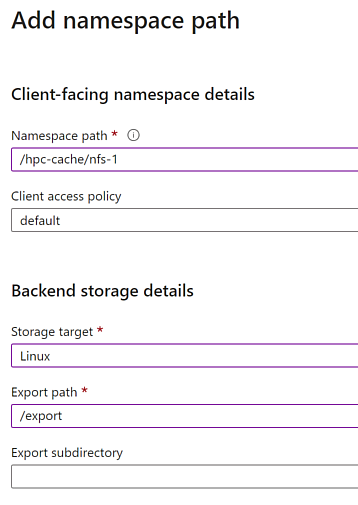
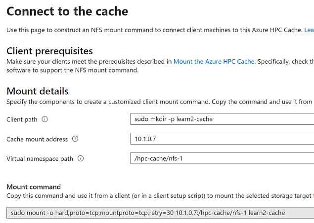

After the storage targets are successfully created, it's time to define the namespace and join the NFS clients to the Azure HPC Cache.

## Define Namespace

A **namespace** is a path that clients use to access storage. Client machines will use a namespace to access the data in the cache instead of accessing the storage targets directly. You must create at least one namespace before clients can access the cache.

To add a new namespace, click the Namespace option in the left navigation. Press the "Add namespace path" button at the top.

1. The namespace path must begin with the slash character (`/`). You could use something like `/hpc-cache/nfs-1` for example.
1. Select the client access policy for this path from the dropdown menu.
1. Choose the storage target from the dropdown.
1. Select the export path on that storage server.
1. If needed, select an optional export subdirectory.
1. Click OK.

You can have up to 10 namespace paths for NFS storage targets.

## Client Requirements

NFS clients require network access, installed NFS utilities, and a local path for the `mount` command.

- Client machines need network access to the cache's virtual network and private subnet.
- Install the NFS utilities using either `sudo yum install -y nfs-utils` or `sudo apt-get install nfs-common`.
- Create a local directory on each client using a command like `sudo mkdir -p /mnt/hpc-cache/target`. Copy this command.

## Copy Mount Instructions

Azure HPC Cache provides a `mount` command that you can copy and paste for your NFS clients.

- With the cache open in the Azure Portal, click the "Mount Instructions" tab on the left.
- In the "Client path" field, paste the full `sudo mkdir` command.
- Choose a cache mount address. Rotate these addresses across the clients to evenly distribute the network traffic.
- Choose your virtual namespace path from the dropdown.
- The mount field automatically populates so you can click the copy button to copy the command to the clipboard.

## Run HPC Workload

Now that the clients are configured to access the Azure HPC Cache, they can begin their HPC workloads.
