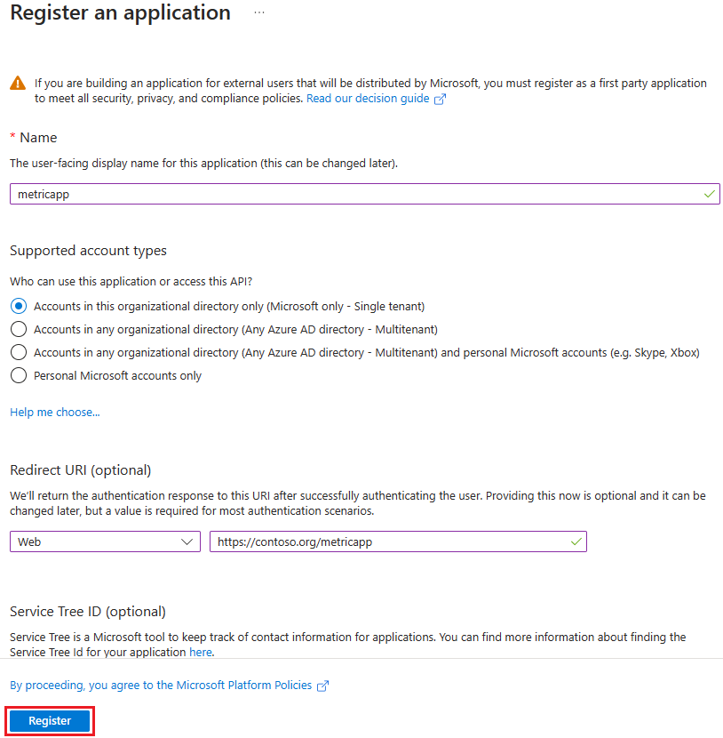
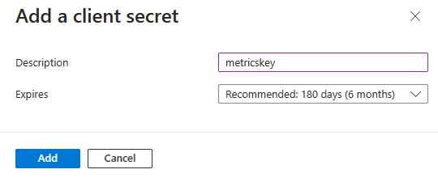
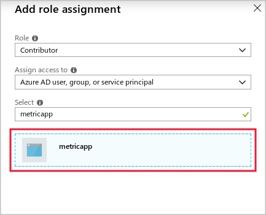

You want to start writing code that obtains metrics about your video app storage account from Azure Monitor. To do this, you must create a service principal for your app in the Azure Active Directory. You'll then configure the correct security information in the app, and write the code that lists metric definitions.

## Create a new console application and add the Azure Monitor API

You must start by using git to clone the application code.

1. In the Cloud Shell on the right, to create a folder for the new console application, type the following command and then press Enter:

    ```bash
    mkdir metricapp
    ```

1. To change into the new folder, type the following command and then press Enter:

    ```bash
    cd metricapp
    ```

1. To clone the console app from Git Hub, type the following command and then press Enter:

    ```bash
    git clone https://github.com/
    ```

<!-- TODO: Add the correct URL to the Git Hub repo when it is known -->

1. To change to the **starter** folder, type the following command and then press Enter:

    ```bash
    cd starter
    ```

## Create an service principal for the new app

In order to grant your app permission to access Azure Monitor metrics, you must create a service principal in the Azure Active Directory. Follow these steps:

1. Go to the [Azure Portal](https://portal.azure.com/learn.docs.microsoft.com?azure-portal=true) and in the navigation on the left, click **Azure Active Directory**.
1. In the **Azure Active Directory** blade, under **Manage** click **App registrations**

    

1. Click **New application registration**.
1. In the **Name** textbox, type **metricapp**.
1. In the **Application type** drop-down list, select **Web app/API**.
1. In the **Sign-on URL** type **https://contoso.org/metricapp** and then click **Create**.

    

1. On the **metricapp** registration page, make a note of the **Application ID** and then click **Settings**

## Obtain an access key and tenant ID

The app will identify itself to Azure by passing an access key and a tenant ID, which is also called a directory ID. To create this, follow these steps:

1. Under **API Access** click **Keys** and then under **Passwords**, in the **Key description** textbox, type **metricskey**.
1. In the **Expires** drop-down list, select **In 1 Year**.
1. In the **Value** textbox, type **Password** and then click **Save**.

    

1. Make a note of the key in the **VALUE** column.
1. In the navigation on the left of the Azure Portal, click **Azure Active Directory**.
1. Under **Manage**, click **Properties**.
1. Make a note of the **Directory ID** value. This value is the tenant ID for your app.

## Assign the app to a role

You must now add the app service principal to a role, so that the app has permission to access Azure Monitor:

1. In the Azure Portal, in the navigation on the left, click **Resource Groups** and then click the only resource group in the list.
1. On the left, click **Access control (IAM)**.
1. Click **+ Add** and then click **Add role assignment**.
1. In the **Role** drop-down list, select **Contributor**.
1. In the **Assign access to** drop-down list, select **Azure AD user, group, or service principal**.
1. In the **Select** textbox, type **metricApp** and then click **metricApp**.

    

1. Click **Save**.

## Start coding the app

Now that the app service principal has been created and configured, you can complete the app's code:

1. In the Cloud Shell on the right, to ensure you are in the correct folder, type the following command and then press Enter:

    ```bash
    cd ~/metricapp/starter
    ```

1. To start the code editor, type the following command and then press Enter:

    ```bash
    code .
    ```

1. In the list of files on the left, click **Program.cs**.
1. At the top of the code file, add the following lines of code:

    ```c#
    using Microsoft.Azure.Management.Monitor;
    using Microsoft.Azure.Management.Monitor.Models;
    ```

## Formulate the resource ID

The app must request metrics by specifying the right resource ID. To formulate that ID, follow these steps:

1. In the **Main** procedure, locate the following line of code, and add, within the quotes, the name of the resource group you determined in unit 3:

    ```c#
    string resourceGroupName = "";
    ```

1. Locate the following line of code and add, within the quotes, the subscription ID you determined in unit 3:

    ```c#
    string subscriptionID = "";
    ```

1. Locate the following line of code and add, within the quotes, the name of the storage account you created in unit 3:

    ```c#
    string storageAccountName = "";
    ```

## Store the correct security information

Now, you must ensure that the app uses the security details you configured and noted earlier:

1. Locate the following line of code and add, within the quotes, the directory ID or tenant ID you noted above:

    ```c#
    string tenantID = "";
    ```

1. Locate the following line of code and add, within the quotes, the application ID you noted above:

    ```c#
    string applicationID = "";
    ```

1. Locate the following line of code and add, within the quotes, the access key you noted above:

    ```c#
    string accessKey = "";
    ```

## Obtain a list of metric definitions

You can now write the code that obtains a list of metric definitions for the Storage account:

1. In the **Program.cs** file, within the **GetMetricDefinitions** method, locate the following comment:

    ```c#
    //Evaluate metric definitions here
    ```

1. To get a list of metric definitions, replace the comment with the following code:

    ```c#
    IEnumerable<MetricDefinition> metricDefinitions = await readOnlyClient.MetricDefinitions.ListAsync(resourceUri: resourceURI, cancellationToken: new CancellationToken());
    ```

1. To show the list of metrics to the user, on the next lines, type the following code:

    ```c#
    Console.WriteLine("Metric Definitions:");
    foreach (var metricDef in metricDefinitions)
    {
        Console.WriteLine(metricDef.Name.Value);
    }
    ```

1. Close the code editor, on the right, click **...** and then click **Close code editor**.
1. To run the application, type the follow command, and then press Enter:

    ```bash
    dotnet run
    ```

    The application runs and the list of metric definitions is displayed in the console window.