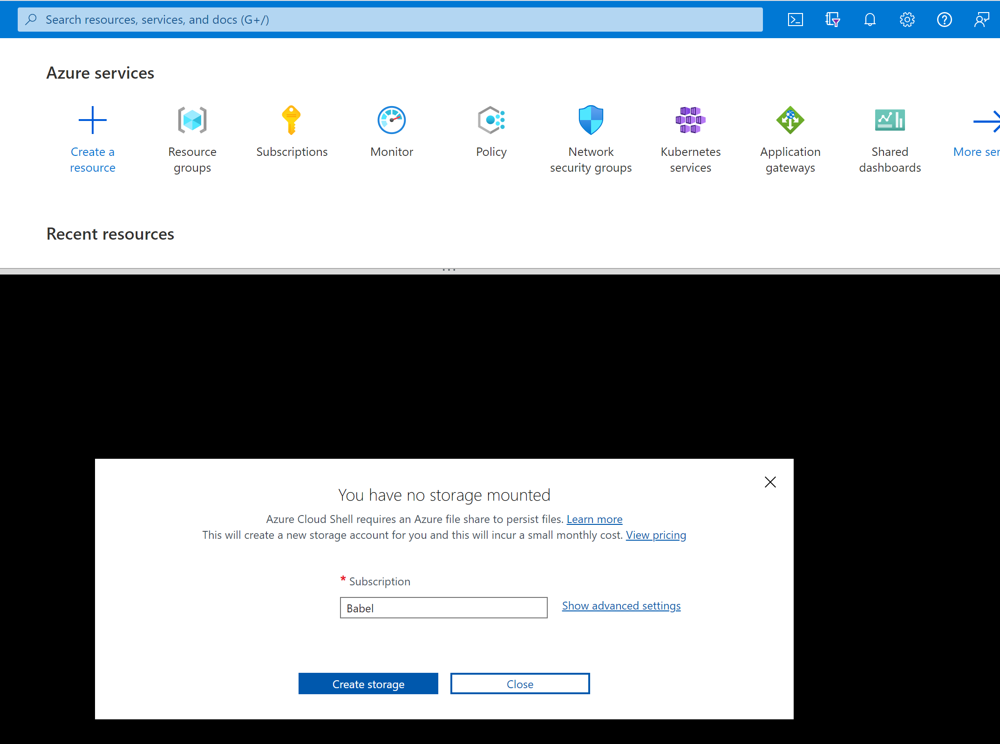

Imagine that you want to create an AKS cluster for a new video game your team is working on and you would like to try out using Azure Policies to govern this cluster. Based on your research, you have decided to start with the following policies:

1. Allow images only from trusted registries into the cluster
1. Kubernetes cluster pod security restricted standards for Linux-based workloads initiative

The first step would be to create an AKS cluster that has Azure policies enabled. 

> [!NOTE]
> If the cluster already exists, you can activate the addon by running the command below
>
> ```azurecli-interactive
> az aks enable-addons --addons azure-policy --name MyAKSCluster --resource-group MyResourceGroup
> ```

## Create an AKS cluster with Azure Policy and Azure Monitor add-on

Before installing the Azure Policy add-on or enabling any of the service features, your subscription must enable the **Microsoft.PolicyInsights** resource provider.

1. You need the Azure CLI version 2.12.0 or later installed and configured. Run `az --version` to find the version. If you need to install or upgrade, see [Install the Azure CLI](https://docs.microsoft.com/en-us/cli/azure/install-azure-cli).
1. Register the resource providers and preview features.

In this exercise, we will be using Azure cloud shell to run the commands. Feel free to use a terminal of your choice for this exercise. To begin, login to your **Azure Portal**

### Setting up the environment

1. From **Azure Portal** click on the **Cloud Shell** icon at the top of the screen to the right of the search bar

   

1. Select the appropriate Subscription and click **Create storage**

1. In the top left corner of the resulting cloud shell, click **PowerShell** and change it to **Bash**. If it is showing Bash already you can skip this step

1. Register the resource providers and preview features by entering the command below to Cloud Shell.

     ```azurecli-interactive
    # Log in first with az login if you're not using Cloud Shell
    # Provider register: Register the Azure Policy provider
    az provider register --namespace Microsoft.PolicyInsights
    ```

1. Once the above prerequisite steps are completed, install the Azure Policy add-on in the AKS cluster you want to manage using the instructions in the note above. In the next section we will create a new cluster and enable the Azure Policy add-on.

### Create AKS cluster and enable Azure Policy add-on

Now that we have the provider registered we can create a new resource group and create an AKS cluster within that group.

1. Create a resource group

   ```azurecli-interactive
   az group create --location eastus --name videogamerg
   ```

1. Create AKS cluster using the default settings
    > [!NOTE]
    > For production workloads, you would want to further customize the creation of your cluster to ensure it meets your security and governance requirements. We are going with a simple cluster purely for training purposes.
    
    ```azurecli-interactive
    az aks create --name videogamecluster --resource-group videogamerg --generate-ssh-keys
    ```
    
1. Enable Azure Monitor for the newly created cluster

    ```azurecli-interactive
    az aks enable-addons -a monitoring --name videogamecluster --resource-group videogamerg
    ```

1. Enable Azure Policies for the cluster

    ```azurecli-interactive
    az aks enable-addons --addons azure-policy --name videogamecluster --resource-group videogamerg
    ```

### Check to ensure Azure Monitor is activated for the cluster

1. Go to **Azure Portal** in a new tab.

1. Search for **resource groups** in the search bar at the top and select **Resource groups**.

1. Select the **videogamerg** resource group you just created.

1. Select the **videogamescluster** you just created.

1. Click on **Insights** under the **Monitoring** section in the left blade.

1. You should see four charts showing the state of your cluster.

   

