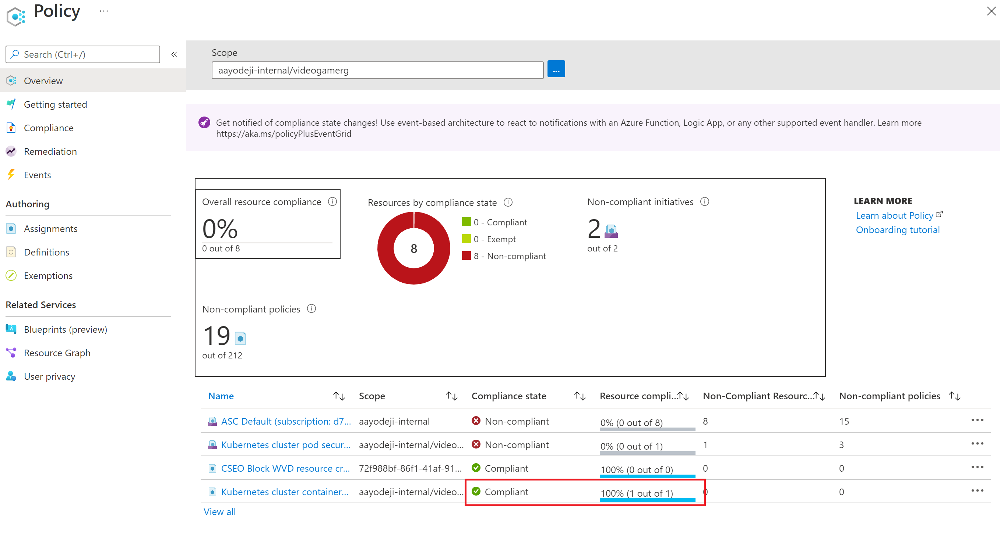

In the previous section you saw how Azure policies can be used to easily govern your cluster by using a built-in Policy and Initiative. We also noted that the policy does not terminate already existing pods. We however would like to discover non-compliant pods so that we can take actions on them. We will do that in this exercise.

## Using the Azure Portal to see non-compliant pods

1. Go to the [Policy](https://portal.azure.com/#blade/Microsoft_Azure_Policy/PolicyMenuBlade/Overview) page in **Azure Portal**.

1. At the top, you can set the scope to your cluster resource group by clicking on the **...**. Select the Subscription and the resource group where the AKS cluster is sitting and click **Select** at the bottom.

   

   >[!NOTE]
   > It may take a few minutes for the non-compliant pods to show up in the Portal.

   Here we see that we have non-compliant resources for both the Policy and the Initiative we deployed. The resources are not compliant with three of the policies from the **Kubernetes cluster pod security restricted standards for Linux-based workloads for videogamerg** initiative. Clicking on that initiative will show which of the eight polices are the three that are not compliant.

   

1. Click on the **Kubernetes cluster containers should only use allowed images** Policy. You will see the cluster that has the non-compliant pod in it

1. Click on the cluster to get more details on which pod is not compliant. Here you will see the name of the specific pod that is not compliant. You will see that it is only the first pod that was deployed that is not compliant. This is an effective way to audit compliance status of your cluster.

   

## Remove the non-compliant pod and recheck compliance

Now that we have found the pod that is not compliant, we will go ahead and delete that pod. Once the pod is deleted, the Policy will prevent future pods that are not compliant with it from being deployed. The **Kubernetes cluster pod security restricted standards for Linux-based workloads for videogamerg** initiative is set to audit meaning we can identify pods that are not compliant, but would not prevent the pods from being deployed. Getting our pods to comply with that initiative is beyond the scope of this course, so we will focus on fixing the Policy that we set to have the **deny** effect.

1. Open the Cloud shell again and delete the non-compliant deployment

   ```bash
kubectl delete deployment simple-nginx
   ```

1. It might take up to 45 minutes for the changes to reflect on the portal. After waiting, head back to the Policy to to see if there are still any uncompliant pods under it. You will find that your cluster is now in compliance with the Policy.

   

## Summary

In this unit, you learned about how to use Azure Portal to identify pods that are not compliant with your policies. We then went ahead and deleted a pod that was not compliant with one of the policies. You also learned how to troubleshoot your deployments and identify pods that are not being deployed because of a deny Policy. You also learned how to use Azure Portal to see non-compliant resources and which policies they are not compliant with. You also resolved one of the issues by deleting the uncompliant pod you first created. Now that you have added and tested out a Policy and an Initiative, you can go through the other in-built policies for Kubernetes and find those that suit your business needs.