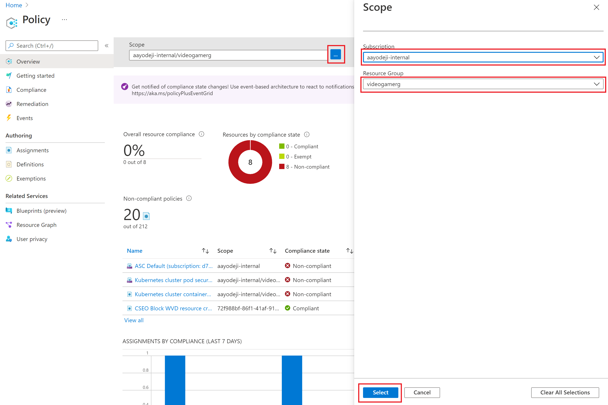
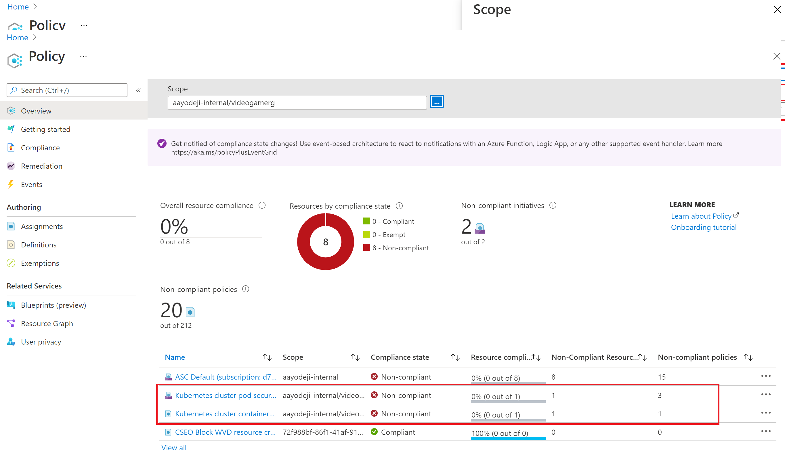
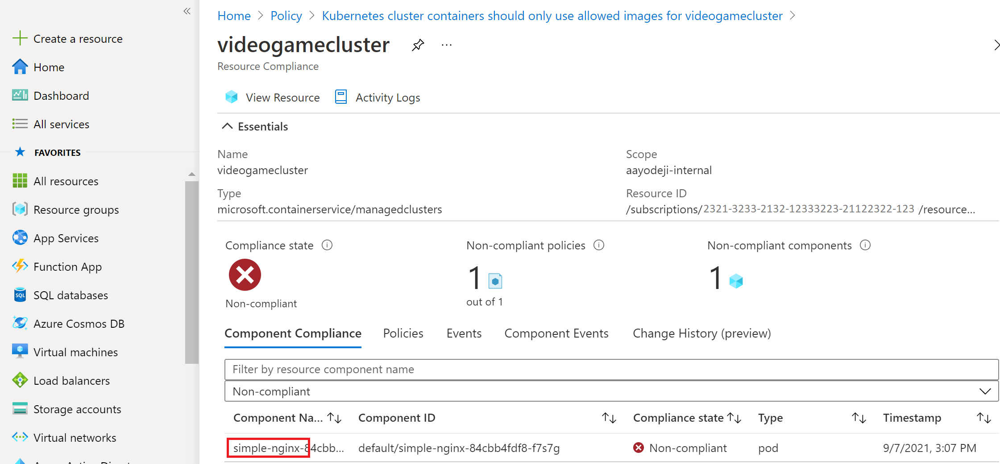

In the previous section you saw how Azure policies can be used to easily govern your cluster by using a build-in policy initiative and using a policy. We also noted that the policy does not terminate already existing pods. We however would like to see non compliant pods so that we can take actions on them. We will do that in this exercise.

## Using the portal to see non compliant pods

1. We begin by enabling monitoring on the cluster. 

   ```bash
   az aks enable-addons -a monitoring -n videogamecluster -g videogamerg
   ```

2. In Azure portal type policy in the search bar at the top and select **Poicy**

3. At the top you can set the scope to your cluster resource group by clicking on the blue **...**. Select the Subscription and the resource group where the AKS cluster is sitting and click ok at the bottom.

   

   Here we see that we have non-compliant resources for both policies we deployed. The resources are not compliant with 3 of the policies from the **Kubernetes cluster pod security restricted standards for Linux-based workloads for videogamerg** initiative. Clicking on that initiative will show which of the polices are the 3 that are not compliant.

   

4. Click on the **Kubernetes cluster containers should only use allowed images** policy. You will see the cluster that has the non compliant pod in it

5. Click on the cluster to get more details on which pod is not compliant. Here you will see the name of the specific pod that is not compliant. You will see that it is only the first pod that was deployed that is not compliant. This is an effective way to audit compliance status of your cluster

   

## Remove non compliant pod and check for compliance

Now that we have found the pod that is not compliant, we will go ahead and delete that pod. Once the pod is deleted, the policy will prevent future pods that are not compliant with the policy: **Kubernetes cluster containers should only use allowed images** from being deployed. The **Kubernetes cluster pod security restricted standards for Linux-based workloads for videogamerg** initiative is set to audit meaning we can identify pods that are not compliant, but would not prevent the pods from being deployed. Getting our pods to comply with that initiative is beyond the scope of this course, so we will focus on fixing the policy that we set to have the **deny** effect.

1. Open the Cloud shell again and delete the non-compliant deployment

   ```
   kubectl delete -f nginxfromdocker.yaml
   ```

2. Give it a few minutes then head back to the policy to to see if there are still any uncompliant pods under that policy. 