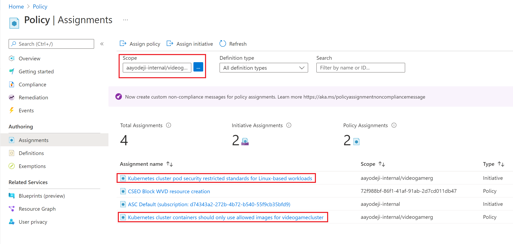

At the beginning of this module, you needed to block new deployments from untrusted registries to your Azure Kubernetes cluster, and present a report of the status of your cluster against that Policy.

In this module, you learned how Azure Policy for Kubernetes can be used to achieve this goal. You created an AKS cluster with the Azure Policy add-on enabled. After that, you assigned a Policy to that cluster to prevent pulling from a non-authorized container registry. You attempted to create a deployment that did not comply with this new Policy and found out that it failed. You also took steps to diagnose why that happened. You also assigned an initiative, which is a group of policies to the same cluster. Finally, you were able to show the compliance state of your cluster against these policies and took steps to bring it back to a compliant state for one of the policies.

Without this solution, your team would be wasting time by manually creating company policies, asking coworkers not to do certain things and potentially opening your clusters to security and operational issues. In the long run, you've saved the company thousands of dollars in time by automating that manual work using Azure policies for AKS.

## Clean up resources

In this module, you created resources by using your Azure subscription. The following steps show you how to clean up these resources so that there's no continued charge against your account.

1. Go to the Azure portal.

    > [!div class="nextstepaction"]
    > [Azure portal](https://portal.azure.com?azure-portal=true)

1. In the left menu, select **Resource groups**.

1. Select the resource group name that starts with **videogamerg** or the resource group name you used.

1. On the **Overview** tab, select **Delete resource group**.

1. To confirm the deletion, enter the name of the resource group. To delete all the resources you created in this module, select **Delete**.

## Clean up Policies

1. Go to the [Policy](https://portal.azure.com/#blade/Microsoft_Azure_Policy/PolicyMenuBlade/Overview) page in **Azure portal**.
1. Click on **Assignments** in the left blade
1. Select the same scope you did before (your AKS cluster resource group)
   
1. Select the Policy you assigned and click **Delete assignment** in the resulting page
1. Click **Yes** when the verification comes up
1. Repeat the same steps for the initiative you assigned

## Learn more

To learn more about Azure Kubernetes Service and GitHub Actions, see the following articles and Microsoft Learn modules:

- [AKS documentation on Azure Policies](/azure/aks/use-azure-policy)
- [Documentation on Azure Policies in general](/azure/governance/policy/overview)