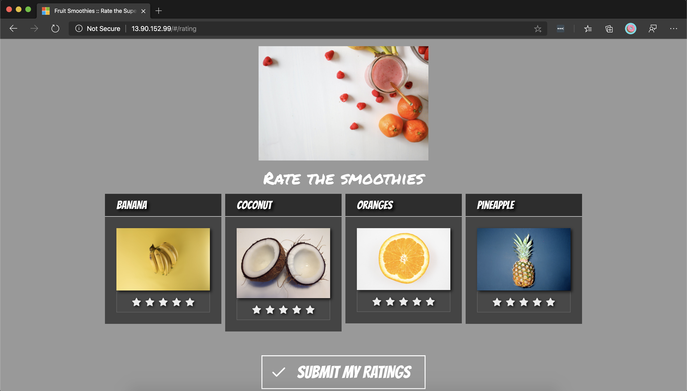

A Kubernetes service is a layer 4 load balancer. An Kubernetes ingress controller is a piece of software that provides layer 7 features such as reverse proxy, configurable traffic routing, and TLS termination for Kubernetes services. Kubernetes ingress resources are used to configure the ingress rules and routes for individual Kubernetes services. Using an ingress controller and ingress rules, a single IP address can be used to route traffic to multiple services in a Kubernetes cluster.

There are a number of choices for running Kubernetes ingress on Azure Kubernetes Service (AKS), including Azure Application Gateway, Ambassador, HAProxy, Kong, NGINX and Traefik. The ingress controllers is exposed to the internet by using a Kubernetes service of type LoadBalancer. The Ingress controller watches and implements Kubernetes Ingress resources, which creates routes to application endpoints.

In this exercise, you're going to deploy a basic Kubernetes ingress controller, using NGINX, then configure the ratings frontend service to use that ingress for traffic.


## Deploy the NGINX ingress controller with Helm

1. Create a namespace for the ingress

    ```bash
    kubectl create namespace ingress
    ```

1. Install the NGINX ingress controller. NGINX ingress is part of the stable Helm repository you already configured when installing MongoDB. For added redundancy, two replicas of the NGINX ingress controllers are deployed with the `--set controller.replicaCount` parameter. The ingress controller also needs to be scheduled on a Linux node. Windows Server nodes shouldn't run the ingress controller. A node selector is specified using the `--set nodeSelector` parameter to tell the Kubernetes scheduler to run the NGINX ingress controller on a Linux-based node.

    ```bash
    helm install nginx-ingress stable/nginx-ingress \
        --namespace ingress \
        --set controller.replicaCount=2 \
        --set controller.nodeSelector."beta\.kubernetes\.io/os"=linux \
        --set defaultBackend.nodeSelector."beta\.kubernetes\.io/os"=linux
    ```

1. Once released, you should get an output similar to this.

    ```output
    NAME: nginx-ingress
    LAST DEPLOYED: Mon Jan  6 15:18:42 2020
    NAMESPACE: ingress
    STATUS: deployed
    REVISION: 1
    TEST SUITE: None
    NOTES:
    The nginx-ingress controller has been installed.
    It may take a few minutes for the LoadBalancer IP to be available.
    You can watch the status by running 'kubectl --namespace ingress get services -o wide -w nginx-ingress-controller'
    ```

1. Next, let's check the public IP of the ingress service. It takes a few minutes for the service to acquire the public IP. Run the following command with a *watch* by adding the `-w` flag to see it updating in real time. You can use <kbd>Ctrl-c</kbd> to stop watching.

    ```bash
    kubectl get service nginx-ingress-controller --namespace ingress -w
    ```

    The service will show `EXTERNAL-IP` as `<pending>` for a while until it finally changes to an actual IP.

    ```output
    NAME                       TYPE           CLUSTER-IP    EXTERNAL-IP      PORT(S)                      AGE
    nginx-ingress-controller   LoadBalancer   10.2.0.162    52.170.254.167   80:32010/TCP,443:30245/TCP   3m30s
    ```

    Make note of that EXTERNAL-IP, for example 52.170.254.167.

## Edit th Kubernetes service file for the ratings web service

Since you’re going to expose the deployment using an ingress, there is no need to use a public IP for the service, hence you can set the type of the service to be `ClusterIP` instead of `LoadBalancer`.

1. Edit the file called `ratings-web-service.yaml` using the integrated editor.

    ```bash
    code ratings-web-service.yaml
    ```

1. Replace the existing content in the file with the following text. Note the change of the service `type` to `ClusterIP`.

    ```yaml
    apiVersion: v1
    kind: Service
    metadata:
      name: ratings-web
    spec:
      selector:
        app: ratings-web
      ports:
      - protocol: TCP
        port: 80
        targetPort: 8080
      type: ClusterIP
    ```

1. To save and close the editor, open the ``...`` action panel in the top right of the editor and select **Save**, then select **Close editor**. You an also use <kbd>Ctrl-s</kbd> to save, and <kbd>Ctrl-q</kbd> to close the editor.

1. Changing the value of `type` on a deployed service is not allowed, so you'll need to delete the service and recreate it again with the changed configuration.

    ```bash
    kubectl delete service \
        --namespace ratingsapp \
        ratings-web
    ```

    then recreate

    ```bash
    kubectl apply \
        --namespace ratingsapp \
        -f ratings-web-service.yaml
    ```

## Create an ingress route file for the ratings web service

1. Edit the file called `ratings-web-ingress.yaml` using the integrated editor.

    ```bash
    code ratings-web-ingress.yaml
    ```

1. Paste the following text in the file.

    ```yaml
    apiVersion: networking.k8s.io/v1beta1
    kind: Ingress
    metadata:
      name: ratings-web-ingress
      annotations:
        kubernetes.io/ingress.class: nginx
    spec:
      rules:
      - http:
          paths:
          - path: /
            backend:
              serviceName: ratings-web
              servicePort: 80
    ```

1. To save and close the editor, open the ``...`` action panel in the top right of the editor and select **Save**, then select **Close editor**. You an also use <kbd>Ctrl-s</kbd> to save, and <kbd>Ctrl-q</kbd> to close the editor.

## Apply the Kubernetes ingress route file to create a load balanced service

1. Apply the configuration using the `kubectl apply` command. You'll be deploying this in the **ratingsapp** namespace.

    ```bash
    kubectl apply \
        --namespace ratingsapp \
        -f ratings-web-ingress.yaml
    ```

    You'll output similar to the following:

    ```output
    service/ratings-web created
    ```

## Test the application

Now that the ratings-web service has a public IP, open that IP in your web browser, for example at **<http://13.90.152.99>** and you should be able to view and interact with the application.



In this exercise, you created a deployment of the **ratings-web** and exposed it to the internet through a LoadBalancer type service.

- **Deployment/ratings-web**. The web frontend.
- **Service/ratings-web**. The load balanced service, which is exposed on the Azure Load Balancer through a public IP.

