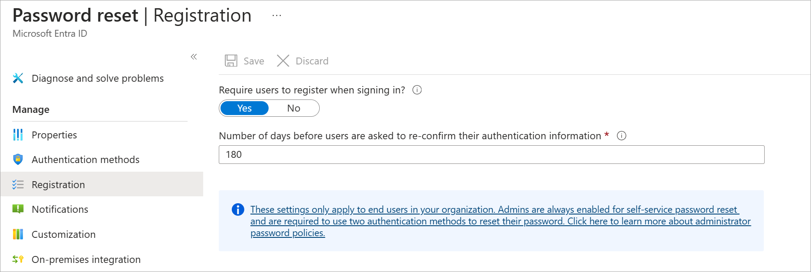

You've decided to implement self-service password reset (SSPR) in the Azure Active Directory (Azure AD) for your  organization. You want to start using SSPR for a group of 20 users in the marketing department as a trial deployment. If everything works well, you'll enable SSPR for your whole organization.

In this unit, you'll learn how to enable SSPR in Azure AD.

## Prerequisites

Before you start to configure SSPR, you need these things in place:

- An Azure AD tenant. This tenant must have at least a trial license (Basic or Premium) enabled. 
- An Azure AD account with Global Administrator privileges. You'll use this account to set up SSPR.
- A non-administrative user account. You'll use this account to test SSPR. It's important that this account isn't an administrator, because Azure AD imposes extra requirements on administrative accounts for SSPR. This user, and all user accounts, must have a valid license to use SSPR.
- A security group to test the configuration with. The non-administrative user account must be a member of this group. You'll use this security group to limit who you roll SSPR out to.

If you don't already have a tenant you can use for the exercises in this module, we'll set one up in the next unit.

## Scope of SSPR roll-out

There are three settings for the **Self-service password reset enabled** property:

- **Disabled**: No users in the directory can use SSPR. This value is the default.
- **Enabled**: All users in the directory can use SSPR.
- **Selected**: Only the members of the specified security group can use SSPR. This allows you to 
enable SSPR for a restricted group of users, who can test it and verify that it works as expected. When you're ready to roll it out broadly, set the property to **Enabled** so that all users have access to the SSPR.

## Configure SSPR

Here are the high level steps to configure SSPR. We'll walk through these steps in more detail later.

1. In the Azure portal, go to **Active Directory** > **Password reset** .
1. Enable SSPR. You can either enable it for all users in the directory, or for selected users. To enable for selected users, you must specify the security group. Members of this group can use SSPR.

    

1. Choose whether to require one or two authentication methods.
1. Choose the authentication methods that the users can use.

    

1. Specify whether users are required to register for SSPR when they next sign in.
1. Specify how often users are asked to reconfirm their authentication information.

    

1. Choose whether to notify users and administrators of password resets.

    

1. Provide an email address or web page URL where your users can get help.

    