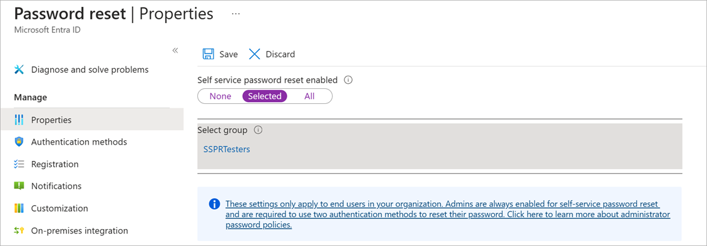
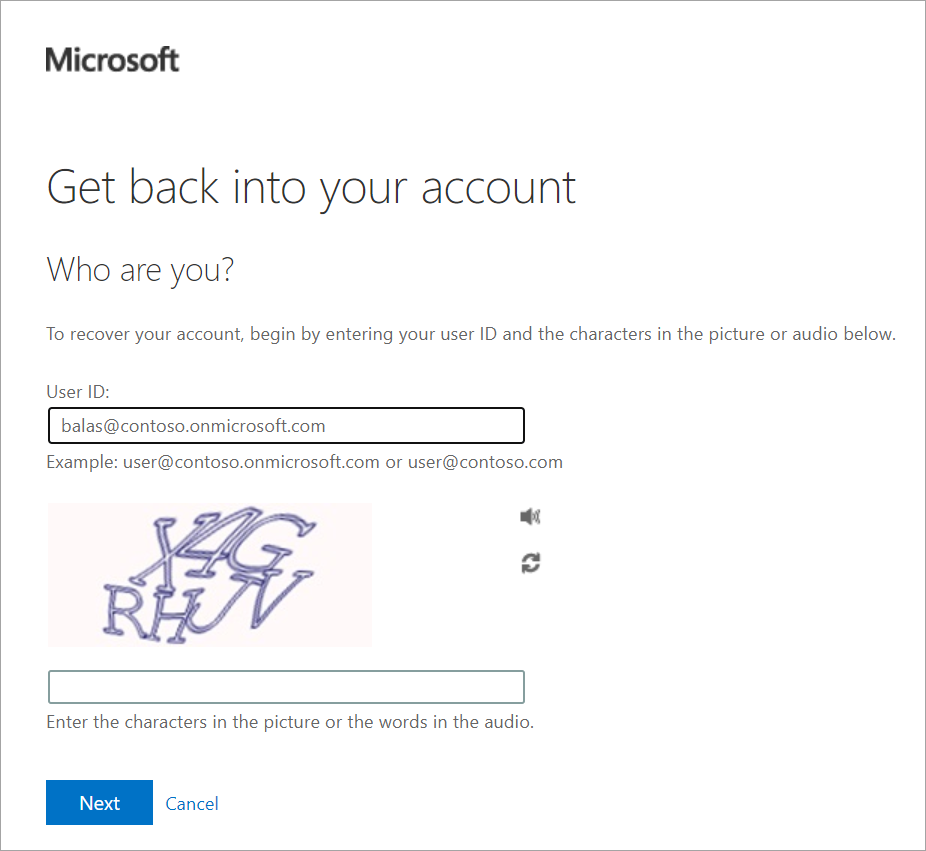

In this unit, you'll configure and test SSPR  using your mobile phone. You'll need to use your mobile phone to complete the password reset process in this exercise.

## Create a Directory

The default directory in the Azure Sandbox doesn't support SSPR. So in this exercise, let's create a second directory and switch to it:

1. In the [Azure portal](https://portal.azure.com/learn.docs.microsoft.com?azure-portal=true), click **+ Create a resource**.
1. In the **Search the Marketplace** textbox, type **Directory**, and then press Enter
1. Click **Azure Active Directory** and then click **Create**. 
1. In the **Create directory** page, use these values, and then click **Create**:

    | Property | Value |
    | --- | --- |
    | Organization name | Choose any organization name |
    | Initial domain name | Choose a domain name that is unique within **.onmicrosoft.com**. Make a note of the domain you choose. |
    | Country or region | United States |
    | | |

1. When the directory has been created press F5 to refresh the page, then in the top-right, click your user account, and then click **Switch directory**.
1. Click the directory you just created.

## Create an Azure AD Premium P2 trial subscription

Now, we must obtain a trial Premium subscription for the directory, to test SSPR:

1. Go to **Azure Active Directory** > **Password reset**.
1. Click **Get a free Premium trial to use this feature**.
1. Under **AZURE AD PREMIUM P2**, expand **Free trial** and then click **Activate**.

## Create a group 

You want to roll out SSPR to a limited set of users first to make sure your SSPR configurations works as expected. Let's begin by creating a security group for the limited roll-out:

1. In the [Azure portal](https://portal.azure.com/learn.docs.microsoft.com?azure-portal=true), go to **Azure Active Directory**.
1. Under **Manage**, select **Groups**.
1. Click **+ New Group**, use the following values, and then click **Create**:

    | Setting | Value |
    | --- | --- |
    | Group type | Security |
    | Group name | SSPRTesters |
    | Group description | Members are testing the roll out of SSPR |
    | Membership type | Assigned |
    | | |

    

## Create a user account

To test your configuration, create an account that's not associated to an administrator role.

1. In the [Azure portal](https://portal.azure.com/learn.docs.microsoft.com?azure-portal=true), go to **Azure Active Directory** > **Manage** > **Users**.
1. Click **+ New user**, use the following values, and then click **Create**:

    | Setting | Value |
    | --- | --- |
    | Name | Birgit Allen |
    | User name | birgit@<your directory name>.onmicrosoft.com |
    | Profile | Not configured |
    | Properties | Default |
    | Groups | Select SSPRTesters |
    | Directory role | User |
    | Password | Click **Show Password** and make a note of the password |
    | | |

    

## Enable SSPR

Now, you're ready to enable SSPR for the group:

1. In the [Azure portal](https://portal.azure.com/learn.docs.microsoft.com?azure-portal=true), go to **Azure Active Directory** > **Manage** > **Password reset**. 
1. If the **Password reset** page still displays the message **Get a free Premium trial to use this feature**, wait for a few minutes and then refresh the page.
1. On the **Properties** page, click **Selected**, select the **SSPRTesters** group, and then click **Save**.

    

1. Click the **Authentication methods** page and review the default values. 
1. Click the **Registration** page and review the default values.
1. Click the **Notifications** page and review the default values.
1. Click the **Customization** page, click **Yes**, and then in the **Custom helpdesk email or URL** textbox, type **admin@<your directory name>.onmicrosoft.com**.
1. Click **Save**.

## Register for SSPR

Now that the SSPR configuration is complete, we can register a mobile phone number for the user you created:

1. In a new browser window, navigate to **https://aka.ms/ssprsetup**.
1. Sign in with the username **birgit@<your directory name>.onmicrosoft.com** and the password that you noted earlier.
1. If you're asked to replace your password, assign a new password of your choice. Make sure you note the new password.
1. Next to **Authentication phone is not configured** click **Set it up now**.
1. Enter your mobile phone details and then click **text me**.

    

1. When you receive the code on your mobile phone, enter the code in the text box.
1. Click **verify** and then click **Finish**.

## Test SSPR

Now let's test whether the user can reset their password:

1. In a new browser window, navigate to **https://aka.ms/sspr**.
1. In the **Get back into your account** page, in the **User ID** textbox, type **birgit@<your directory name>.onmicrosoft.com**.
1. Complete the Captcha, and then click **Next**.

    

1. Enter your mobile phone number and then click **Text**.
1. When the text arrives, in the **Enter your verification code** textbox, type the code you were sent, and then click **Next**.
1. Assign a new password of your choice and then click **Finish**. Make sure you note the new password.
1. Sign out of the account **birgit@<your directory name>.onmicrosoft.com**.