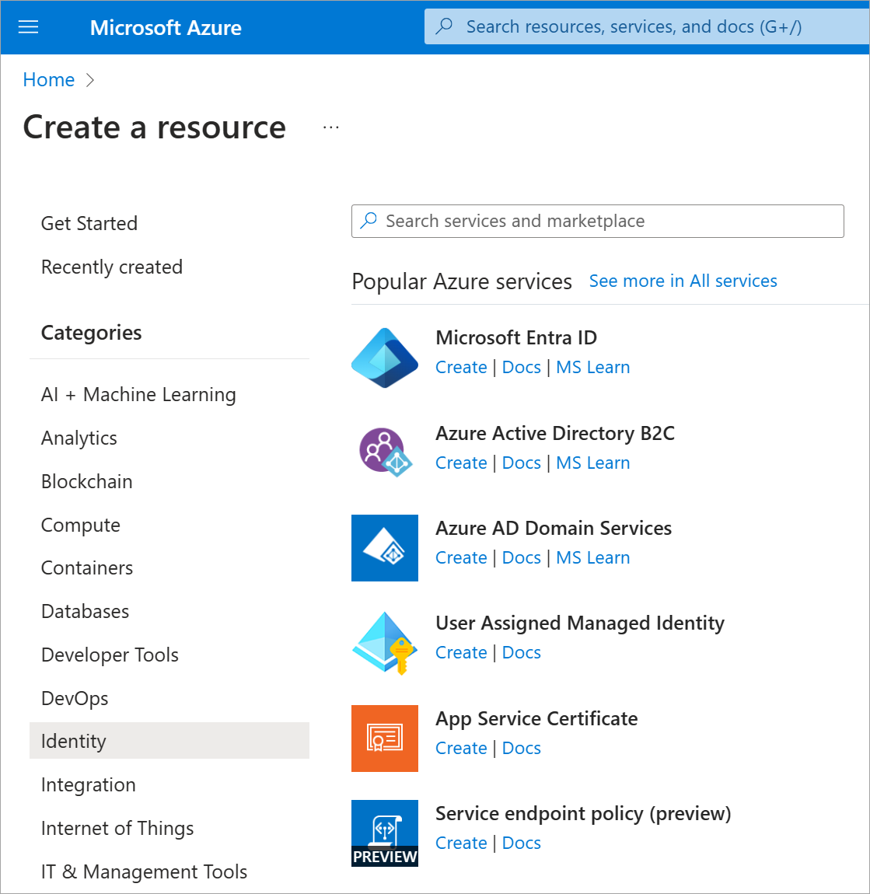

In this unit, you'll configure and test SSPR  using your mobile phone. You'll need to use your mobile phone to complete the password reset process in this exercise.

## Create an Azure AD organization

The default Azure AD organization in the Azure Sandbox doesn't support SSPR. So in this exercise, let's create a second organization and switch to it.

1. Sign in to the [Azure portal](https://portal.azure.com/learn.docs.microsoft.com?azure-portal=true) with the same account you used to activate the sandbox.
1. Select **Create a resource** > **Identity** > **Azure Active Directory**.

   
1. In the **Create directory** page, use these values, and then click **Create**:

    | Property | Value |
    | --- | --- |
    | Organization name | Choose any organization name |
    | Initial domain name | Choose a domain name that is unique within **.onmicrosoft.com**. Make a note of the domain you choose. |
    | Country or region | United States |
    | | |

1. When the organization has been created press F5 to refresh the page, then in the top-right, select your user account, and then click **Switch directory**.
1. Click the organization you just created.

## Create an Azure AD Premium P2 trial subscription

Now activate a trial Premium subscription for the organization so you can test SSPR.

1. Go to **Azure Active Directory** > **Password reset**.
1. Click **Get a free Premium trial to use this feature**.
1. Under **AZURE AD PREMIUM P2**, expand **Free trial** and then click **Activate**.
1. Refresh the browser to see the **Password reset - Properties** page.

## Create a group 

You want to roll out SSPR to a limited set of users first to make sure your SSPR configurations works as expected. Let's begin by creating a security group for the limited roll-out.

1. In the Azure AD organization you created, under **Manage**, select **Groups**.
1. Select **+ New Group**.
1. Enter the following values:

    | Setting | Value |
    | --- | --- |
    | Group type | Security |
    | Group name | SSPRTesters |
    | Group description | Testers of SSPR roll out |
    | Membership type | Assigned |
    | | |

1. Select **Create**.

    

## Create a user account

To test your configuration, create an account that's not associated to an administrator role.

1. In your Azure AD organization, under **Manage**, select **Users**.
1. Select **+ New user**, use the following values, and then click **Create**:

    | Setting | Value |
    | --- | --- |
    | User name | balas |
    | Name | Bala Sandhu |
    | Password | Click **Show Password** and make a note of the password |
    | Groups | Select SSPRTesters |

1. Select **Create**.

## Enable SSPR

Now, you're ready to enable SSPR for the group.

1. In your Azure AD organization, under **Manage**, select **Password reset**. 
1. If the **Password reset** page still displays the message **Get a free Premium trial to use this feature**, wait for a few minutes and then refresh the page.
1. On the **Properties** page, click **Selected**, select the **SSPRTesters** group, and then click **Save**.

    

1. Under **Manage**, select the **Authentication methods**, **Registration** and **Notifications** pages to review the default values.
1. Select **Customization**.
1. Select **Yes**, and then in the **Custom helpdesk email or URL** textbox, enter admin@organization-domain-name.onmicrosoft.com where you replace "organization-domain-name" with the domain name of the Azure AD organization you created. If you've forgotten the domain name, hover over your profile in the top right-hand side of the Azure portal.
1. Click **Save**.

## Register for SSPR

Now that the SSPR configuration is complete, we can register a mobile phone number for the user you created.

1. In a new browser window, go to **https://aka.ms/ssprsetup**.
1. Sign in with the username **balas@organization-domain-name.onmicrosoft.com** and the password that you noted earlier.
1. If you're asked to update your password, enter a new password of your choice. Make sure you note the new password.
1. Next to **Authentication phone is not configured** click **Set it up now**.
1. Enter your mobile phone details.

    

1. Select **text me**.
1. When you receive the code on your mobile phone, enter the code in the text box.
1. Click **verify** and then click **finish**.

## Test SSPR

Now let's test whether the user can reset their password:

1. In a new browser window, go to **https://aka.ms/sspr**.
1. For **User ID**, type balas@organization-domain-name.onmicrosoft.com where you replace ""organization-domain-name" with the domain you used for your Azure AD organization.

    
1. Complete the Captcha, and then select **Next**.
1. Enter your mobile phone number and then click **Text**.
1. When the text arrives, in the **Enter your verification code** textbox, type the code you were sent, and then click **Next**.
1. Enter a new password and then click **Finish**. Make sure you note the new password.
1. Sign out of the account.
