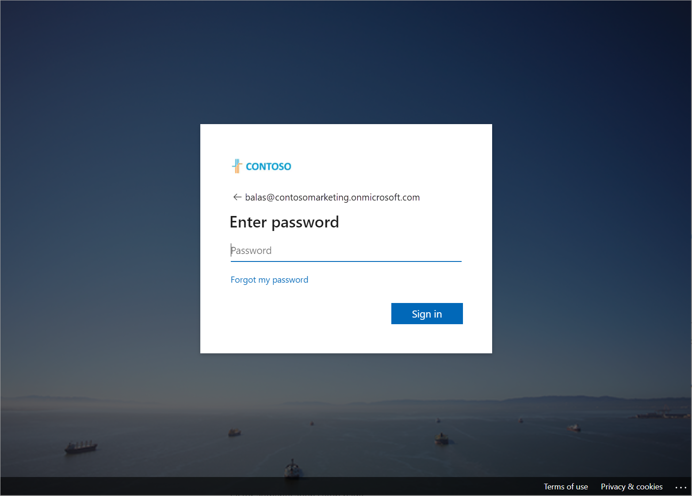

An administrator can apply the organization's branding to the Azure sign-in page. 

Suppose you've been asked to display your retail organization's branding to the Azure sign-in page to reassure users that they are passing credentials to a legitimate system.

Here, you'll learn how to configure this custom branding.

To complete this exercise, you must have two image files:
 - A page background image. This must be a PNG or JPG files, 1920 x 1080 pixels, and smaller than 300 KB.
 - A company logo image. This must be a PNG or JPG files, 280 x 60 pixels, and smaller than 10 KB.

## Customize directory branding

Let's use Azure Active Directory (Azure AD) to set up the custom branding:

1. In the [Azure portal](https://portal.azure.com/learn.docs.microsoft.com?azure-portal=true), go to **Azure Active Directory** > **Manage** > **Company branding** > **Configure**.
1. Next to the **Sign-in page background image**, click the **Browse** button. Select your page background image.
1. Next to the **Banner logo**, click the **Browse** button. Select your logo image and then click **Save**.

    

## Test directory branding

Now, let's use the account that we created in the last exercise to test the branding:

1. In a new browser window, navigate to **https://login.microsoft.com**.
1. Pick the account **birgit@<your directory name>.onmicrosoft.com**. Your custom branding is displayed.
1. Enter the password you noted in the previous exercise to authenticate.

    