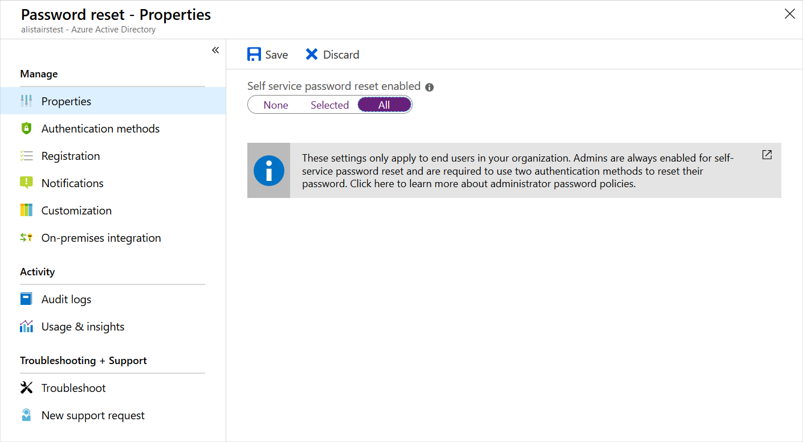
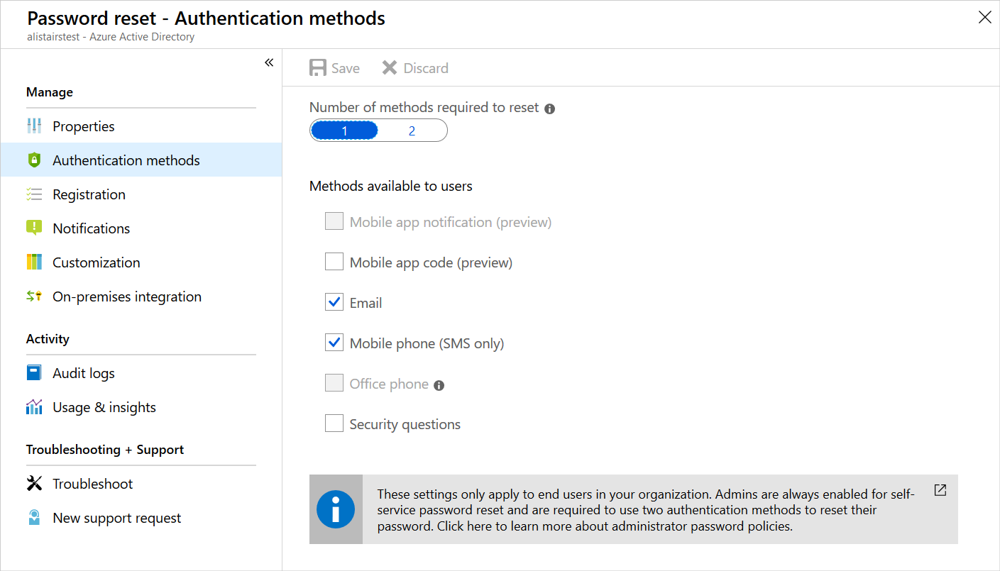
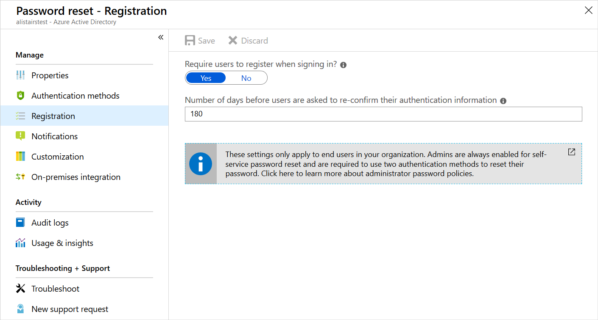

After you plan a roll out of Self-Service Password Reset (SSPR), you can implement it by using the Azure portal.

Suppose you've decided to implement SSPR in the Azure Active Directory for your retail organization, so that your users can recover from forgotten or expired passwords. You want to start using SSPR for a group of 20 users in the marketing department as a trial deployment. If everything works well, you'll enable SSPR for your whole organization.

Here, you'll learn how to enable SSPR in the Azure AD.

## Prerequisites

Before you start to configure SSPR, make sure you have these things in place:

- An Azure AD tenant. This tenant must have at least a trial license (Basic or Premium) enabled.
- An Azure AD account with Global Administrator privileges. You'll use this account to set up SSPR.
- A non-administrative user account. You'll use this account to test SSPR. It's important that this account is **not** an administrator, because Azure AD imposes extra requirements on administrative accounts for SSPR. This user, and all user accounts, must have a valid license to use SSPR.
- A security group to test the configuration with. The non-administrative user account must be a member of this group.

SSPR is not permitted in the default Active Directory in the sandboxed Azure subscription, which you'll use in the exercises in this module. To enable SSPR, you'll create a second, Premium tier directory and enable SSPR in that.

You can use the security group to perform a phased roll-out of SSPR. There are three settings for the **Self-service password reset enabled** property:

- **Disabled.** No users in the directory can use SSPR. This value is the default.
- **Enabled.** All users in the directory can use SSPR.
- **Selected.** Only the members of the specified security group can use SSPR. 

So you can enable SSPR for a restricted group of users, who can test it and ensure that all works well. As you become confident that your configuration works as intended, add more users to this group. When you feel that no further testing is required, set the property to **Enabled** so that all users have access to the functionality.

## Configure SSPR

To set up SSPR in your directory, complete these tasks:

1. In the [Azure portal](https://portal.azure.com/learn.docs.microsoft.com?azure-portal=true), go to the **Password reset** page in the **Active Directory** resource.
1. Enable SSPR. You can either enable it for all users in the directory, or for selected users. To enable for selected users, you must specify the security group. Members of this group will be able to use SSPR.

    

1. Choose whether to require one or two authentication methods.
1. Choose the authentication methods that the user will be able to choose from.

    

1. Specify whether users are required to register for SSPR when they next sign in.
1. Specify how often users are asked to reconfirm their authentication information.

    

1. Choose whether to notify users and administrators of password resets.

    

1. Provide an email address or web page URL where your users can get help.

    