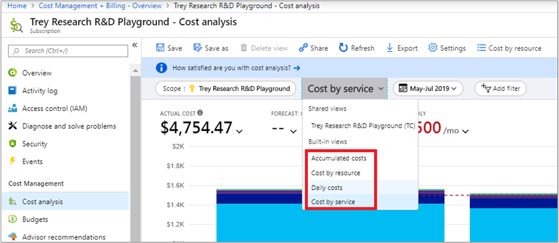
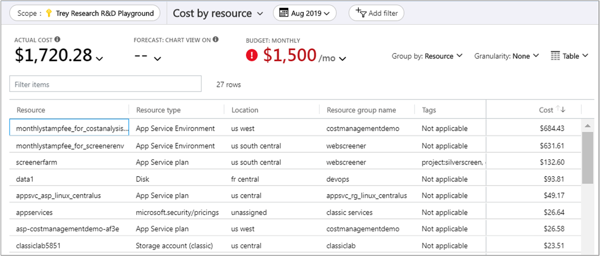
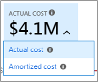
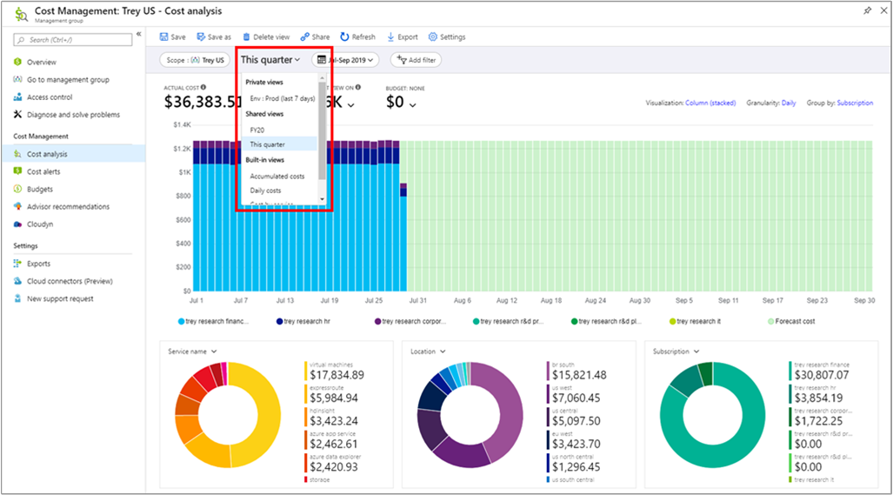
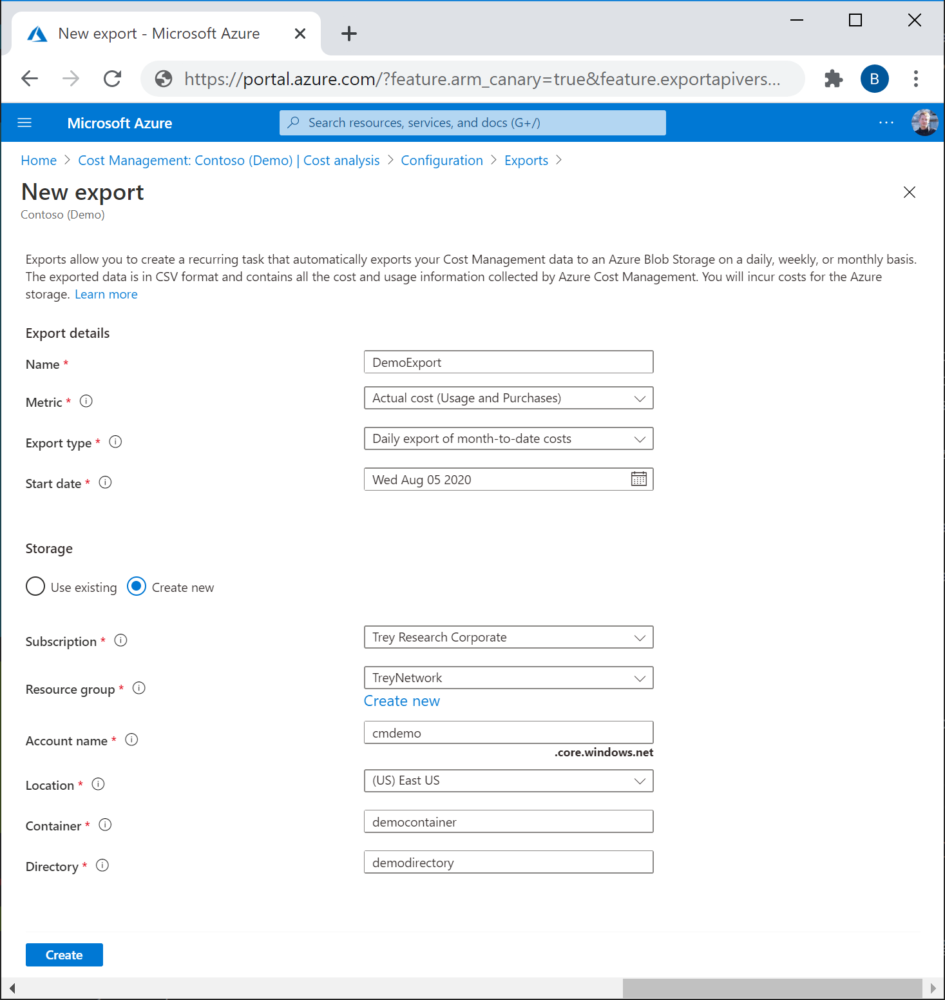

This unit explains how you can use cost analysis with several different default ways to view cost and usage information. There are also many ways you can customize cost views for deeper analysis. This unit also covers how to save and share cost analysis views. Lastly, you learn how to export data from cost analysis for use elsewhere.

**Accumulated cost view** - This view represents the predefined cost analysis view configuration. Each view includes date range, granularity, group by, and filter settings. The default view shows accumulated costs for the current billing period, but you can change to other built-in views. This view answers questions like: How much have I spent so far this month? Will I stay within my budget?

**Actual cost** - This view shows the total usage and purchase costs for the current month, as they're accrued and will show on your bill.

**Forecast** - This view shows the total forecasted costs for the period you choose. Use the forecast chart view to identify potential budget breaches. When there's a potential budget breach, projected overspending is shown as a red area. An indicator symbol is also shown in the chart. Hovering over the symbol shows the estimated date of the budget breach.

**Budget** - Shows the planned spending limit for the selected scope, if available.

**Pivot (donut) charts** - Provide dynamic pivots, breaking down the total cost by a common set of standard properties. They show the largest to smallest costs for the current month. You can change pivot charts at any time by selecting a different pivot. Costs are categorized by service (meter category), location (region), and child scope by default. For example, enrollment accounts are under billing accounts, resource groups are under subscriptions, and resources are under resource groups.

## Customized cost views

Let's look at each cost view in more detail.

**Accumulated costs** - Cost analysis shows data for the current month by default. Use the date selector to switch to common date ranges quickly. Examples include the last seven days, the last month, the current year, or a custom date range. Pay-as-you-go subscriptions also include date ranges based on your billing period, which isn't bound to the calendar month, like the current billing period or last invoice. Use the  **<PREVIOUS**  and  **NEXT>**  links at the top of the menu to jump to the previous or next period, respectively. For example,  **<PREVIOUS**  will switch from the  **Last 7 days**  to  **8-14 days ago**  or  **15-21 days ago**.

Cost analysis shows  **accumulated**  costs by default. Accumulated costs include all costs for each day plus the previous days, for a constantly growing view of your daily aggregate costs. This view is optimized to show how you're trending against a budget for the selected time range.

**Cost by resource** – The cost by resource view shows a table of grouped resources sorted by highest cost.

This view answers the question: Which resources cost the most so far this month?

**Daily costs** - The daily view showing costs for each day. The daily view doesn't show a growth trend. The view is designed to show irregularities as cost spikes or dips from day to day. If you've selected a budget, the daily view also shows an estimate of your daily budget.

When your daily costs are consistently above the estimated daily budget, you can expect you'll surpass your monthly budget. The estimated daily budget is a means to help you visualize your budget at a lower level. If you have fluctuations in daily costs, then the estimated daily budget comparison to your monthly budget is less precise.

Here's a daily view of recent spending.

This view answers the question: Have there been any increases in the costs per day for the last 30 days?

**Cost by service** – By default, this view shows the last three months of spending on services shown in bar charts. Donut charts show spending for the same period by service name, resource location, and resource group name.

This view answers the question: How has my monthly usage varied over the past three invoices?

## Group by and filtering

The following table lists some of the most common grouping and filtering options and when you should use them.

| **Property** | **When to use** |
| --- | --- |
| **Billing period** | Break down costs by invoice month. This option is important for pay-as-you-go and development/test subscriptions, which aren't bound to calendar months. EA/MCA accounts can use calendar months in the date picker or monthly granularity to accomplish the same goal. |
| **Charge type** | Break down usage, purchase, refund, and unused reservation costs. Reservation purchases and refunds are available only when using action costs and not when using amortized costs. Unused reservation costs are available only when looking at amortized costs. |
| **Cloud** | Break down costs by AWS and Azure. AWS costs are available only from management groups, external billing accounts, and external subscriptions. |
| **Department** /  **Invoice section** | Break down costs by EA department or MCA invoice section. This option is available only for EA/MCA billing accounts and MCA billing profiles. |
| **Enrollment account** | Break down costs by EA account owner. This option is available only for EA billing accounts and departments. |
| **Frequency** | Break down usage-based, one-time, and recurring costs. |
| **Meter** | Break down costs by Azure usage meter. This option is available only for Azure usage. All purchases and Marketplace usage will show as  **Not specified**  or  **unassigned**. |
| **Publisher type** | Break down AWS, Azure, and Marketplace costs. |
| **Reservation** | Break down costs by reservation. Any usage that doesn't include a reservation will show as  **Not specified**. |
| **Resource** | Break down costs by resource. All purchases will show as  **Not specified, because they're applied at an EA/PAYG billing account or MCA billing profile level. |
| **Resource group** | Break down costs by resource group. This option is available only for non-classic usage. Classic resource usage will show as  **other, and purchases will show as  **Not specified**. |
| **Resource type** | Break down costs by resource type. This option is available only for non-classic usage. Classic resource usage will show as  **other, and purchases will show as  **Not specified**. |
| **Service name**  or  **Meter category** | Break down cost by Azure service. This option is available only for Azure usage. All purchases and Marketplace usage will show as  **Not specified**  or  **unassigned**. |
| **Service tier** or  **Meter subcategory** | Break down cost by Azure usage meter subclassification. This option is available only for Azure usage. All purchases and Marketplace usage will show as  **Not specified**  or  **unassigned**. |
| **Subscription** | Break down costs by subscription. All purchases show as  **Not specified**. |
| **Tag** | Break down costs by tag values for a specific tag key. |

## Actual versus amortized cost

Let's look at Azure service costs for the current month. You should see a graph like the following example.

By default, cost analysis shows all usage and purchase costs as they are accrued and will show on your invoice, also known as  **Actual cost**. Viewing actual cost is ideal for reconciling your invoice. However, purchase spikes in cost can be alarming when you're keeping an eye out for spending anomalies and other changes in cost. To flatten out spikes caused by reservation purchase costs, switch to  **Amortized cost**.

Amortized cost breaks down reservation purchases into daily chunks and spreads them over the duration of the reservation term. For example, instead of seeing a USD 365.00 purchase on January 1, you'll see a USD 1.00 purchase every day from January 1 to December 31. In addition to basic amortization, these costs are also reallocated and associated by using the specific resources that used the reservation. For example, if the USD 1.00 daily charge was split between two virtual machines, you'd see two USD 0.50 charges for the day. If part of the reservation isn't utilized for the day, you'd see one USD 0.50 charge associated with the applicable virtual machine and another USD 0.50 charge with a charge type of UnusedReservation. Unused reservation costs can be seen only when viewing amortized cost.

Due to the change in how costs are represented, it's important to note that actual cost and amortized cost views will show different total numbers. In general, the total cost of months with a reservation purchase will decrease when viewing amortized costs, and months following a reservation purchase will increase. Amortization is available only for reservation purchases and doesn't apply to Azure Marketplace purchases currently.

## Saving and sharing views

Customizing a view in cost analysis is easy. Just pick the date range you need, group the data to see a breakdown, and then choose the visualization that you want. Pin your view to a dashboard for one-click access, then share the dashboard with your team so everyone can track costs from a single place.

You can also share a direct link to your customized view so others can copy and personalize it for themselves:

Both sharing options offer flexibility, but you need something more convenient. You can save customized views and share them with others, directly from within cost analysis.

People with Cost Management Contributor (or greater) access can create shared views. You can create up to 50 shared views per scope.

Anyone can save up to 50 private views, even if they only have read access. These views cannot be shared with others directly in cost analysis, but they can be pinned to a dashboard or shared via URL so others can save a copy.

All views are accessible from the view menu. You'll see your private views first, then you see views shared across the scope, and lastly the built-in views that are always available.

Do you need to share your view outside of the portal? Download the charts as an image and copy it into an email or presentation, as an example, to share it with your team. There's a slightly redesigned Export menu that offers a PNG option when viewing charts. The table view can't be downloaded as an image.

The filter bar shows:

- The scope pill shows the scope name for added clarity
- The view menu is based on its growing importance with saved views

## Exporting data

Let's start by creating a daily export of your cost and usage data.

Navigate to **Subscriptions**, select a subscription from the list, and then select **Cost analysis** in the menu. At the top of the Cost analysis page, click **Export** and then choose an export option. For example, click  **Schedule export**.

Besides subscriptions, you can create exports on resource groups, accounts, departments, and enrollments.

Click  **Add**, type a name for the export, and then select the  **Daily export of month-to-date costs** option. Click  **Next**.

Specify the subscription for your Azure storage account, then select your storage account. Specify the storage container and the directory path that you'd like the export file to go to. Click  **Next**.

Review your export details and click  **Create**.

Your new export appears in the list of exports. By default, new exports are enabled. If you want to disable or delete a scheduled export, click any item in the list and then click either  **Disable**  or  **Delete**.

Initially, it can take one to two hours before the export runs. However, it can take up to four hours before data is shown in exported files.

### Export schedule

Scheduled exports are affected by the time and day of week of when you initially create the export. When you create a scheduled export, the export runs at the same time of day for each subsequent export occurrence. For example, you create a daily export at 1:00 PM. The next export runs at 1:00 PM the following day. The current time affects all other export types in the same manner—they always run at the same time of day as when you initially created the export. In a different example, you create a weekly export at 4:00 PM on Monday. The next report runs at 4:00 PM the following Monday. _Exported data is available within four hours of run time._

Each export creates a new file, so older exports are not overwritten.

There are three types of export options:

**Daily export of month-to-date costs**  – The initial export runs immediately. Subsequent exports run the next day at the same time as the initial export. The latest data is aggregated from previous daily exports.

**Weekly export of costs for the last 7 days**  – The initial export runs immediately. Subsequent exports run on the day of the week and at the same time as the initial export. Costs are for the last seven days.

**Custom**  – Allows you to schedule weekly and monthly exports with week-to-date and month-to-date options. _The initial export will run immediately._

If you have a Pay-As-You-Go, MSDN, or Visual Studio subscription, your invoice billing period might not align to the calendar month. For those types of subscriptions and resource groups, you can create an export that's aligned to your invoice period or to calendar months. To create an export aligned to your invoice month, navigate to  **Custom**, then select  **Billing-period-to-date**. To create an export aligned to the calendar month, select  **Month-to-date**.

### Verify that data is collected

You can easily verify that your Cost Management data is being collected and view the exported CSV file using Azure Storage Explorer.

In the export list, click the storage account name. On the storage account page, click Open in Explorer. If you see a confirmation box, click  **Yes**  to open the file in Azure Storage Explorer.

In Storage Explorer, navigate to the container that you want to open and select the folder corresponding to the current month. A list of CSV files is shown. Select one and then click  **Open**.

The file opens with the program or application that's set to open CSV file extensions. Here's an example in Excel.

