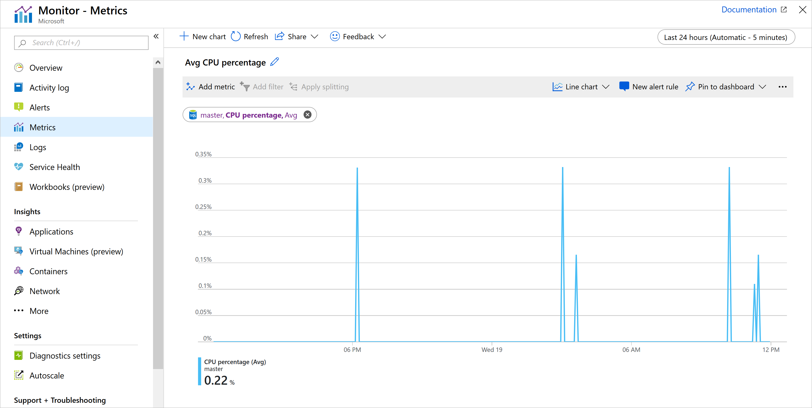

Azure Monitor is a service for collecting and analyzing telemetry allowing maximum performance and availability on your cloud and on on-premises resources and applications. Its purpose is to show you how your applications are performing as well as identifying any issues regarding them.

## Data collection in Azure Monitor

All data collected by Azure Monitor fits into one of two fundamental types: logs and metrics. Logs contain records indicating when resources are created or modified. Metrics tell you how the resource is performing, and the other resources that it's consuming.

The following diagram gives a high-level view of Azure Monitor. On the left, are the sources of monitoring data, which include Azure, operating systems, and custom sources. At the center of the diagram, are the data stores for metrics and logs. Metrics and logs are the two fundamental types of data used by Azure Monitor. On the right, are the different functions that Azure Monitor performs with this collected data such as analysis, alerting, and streaming to external systems.

### Logs

Logs contain timestamped information about changes made to resources. The type of information recorded varies by log source. The log data is organized into records, with different sets of properties for each type of record. The logs can include numeric values such as Azure Monitor Metrics but most include text data rather than numeric values.

The most common type of log entry records an event. Events can occur sporadically rather than at fixed intervals or according to some schedule. Events are created by applications and services, which provide the context for the events. Metric data can be stored in logs to combine them with other monitoring data for other data analysis.

Log data from Azure Monitor in a Log Analytics workspace. Azure provides an analysis engine and rich query language. The logs are used to show enough context of the issue being identified and are useful for identifying the root case of any problems.

### Metrics

Metrics are numerical values that describe some aspect of a system at a particular point in time. Azure Monitor is capable of capturing metrics in near real time. The metrics are collected at regular intervals and are useful for alerting due to their frequent sampling. With a variety of algorithms, a metric can be compared to other metrics to observe trends over time.

Metrics are stored in a time-series database. This data store is most effective for analyzing time stamped data. Metrics are particularly suited for alerting and fast detection of issues. They can tell you about system performance, but if needed they can be combined with logs to identify the root cause of issues.

## Analyzing logs with Kusto

To retrieve, consolidate and analyze data, you specify a query that Azure Monitor Logs runs. You write a log query with the **Kusto** query language, which is also used by **Azure Data Explorer**. Log queries can be tested in the Azure portal so you can work with them interactively. You'll typically start with basic queries and then progress to use more advanced functions as your requirements become more complex.

In the example scenario, the operations team can consolidate their data by visualizing monitoring data such as charts and tables. These tools are effective for summarizing data and presenting it to different audiences. The use of Azure Dashboards enables you to combine different kinds of data, including both logs and metrics, into a single pane in the Azure portal. For example, you might wish to create a dashboard that combines tiles that show a graph of metrics, a table of activity logs, charts from Application Insights and the output of a log query.
