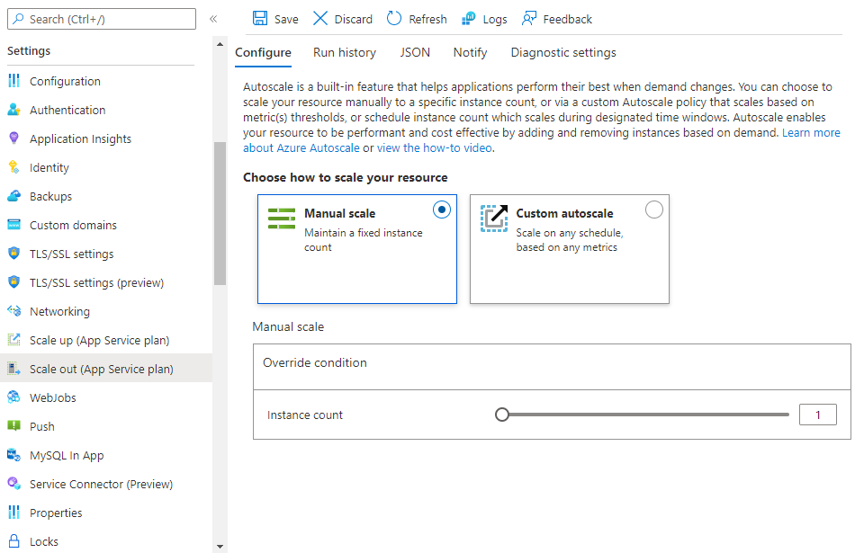
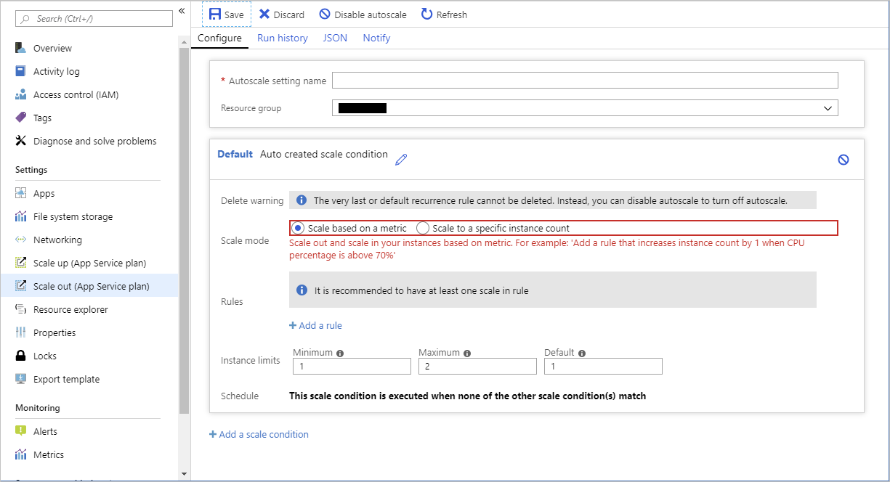
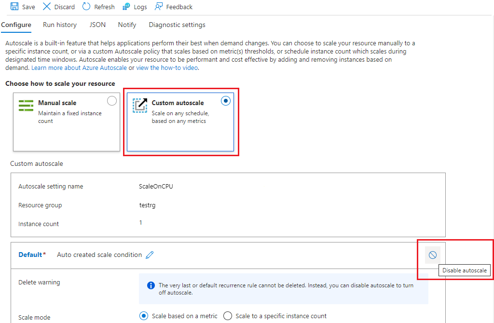

By default, an App Service Plan only implements manual scaling. The hotel reservation system in the scenario requires you to configure autoscaling.

In this unit, you will see how to enable autoscaling, create autoscale rules, and monitor autoscaling activity

## Enable autoscaling

You modify the App Service Plan for a web app to implement autoscaling. An App Service Plan has scale-out settings that you use to enable autoscaling, add autoscaling conditions, and define autoscale rules.

> [!NOTE]
> Not all pricing tiers support autoscaling. The development pricing tiers are either limited to a single instance (the **F1** and **D1** tiers), or they only provide manual scaling (the **B1** tier). If you've selected one of these tiers, you must first scale up to the **S1** or any of the **P** level production tiers.

You enable autoscaling with the **Enable autoscale** button on the **Scale out** page for an App Service Plan.

## Add scale conditions

Once you enable autoscaling, you can edit the default scale condition, and you can add your own custom scale conditions. Remember that each scale condition can either scale based on a metric, or scale to a specific instance count.

A metric-based scale condition can also specify the minimum and maximum number of instances to create. The maximum number can't exceed the limits defined by the pricing tier. Additionally, all scale conditions other than the default may include a schedule indicating when the condition should be applied.

## Create scale rules

A metric-based scale condition contains one or more scale rules. Initially, a scale condition contains only a default rule. You use the **Add a rule** link to add your own custom rules. You define the criteria that indicate when a rule should trigger an autoscale action, and the autoscale action to be performed (scale out or scale in) using the metrics, aggregations, operators, and thresholds described earlier.

## Monitor autoscaling activity

The Azure portal enables you to track when autoscaling has occurred through the **Run history** chart. This chart shows how the number of instances varies over time, and which autoscale conditions caused each change.

You can use the **Run history** chart in conjunction with the metrics shown on the **Overview** page to correlate the autoscaling events with resource utilization.

## Disable autoscaling

To disable autoscaling, you can select the **Disable autoscale** option on the **Scale out** page of the App Service Plan. Autoscaling is also disabled if you delete all of the autoscale conditions, including the default condition.

