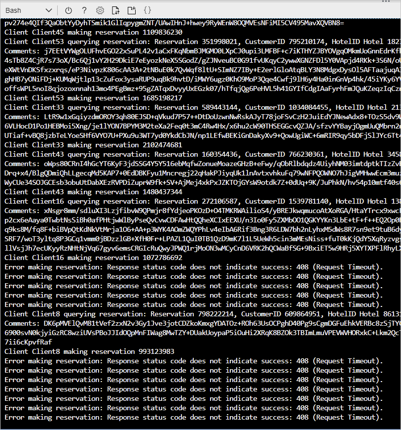
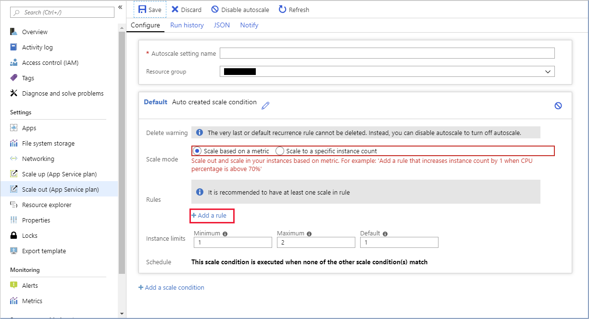
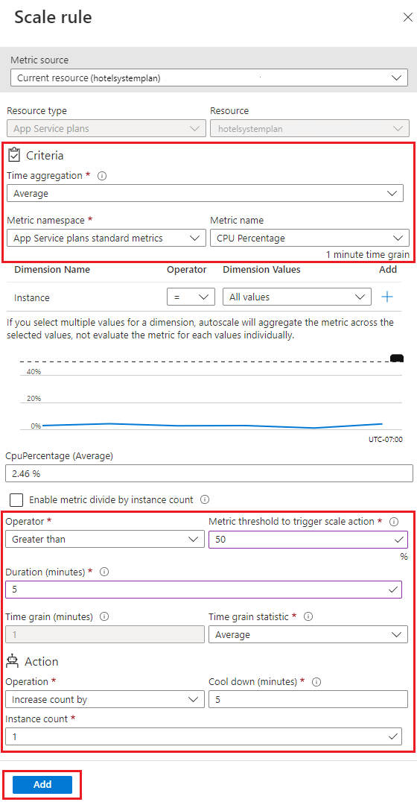
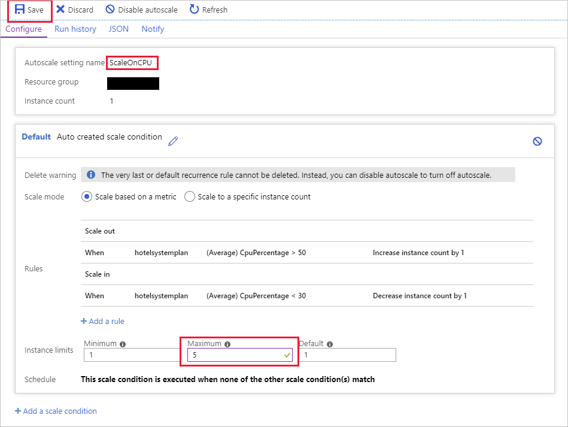
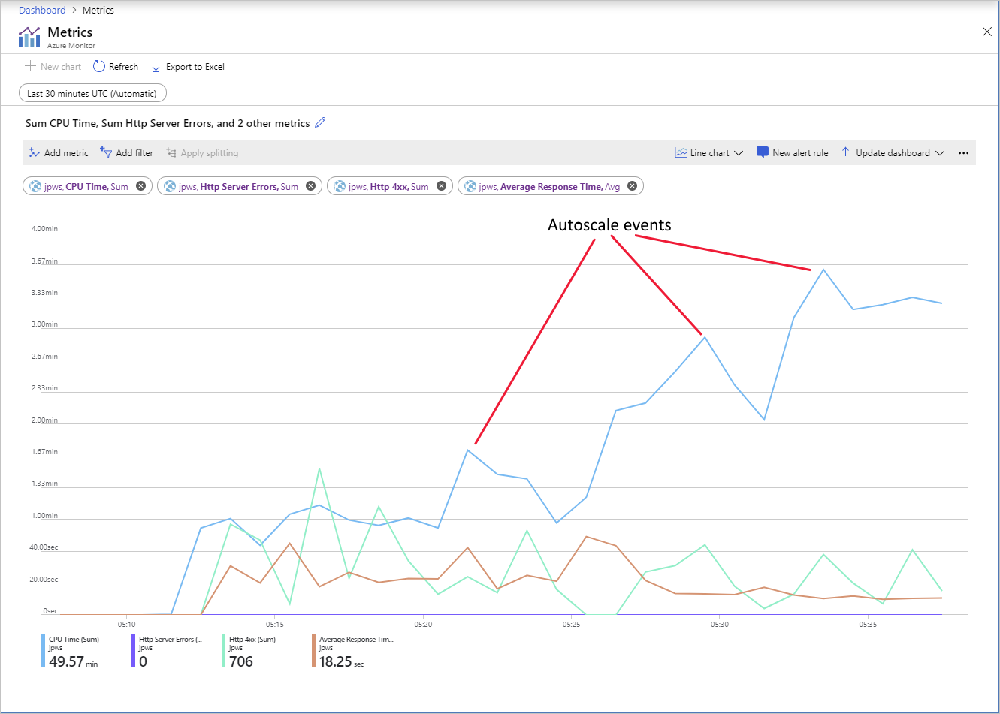
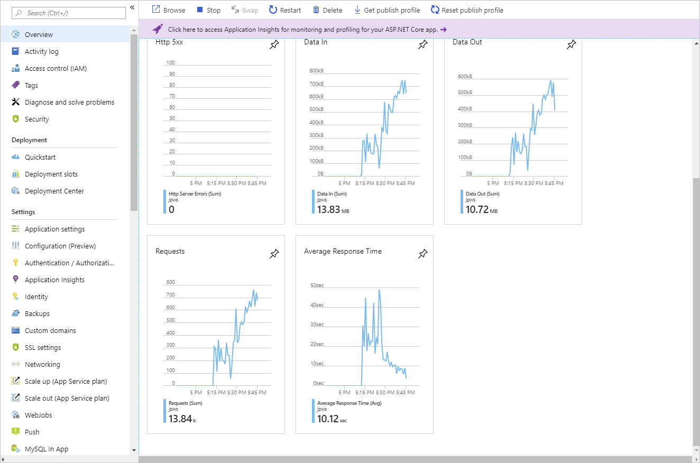
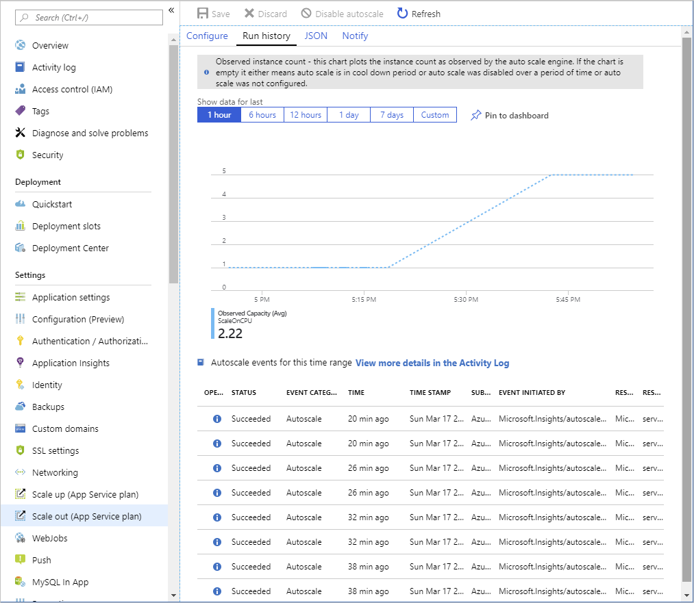

Autoscaling is a key part of ensuring that a system remains available and responsive.

You want to implement autoscaling for the hotel reservation system web app, based on the CPU usage of the host. When the CPU utilization rises over a specific threshold, the web app will scale out. If the CPU usage drops, the web app will scale back in again.

In this unit, you'll set up the web app and run a test client app that imposes a load on the web app. You'll see the types of errors that can occur when the web host becomes overloaded. Next, you'll configure autoscaling for the web app and run the test client again. You'll monitor the autoscale events that occur, and examine how the system responds to the workload.

## Setup

The web app for the hotel reservation system implements a web API. The web API exposes HTTP POST and GET operations that create and retrieve customer's bookings. In this exercise, the bookings aren't saved, and the GET operation simply retrieves dummy data.

The exercise also runs a client app that simulates a number of users issuing POST and GET operations simultaneously. This app provides the workload for testing how the web app autoscales.

[!include[](../../../includes/azure-exercise-subscription-prerequisite.md)]

1. Sign in to the [Azure portal](https://portal.azure.com/?azure-portal=true).

1. From the Azure portal menu, select **Create a resource**.

    

1. Select **Web**, and then select **Web App**.

    

1. Specify the values in the following table for the properties of the web app.

    > [!NOTE]
    > The web app must have a unique name. We suggest using something like **\<*your name or initials*\>hotelsystem**. Use this name wherever you see *\<your-webapp-name\>* in this exercise.

    | Property  | Value  |
    |---|---|
    | Name | *\<your-webapp-name\>* |
    | Subscription | Select the Azure subscription you'd like to use for this exercise  |
    | Resource Group | Create a new resource group called **mslearn-autoscale** |
    | Runtime stack | .NET Core 2.1 |
    | OS | Windows |
    | Publish | Code |

1. Select **Create**.

1. To open the Cloud Shell in the Azure portal, to download the source code for the hotel reservation system, run the following command.

    ```bash
    git clone https://github.com/MicrosoftDocs/mslearn-hotel-reservation-system.git
    ```

1. Move to the `mslearn-hotel-reservation-system/src` folder.

    ```bash
    cd mslearn-hotel-reservation-system/src
    ```

1. Build the apps for the hotel system. There are two apps - a web app that implements the web API for the system, and a client app that you'll use for load testing the web app.

    ```bash
    dotnet build
    ```

1. Prepare the HotelReservationSystem web app for publishing.

    ```bash
    cd HotelReservationSystem
    dotnet publish -o website
    ```

1. Go to the **website** folder containing the published files, zip them up, and deploy them to the web app you created in the previous task. Replace `<your-webapp-name>` with the name of your web app.

    ```bash
    cd website
    zip website.zip *
    az webapp deployment source config-zip --src website.zip --name <your-webapp-name> --resource-group mslearn-autoscale
    ```

## Test the web app before configuring autoscaling

1. Using a web browser, go to `https://<your-webapp-name>.azurewebsites.net/api/reservations/1`. Visiting this URL sends a GET request to the web API to retrieve the details of reservation number 1. You should see a result similar to the one that follows. The response contains a JSON document with the details of the booking. Remember that this is dummy data.

    

1. Return to the Cloud Shell, and move to the **~/mslearn-hotel-reservation-system/src/HotelReservationSystemTestClient** folder.

   ```bash
   cd ~/mslearn-hotel-reservation-system/src/HotelReservationSystemTestClient
   ```

1. Using the **code** editor, edit the App.config file in this folder.

    ```bash
    code App.config
    ```

1. Uncomment the line that specifies the **ReservationsServiceURI**, and replace the value with the URL of your web app. The file should like the example that follows.

    ```text
    <?xml version="1.0" encoding="utf-8" ?>
    <configuration>
        <appSettings>
            <add key="NumClients" value="100" />
            <add key="ReservationsServiceURI" value="https://<your-webapp-name>.azurewebsites.net/"/>
            <add key="ReservationsServiceCollection" value="api/reservations"/>
        </appSettings>
    </configuration>
    ```

    > The **NumClients** setting in this file specifies the number of simultaneous clients that will attempt to connect to the web app and perform work. The work consists of creating a reservation, and then running a query to fetch the details of a reservation – all of the data used is fake and is not actually persisted anywhere. Leave this value set to 100.

1. Save the file, and close the code editor.

1. Rebuild the test client app with the new configuration.

    ```bash
    dotnet build
    ```

1. Run the client app. You'll see a number of messages appear as the clients start running, make reservations, and run queries. Allow the system to run for a couple of minutes. The responses will be slow, and soon the client requests will start to fail with HTTP 408 (Timeout) errors.

    ```bash
    dotnet run
    ```

   

1. To stop the client app, press Enter.

## Enable autoscaling and create a scale condition

1. In the Azure portal, return to your web app.

1. Under **Settings**, select **Scale out (App Service plan)**, and then select **Enable autoscale**.

1. In the default autoscale rule, verify that the scale mode is set to **Scale based on a metric**, and then select **Add a rule**.

    

1. Add a rule that increases the instance count by one if the average CPU utilization across all instances in the web site exceeds 50 percent in the preceding five minutes. This is a scale-out rule.

    

1. Select **Add a rule** again. Add a rule that reduces the instance count by one if the average CPU utilization across all instances in the web site drops below 30 percent in the preceding five minutes. This is a scale-in rule. Remember that it's good practice to define scale rules in pairs.

    

1. In the **Default** auto scale condition window, in the **Instance limits** section, set the **Maximum** instance count to five. Name the Autoscale setting **ScaleOnCPU**, and then select **Save**.

    

## Monitor autoscale events

1. Return to the Cloud Shell, go to the **~/hotelsystem/HotelReservationSystemTestClient** folder, and run the test client again.

    ```bash
    cd ~/hotelsystem/HotelReservationSystemTestClient
    dotnet run
    ```

1. While the client app is running, switch back to the Azure portal showing the autoscale settings for the web app, and select **Run history**. Under **show data for last**, select **1 hour**. Initially, the chart will be empty as it will take several minutes for autoscaling to kick in.

1. While you're waiting for autoscaling events to occur, go to the pane for your web service (not the service plan), and under **Monitoring**, select **Metrics**.

1. Add the following metrics to the chart, set the time range to **Last 30 minutes**, and then pin the chart to the current dashboard:

   - CPU Time. Select the Sum aggregation
   - Http Server Errors. Select the Sum aggregation.
   - Http 4.xx. Select the Sum aggregation.
   - Average Response Time. Select the Avg aggregation.

1. Allow the system to stabilize, and note the CPU Time, the number of HTTP 4.xx errors, and the average response time. Before the system autoscales, you should see a significant number of HTTP 4.xx errors (these are HTTP 408 Timeout errors), and that the average response time is several seconds. There may be the occasional HTTP Server Error, depending on how the web server is coping with the burden.

1. After 10 minutes or so, you should see the following trends in this chart:

   - CPU Time jumps up.
   - Number of HTTP 4.xx errors diminishes.
   - Average response time drops.

    

    Each major spike in the CPU Time indicates that more CPU processing power has become available. This is a result of autoscaling.

1. For the web app and examine the charts, return to the **Overview** page. These charts should indicate the following trends:

    - Data In, Data Out, and Requests metrics have increased.
    - Average Response Time has dropped.
  
    

1. Select **Scale out (App Service plan)**, and then select **Run history**. Select **1 hour**. The graph should now indicate that autoscaling has occurred. The number of instances will have increased (it may have reached five, depending on how long the client app has been running), and you should see a number of autoscale events reported.

    

    > [!NOTE]
    > The autoscale events are reported in pairs. The first event occurs when autoscaling has triggered an increase in the number of instances. The second event occurs when autoscaling has completed.

1. Return to the Cloud Shell. You should see that the app is running more quickly, and far fewer requests are failing.

1. To stop the app, press Enter.

1. After several minutes, if you examine the run history of the App Service Plan, you'll see the number of instances drop. This is the result of the scale-in rule releasing these resources.

You configured autoscaling for the hotel reservation system. The system scaled out when the total CPU usage across all instances hosting the web site exceeded 50 percent in a five-minute period. The system scaled back in when the total CPU utilization dropped below 30 percent, again for a five-minute period. You subjected the hotel reservation system to a test load, and monitored when autoscaling occurred.