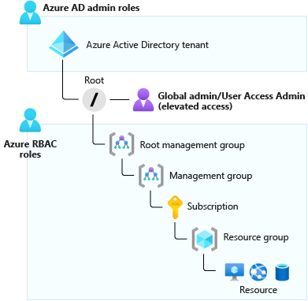

Azure resources and Azure Active Directory (Azure AD) have independent permission systems. Azure role-based access control (Azure RBAC) roles are used to manage access to Azure resources like virtual machines, storage, and much more. Azure AD roles are used to manage access to Azure AD resources such as user accounts and passwords.

In this unit, you'll look at the essential aspects of Azure RBAC roles and Azure Active Directory roles. You'll explore the different scopes available to you. You'll then identify the right role to assign for your scenario.

## Azure RBAC roles

Azure RBAC is the system that allows control over who has access to which Azure resources, and what they can do with those resources. This is accomplished by assigning roles to users, groups, or applications at a particular scope. A role is just a collection of permissions.

For example, you can allow one user, or set of users, to access resources in a subscription. Azure RBAC also allows you to separate responsibility for different resources according to the specializations within your team. For example, give your organization's data scientists access to Azure Machine Learning and any associated resources such as an Azure SQL Database, or Blob storage within a dedicated machine learning resource group. This access isolates these resources from other team members who don't have such skills.

You can specify fine-grained permissions for applications so that a marketing web app only has access to the associated marketing database and storage account. For managers or team members higher up in the organization, you could give access to all resources in a resource group or even a subscription for management purposes and an overview of billing and consumption.

Azure RBAC has many built-in roles, and you can create custom roles.

Here are a couple example built-in roles:

- **Owner**: Has full access to all resources, including the ability to delegate access to other users.
- **Contributor**: Can create and manage Azure resources.
- **Reader**: Can only view existing Azure resources.
- **User Access Administrator**: Can manage access to Azure resources.

## Identify the right scope

Azure RBAC roles can be applied at four levels of scope: management groups, subscriptions, resource groups, and resources. The following diagram shows an example with the hierarchy for these four levels.

Azure management groups help you manage your Azure subscriptions by grouping them together. If your organization has many subscriptions, you may need a way to efficiently manage access, policies, and compliance for those subscriptions. Azure management groups provide a level of scope above subscriptions.

Azure subscriptions help you organize access to Azure resources and how resource usage is reported, billed, and paid for. Each subscription can have a different billing and payment setup, so you can have different subscriptions and different plans by office, department, project, and so on.

Resource groups are containers that holds related resources for an Azure solution. The resource group includes those resources that you want to manage as a group. You decide which resources belong in a resource group based on what makes the most sense for your organization.

The scope is important and establishes which resources should have a specific type of access applied. Imagine someone needs access to VMs. You could use the Virtual Machine Contributor role, with the ability to manage virtual machines, limited to a specific resource group. You can set the scope for a role to a specific resource, resource group, subscription, or management group level.

By combining an Azure RBAC role and a scope, you can set incredibly tailored permissions on your Azure resources.

## Azure AD roles

Azure AD also has its own set of roles that mostly apply to users, passwords, and domains. These roles have different purposes. Here are a few examples:

- **Global Administrator**: Can manage access to administrative features in Azure AD. This role can give administrator roles to other users, and handle password reset for any user or administrator. By default, whoever signs up for the directory is automatically assigned this role.

- **User Administrator**: Can manage all aspects of users and groups, including support tickets, monitoring service health, and changing passwords for certain types of users. 

- **Billing Administrator**: Can make purchases, manage subscriptions and support tickets, and monitor service health. Azure has granular billing permissions that are in addition to RBAC. The billing permissions available depend on the agreement you have with Microsoft.

## Differences between Azure RBAC and Azure AD roles

The main difference between Azure RBAC roles and Azure AD roles is the area they cover. Azure RBAC roles apply to Azure resources, while Azure AD roles apply to Azure AD resources (particularly users, groups, and domains). Also, Azure AD has only one scope, the directory, while Azure RBAC's scope covers management group, subscription, resource group, and resource.

There's a key area of overlap. An Azure AD Global Administrator can elevate their access to manage all Azure subscriptions and management groups. This access grants them the Azure RBAC User Access Administrator role for all subscriptions of their directory. The User Access Administrator role enables the Global Administrator to give other users access to Azure resources. In our scenario, you need to give full Azure RBAC management and billing privileges to a new manager. To achieve this, you'll temporarily elevate your access to include the User Access Administrator role. You can then grant the new manager the Owner role so that they can create and manage resources. You also set the scope to the subscription level, so that they can do this for all resources in the subscription.

The following diagram shows what resources the Global Administrator can view when their permissions are elevated to User Access Administrator.

