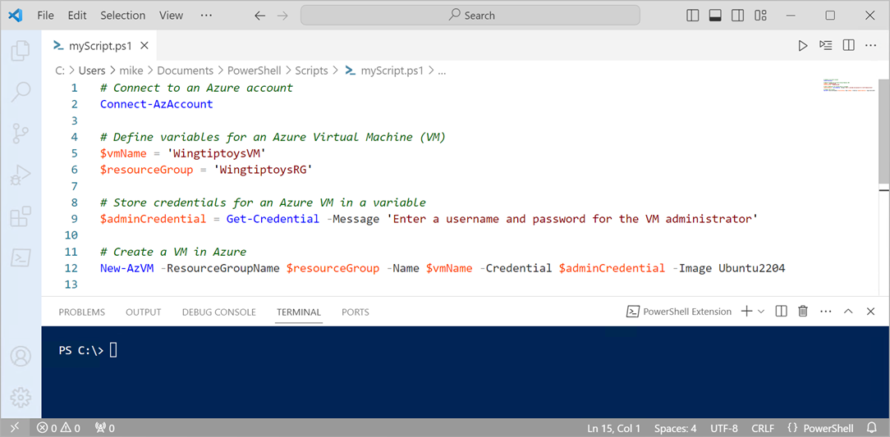

<!-- markdownlint-disable MD041 -->

Complex or repetitive tasks can be time-consuming and error-prone when performed manually.
Organizations prefer to automate these tasks to reduce costs and avoid mistakes.

Automation is essential in the Customer Relationship Management (CRM) example, where you're testing
your software on multiple Linux virtual machines (VMs) that need to be continuously deleted and
re-created. Using a PowerShell script to automate VM creation is much more efficient and reliable
than manually creating them each time.

Beyond the core operation of creating a VM, your script needs to meet a few other requirements:

- **Create multiple VMs**: Use `New-AzVM` to create multiple uniquely named VMs.
- **Resource group parameter**: Allow the script to accept the name of the resource group as a
  parameter.

In this unit, you learn how to write and execute a PowerShell script that meets these
requirements.

## What is a PowerShell script?

A PowerShell script is a text file containing commands and control constructs. The commands are
invocations of cmdlets, and the control constructs are programming features like loops, variables,
parameters, comments, etc. supplied by PowerShell.

PowerShell script files have a `.ps1` file extension. You can create and save these files using any
text editor.

> [!TIP]
> If you're writing PowerShell scripts, consider using Visual Studio Code (VS Code), which is free
> and supported on Windows, Linux, and macOS. The PowerShell extension for VS Code offers features
> like syntax highlighting and a list of available cmdlets.

The following screenshot is an example of VS Code with a sample script to connect to Azure and
create a virtual machine:

>

Once you create a script, you can execute it from the PowerShell command line by passing the name of
the file preceded by a dot for the current directory and a backslash:

```powershell
.\myScript.ps1
```

## PowerShell techniques

PowerShell includes features commonly found in programming languages. You can define variables, use
branches and loops, capture command-line parameters, write functions, add comments, and more. For
the script you're focusing on, you need three key features: variables, loops, and parameters.

### Variables

In PowerShell, variables are declared using the dollar sign (`$`) and assigned values using the
equals (`=`) operator. For example:

```powershell
$location = 'eastus'
```

To determine the value stored in a variable, use the `$` prefix and its name:

```powershell
$location
```

Variables can hold objects. For example, the following definition sets the `$adminCredential`
variable to the object returned by the `Get-Credential` cmdlet:

```powershell
$adminCredential = Get-Credential
```

### Loops

PowerShell has several loop structures, including `For`, `Foreach`, `Do-Until`, `Do-While`, and
`While`. The `Foreach` loop is a good choice for scenarios where you need to execute a loop over a
set of values in a collection.

```powershell
$items = 1..3
foreach ($item in $items) {
    $item
}
```

### Parameters

When you create a PowerShell script, you can add parameters to the script and then specify values
for these parameters when executing the script. For example:

```powershell
.\setupEnvironment.ps1 -VmCount 5 -Location eastus
```

Inside the script, capture the values into variables. In this example, the parameters are
**VmCount** and **Location**:

```powershell
param (
    [int]$VmCount,
    [string]$Location
)
```

You can use these parameters as input and a loop to create a set of VMs based on the given
parameters. This approach keeps the script generic and avoids repeating the same code.

## Combining techniques

The combination of PowerShell language features and Azure PowerShell cmdlets provides all the tools
you need to automate Azure tasks. In the CRM example, you can create multiple Linux VMs using a
parameterized script and a loop to streamline the process. This script allows you to perform a
complex operation in a single step.

### Example script

Here's an example script that demonstrates using variables, loops, and parameters to create multiple
VMs:

```azurepowershell
param (
    [int]$VmCount = 3,
    [string]$ResourceGroupName,
    [string]$Location = 'eastus'
)

$adminCredential = Get-Credential

$vms = 'web','app','sql'

foreach ($vm in $vms) {
    $vmName = "testvm-$vm"

    $azVmParams = @{
        ResourceGroupName   = $ResourceGroupName
        Name                = $vmName
        Credential          = $adminCredential
        Location            = $Location
        Image               = 'Canonical:0001-com-ubuntu-server-jammy:22_04-lts:latest'
        OpenPorts           = 22
        PublicIpAddressName = $vmName
    }
    New-AzVM @azVmParams
}
```

### Executing the script

Save the script as `CreateVMs.ps1` and run it from the PowerShell command line, providing the
required parameters:

```powershell
.\CreateVMs.ps1 -ResourceGroupName <resource-group-name>
```

Using this script, you can efficiently create multiple VMs in different resource groups, automating
repetitive tasks and ensuring consistency across your Azure environment.
