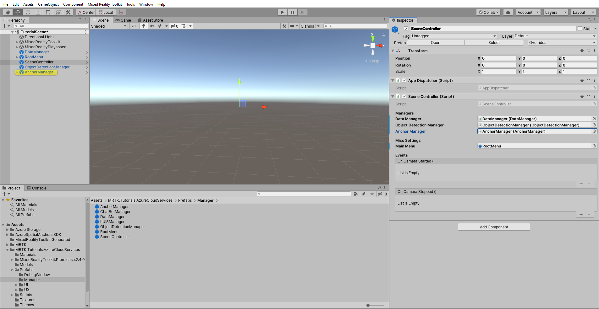

In this module, you will learn how to use **Azure Spatial Anchors**. You will store the location of a **Tracked Object** as an Azure Spatial Anchor. Once you query for the anchor, an arrow will appear to guide you toward the location.

## Understanding Azure Spatial Anchors

**Azure Spatial Anchors** is part of the Azure Cloud Services family and is used to save anchor locations. The saved anchor locations can be retrieved based on the *anchor ID* from the cloud. This anchor location can be shared and accessed by multi-platform devices like HoloLens, iOS, and Android devices.

Learn more about [Azure Spatial Anchors](/azure/spatial-anchors/overview).

## Preparing Azure Spatial Anchors

Before you can start, you have to create a spatial anchor resource in your Azure portal.
Learn how to make a [spatial anchor resource](/azure/spatial-anchors/quickstarts/get-started-hololens#create-a-spatial-anchors-resource).

## Preparing the scene

In this section, you will learn how to configure the scene and make the necessary changes.

1. In the Project window, navigate to the **Assets > MRTK.Tutorials.AzureCloudServices > Prefabs > Manager**

2. From the **Manager** folder, drag and drop the prefab **Anchor Manager** into the scene Hierarchy.

3. Select **Anchor Manager** GameObject in the Hierarchy, and in the Inspector section, you will find **Spatial Anchor Manager** (Script). Find account ID and key field and add the credentials which you had created in the prerequisite in the earlier stage.

4. Now find the **Scene Controller** object in your scene Hierarchy and select it. You will see the **Scene Controller** Inspector.

5. You will observe that the **Anchor Manager** field in the **Scene Controller** component is empty, drag and drop the **Anchor Manager** from the Hierarchy in the scene into that field and save the scene.

## Build and Deploy the app to your HoloLens 2

Azure Spatial Anchors can not run in Unity, so to test the Azure Spatial Anchors functionality, you need to deploy the project to your device.

> [!TIP]
> For a reminder on how to build and deploy your Unity project to HoloLens 2, you can refer to the Building your application to your HoloLens 2 instructions.

## Run the app on your HoloLens 2 and follow the in-app instructions

### Create an anchor to store a location

In this section you will see how to save the object location.

1. Run the application and click on **Set Object** in the main menu of the experience.

2. Give the **name** of the object you want to save and click on **Set Object** to continue. To add more information about the object, select the **image**, and describe the object.

3. To save the location, click on **Save Location**

4. You will see an **anchor pointer** that you can move and place on the location you want to save. After that, you will get a confirmation popup. If you want to confirm and save the location, click on **Yes**; otherwise, you can change the location by clicking on **No** and selecting the location again.

5. Once you confirm the location by clicking on **Yes**, the location and the Anchor ID will be saved in the Azure cloud storage. Once it is saved, you will see the **Object tag**  in the anchor with the object's name.

Now the object location is saved successfully.

### Query for finding an anchor location

1. Once after you successfully saved the anchor location, now you can find the anchor location by selecting **Search Object** in the main menu.

2. After clicking on **Search Object**, a new window will pop up in which you should give the name of the object you want to search.

3. Enter the name of the object and click on **Search Object**. If the object is saved previously and is found in the database, you will get the object card with all the details of the object you would have saved earlier.

4. Now you can click on **Show Location** to find the object. Once you click on **Show Location**, the system will query the object address from the cloud storage.

5. After successfully retrieving the location, an **arrow** will direct you towards the location of the object. Follow the arrow mark until you find the location of the object.

6. Once you find the object, the object name will appear at the top, and the arrow mark will disappear, and now you can click on the **object tag** to see the details of the object.