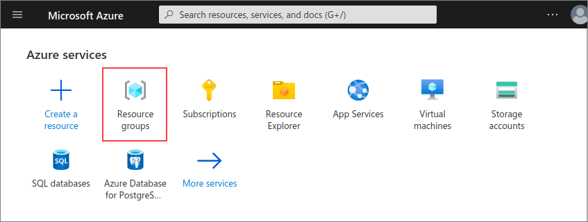
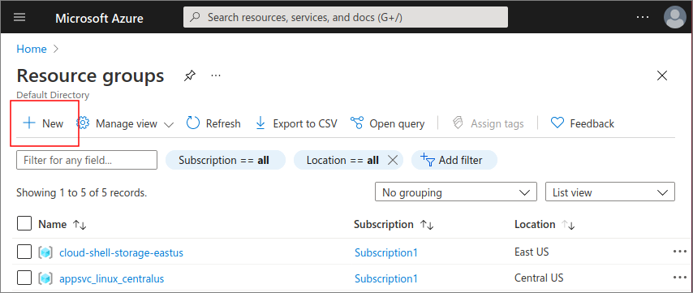
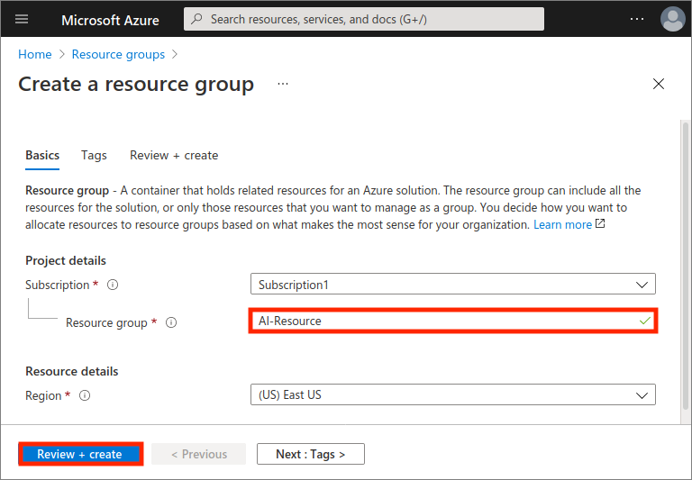
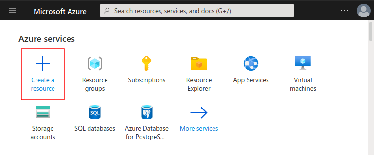
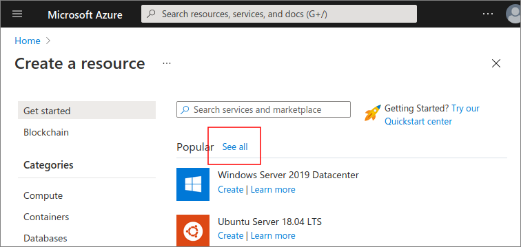
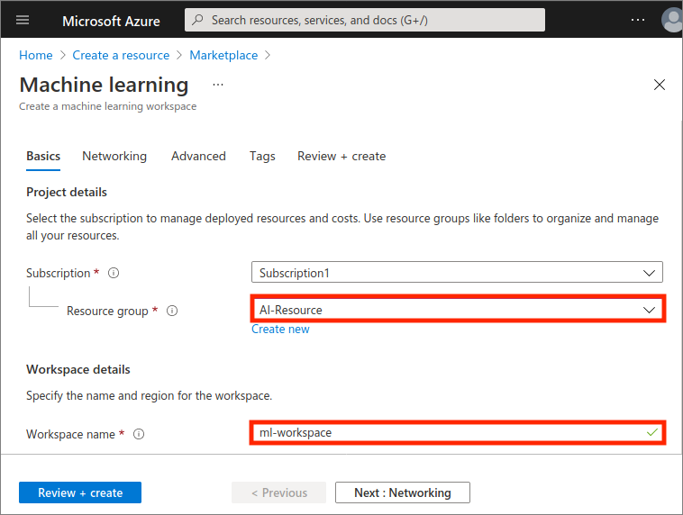

 A [Machine Learning Workspace.](https://docs.microsoft.com/en-us/azure/machine-learning/concept-workspace) is probably one of the most interesting resources to Data Scientists and ML Engineers.

It is the top level resource where you work with artifacts needed in Azure Machine Learning, such as datasets, models and user roles.

In this exercise we will setup an Azure Ml Workspace, which will be used in following exercises and modules.

## Prerequisites

- Azure Account and a Subscription

If you don't have an Azure subscription yet, please follow the instructions in the link below:

[Create a subscription in the Azure portal.](https://docs.microsoft.com/en-us/azure/cost-management-billing/manage/create-subscription#create-a-subscription-in-the-azure-portal)

## Sign in to Azure

Sign in to the [Azure portal.](https://portal.azure.com)

## Create a Resource Group

A Resource Group is where administrators can create logical groups of resources, like storage volumes, virtual machines and ML workspaces, so they can more easily track costs, apply access controls and monitor activity.

Let's create a Resource Group for this exercise:

1. In the Azure Portal, select **Resource Groups**:

   

2. Click **New** in the resource groups list:

   

3. Fill in the form to add a new Resource Group

   - Select your previously created subscription.
   - Use **AI-Resource** as the Resource group's name.
   - Select your preferred region.

   

## Create ML Workspace

To create a ML Workspace, follow these steps:

1. Select **Create a resource** in the Azure Portal:

   

2. Ckick on **See all**.

   

3. Scroll down until the **AI + Machine Learning** option is visible.

   

4. Fill in the form, selecting your current subscription and the resource group we had previsously created (AI-Resource). Use **ml-workspace** as the workspace name:

   

5. Click on the **Review + create** button to load a review confirmation screen:

   

6. Click on **Create** to start deploying your new workspace (this can take a few minutes).

> [!IMPORTANT]
> Notice that the deployment above created other resources:  
>  
> - A [storage account](https://azure.microsoft.com/services/storage/) - used to store files used by the Workspace as well as data for experiments and model training.
>   - An [Application Insights](https://azure.microsoft.com/services/application-insights/) instance, used to monitor predictive services in the Workspace.
>   - An [Azure Key Vault instance](https://azure.microsoft.com/services/key-vault/), used to manage secrets such as authentication keys and credentials used by the Workspace.
>   - A [container registry](https://azure.microsoft.com/services/container-registry/), created as-needed to manage containers for deployed models.

## Create a Custom Role and Assign it to the Workspace

1. Open Azure Cloud Shell

   Click on the Cloud Shell Icon:
    or use the direct URL in your browser:
   https://shell.azure.com.

1. Select Bash or Powershell (we will use `bash`):

   

## Define a Custom Role:

1. Using a text editor of your choice, create a file called `data_scientist_custom_role.json`, replacing the information below:

   | Variable              | Value                |
   | --------------------- | -------------------- |
   | <subscription_id>     | Your subscription ID |
   | <resource_group_name> | AI-Resource          |
   | <workspace_name>      | ml-workspace         |
   ```json
   {
     "Name": "Data Scientist Custom",
     "IsCustom": true,
     "Description": "Can run experiment but can't create or delete compute.",
     "Actions": ["*"],
     "NotActions": [
       "Microsoft.MachineLearningServices/workspaces/*/delete",
       "Microsoft.MachineLearningServices/workspaces/write",
       "Microsoft.MachineLearningServices/workspaces/computes/*/write",
       "Microsoft.MachineLearningServices/workspaces/computes/*/delete",
       "Microsoft.Authorization/*/write"
     ],
     "AssignableScopes": [
       "/subscriptions/<subscription_id>/resourceGroups/<resource_group_name>/providers/Microsoft.MachineLearningServices/workspaces/<workspace_name>"
     ]
   }
   ```
1. Upload the role definition file:

   - Click on the **upload/Download files** icon
   - Select **Upload**
   - Select the `data_scientist_custom_role.json` file you created above:

   

1. Create a role definition using the `az role definition create` CLI command (notice that the last argument is the file we just uploaded):
   ```sh
   az role definition create --role-definition data_scientist_custom_role.json
   ```

This adds the "Data Scientist Custom" role which is limited to running experiments in the `ml-workspace`.

To verify and list existing roles using the Azure Portal, select the option **Access Control (IAM)** on your `ml-workspace` then select the **Roles** tab:


<!-- ## Assign Custom Role to an User
Finally, to assign this role to an user, use the CLI commans below:
```sh
# Add machine learning extension
az extension add --name ml
# Assing custom role to user
az ml workspace share -w ml-workspace -g AI-Resource --role "Data Scientist Custom" --user user@your-domain.com
```
 -->
## Summary

Congratulations!

In this unit you've covered the following topics:

- Creating a Resource group
- Creating a Machine Learning Workspace
- Using the Cloud Shell to run commands and uploading files to your account
- Defining a Custom Role for Machine Learning with access to your workspace

<!-- - Assigning roles to an user -->

## More Resources

To read more about Workspaces and Custom Roles visit:

- [What is an Azure Machine Learning workspace?](/azure/machine-learning/concept-workspace)
- [Manage Azure Resource Manager resource groups by using the Azure portal](/azure/azure-resource-manager/management/manage-resource-groups-portal#what-is-a-resource-group)
- [Manage access to an Azure Machine Learning workspace](/azure/machine-learning/how-to-assign-roles)