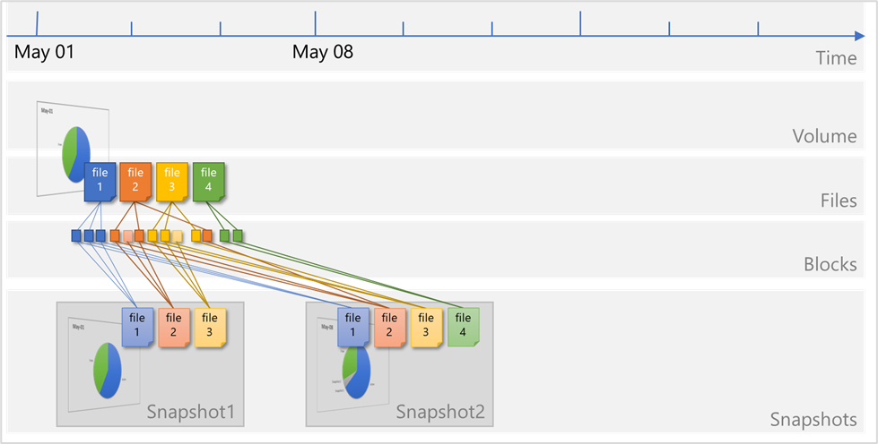

Azure NetApp Files is an enterprise-class, high-performance, fully managed NAS service for shared file storage. It's a first-party service, natively integrated with Microsoft Azure and optimized for use with other Azure services. Deployment and management can be done through the Azure portal, CLI, Azure PowerShell, ARM templates, and more. Monitoring is also available natively through Azure monitor.

## Performance

Azure NetApp Files is designed to deliver the highest performance for even the most demanding Windows and Linux workloads. This performance is delivered by Azure NetApp Files using dedicated NetApp engineered platforms running NetApp's proprietary ONTAP operating system, which is optimized for extremely high storage throughput and availability.

A single Azure NetApp Files volume can deliver up to 5,025 MiB/s of throughput at sub-millisecond latencies. Multiple volumes can be deployed to scale up performance as needed. By default, up to 8 Azure NetApp Files volumes can be attached to a single Azure VMware Solution (AVS) software-defined data center (SDDC). This limit can be increased to 256 via a support request.

## Data management

Azure NetApp Files offers a complete range of enterprise-grade data management features. These include snapshots, replication, integrated backup, volume cloning, and more. These features provide protection and flexibility for AVS virtual machines (VMs) and workloads hosted on the service, without affecting performance.

### Snapshots

Azure NetApp Files snapshots are point-in-time images of a volume. These snapshots have low overhead because of the way Azure NetApp Files performs volume virtualization. Snapshots utilize pointer manipulation to the actual data blocks on disk. However, unlike a database, it doesn't rewrite existing blocks. New blocks are written to unused locations in the system. Pointers are updated to reflect the changes while snapshots maintain point-in-time representations of the data present in the system at the time the snapshots were taken.

The following diagram illustrates the snapshot process:

1. A snapshot (`Snapshot1`) is created.

   

2. Changed data (`file2` is updated and `file4` is added) is written to a new block; the pointer is updated. The snapshot pointer still points to the previously written block, giving you both a live view and a historical view of the data.

   

3. Another snapshot (`Snapshot2`) is created, providing access to three generations of data: the live data, `Snapshot2`, and `Snapshot1`. The snapshots are presented in descending order of age without taking up the volume space that three full copies require.

   

An Azure NetApp Files snapshot only manipulates block pointers, creating a "frozen," read-only view of a volume. By design snapshots cannot be modified, only deleted once they expire useful life on the system.

Actual data blocks aren't copied, which leads to two efficiencies:

- **Speed**: Creating a snapshot is near-instantaneous. No matter the volume size, creating a snapshot takes only a few seconds. Reverting a volume to a snapshot is also near-instantaneous, supporting fast data recovery in case of a corruption or malicious hijack event.
- **Space**: A snapshot consumes minimal storage space because it doesn't copy the data blocks of the entire volume. Two snapshots taken in sequence differ only by the blocks added or changed in the time interval between the two.
You can create up to 255 snapshots per volume. Creating a snapshot doesn't impact volume performance. You can create and maintain snapshots in two ways:
- **Manual**: Create on-demand snapshots by using the Azure portal, Azure CLI, Azure PowerShell, or Azure REST API.
- **Automatic**: Automated snapshot creation. You can set up snapshot policies by using the Azure portal, Azure CLI, Azure PowerShell, or Azure REST API.

## Replication

**Cross-zone replication:** Azure NetApp Files replication can provide data protection through cross-zone volume replication. You can asynchronously replicate data from an Azure NetApp Files volume in one zone (source) to another Azure NetApp Files volume in another zone within the same region (destination). This capability enables you to failover your critical applications if there's a zone outage or disaster.

**Cross-region replication:** Azure NetApp Files replication functionality can provide data protection through cross-region volume replication. You can asynchronously replicate data from an Azure NetApp Files volume in one region (source) to another Azure NetApp Files volume (destination) in another region (destination). This capability enables you to failover your critical applications if there's a region-wide outage or disaster.

## Azure NetApp Files integration with Azure VMware Solution

Azure NetApp Files improves utilization of AVS resources, lowers total cost of ownership (TCO), and delivers advanced data management functionality.

As business needs change, Azure NetApp Files storage can be scaled independently of AVS compute, optimizing TCO. Azure NetApp Files offloads I/O and memory from AVS hosts which can improve AVS performance and free up resources for other VMs.

Azure NetApp Files delivers enterprise grade performance, availability and data management. Efficient snapshots and clones can rapidly create copies and protect data. Cross-zonal and cross-region replication enable integrated backup and disaster recovery for AVS VMs.
