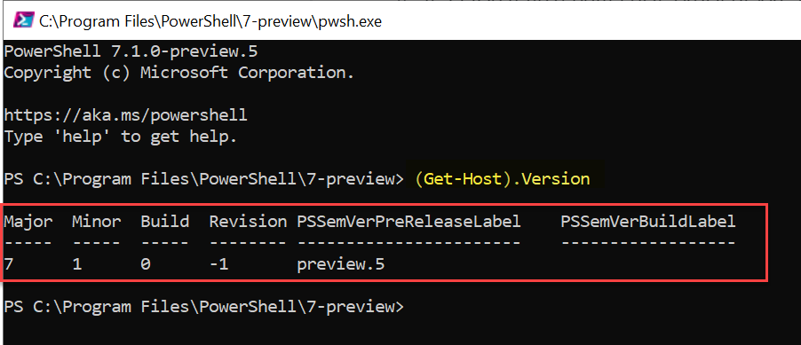

There are always questions on the mind of anyone deploying or modifying resources in an existing environment.

- Will I break something?
- How will this deployment affect existing resources?
- Can I validate that what we are thinking will happen is actually what will happen deployment before hitting the deploy button?

deploying and hoping for the best is **NOT** the approach you should be taking.  The "what-if" operation is here to address this.

Azure Resource Manager now provides the what-if operation to highlight the changes when you deploy a template. The what-if operation doesn't make any changes to existing resources. Instead, it predicts the changes if the specified template is deployed at a resource group and subscription level.

> [!NOTE]
> The ***what-if*** operation is currently in preview. As a preview release, the results may sometimes show that a resource will change when actually no change will happen. We're working to reduce these issues, but we need your help. Please report these issues at https://aka.ms/whatifissues.
>

## What-if prerequisites

### PowerShell

To use what-if in PowerShell, you must have version **4.2 or later of the Az module**.

Before installing the required module, make sure you have PowerShell Core (6.x or 7.x). If you have PowerShell 5.x or earlier, [update your version of PowerShell](https://docs.microsoft.com/powershell/azure/install-az-ps?view=azps-4.4.0&WT.mc_id=MSLearn-ARM-pierrer). You can't install the required module on PowerShell 5.x or earlier.

To verify the PowerShell version you can use the following command in a PowerShell session:

```azurepowershell
(Get-Host).Version
```



To install this module use the following command in an elevated privileged (running PowerShell as administrator) PowerShell session:

```azurepowershell
Install-Module -Name Az -Force
```

if you have an older version of the Az Module, and need to update it, use the following command, again in an elevated privileged (running PowerShell as administrator) PowerShell session:

```azurepowershell
Update-Module -Name Az
```

### Azure CLI

To use what-if in Azure CLI, you must have Azure CLI 2.5.0 or later. If needed, [install the latest version of Azure CLI](https://docs.microsoft.com/cli/azure/install-azure-cli?view=azure-cli-latest&WT.mc_id=MSLearn-ARM-pierrer).

