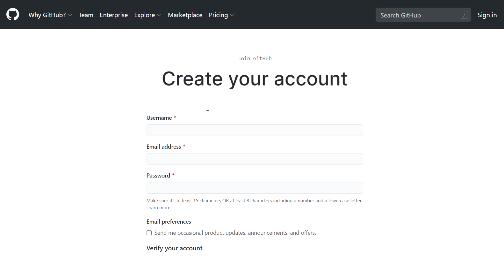
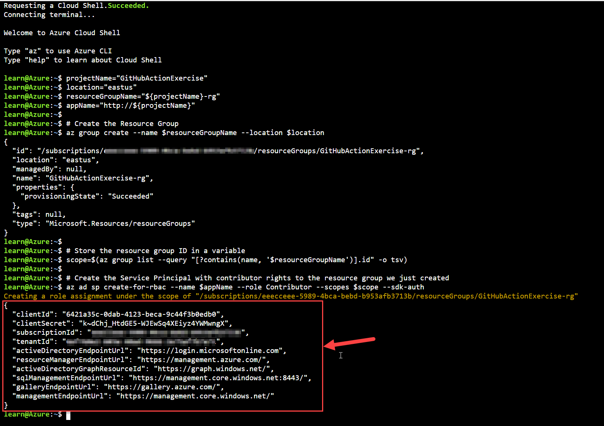
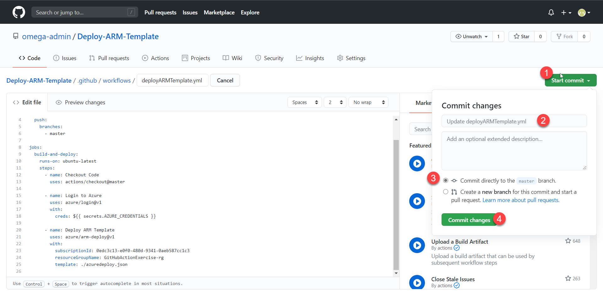

Here you'll deploy an Azure Resource Manager (ARM) template from a GitHub Action workflow.

> [!IMPORTANT]
> This exercise is performed outside of the Microsoft Learn environment.  It requires you to have your own Azure subscription to run this exercise and you may incur charges. This is required since you will need to create a Service Principle which is **NOT** supported in the Sandbox subscription. If you don't already have an Azure subscription, create a [free account](https://azure.microsoft.com/free/?azure-portal=true) before you begin.

## Create your GitHub account and repository

First,  If you do not have a GitHub account, please create one now (It's free) by navigating to the [GitHub account creation page](https://github.com/join?ref_cta=Sign+up&ref_loc=header+logged+out&ref_page=%2F&source=header-home).



Once you have the account created, sign-in and create a new repository where you will keep your templates as part of Infrastructure as Code (IaC) model.  To create the repository (or *repo* as it's affectionately referred to in the industry) follow the steps below:

1. In the upper-right corner of any page in the GitHub site, use the **+** drop-down menu, and select New repository. or click on the green `Create repository` button, if it's there.

    
1. Type a short, memorable name for your repository. For example, "Deploy-ARM-Template" and optionally, add a description of your repository. For example, "Deploying my first ARM template with GitHub Action"
1. Choose a repository visibility setting.  Public repositories are accessible to everyone on the internet. Private repositories are only accessible to you, people you explicitly share access with. (Either will work with this exercise)
1. Select Initialize this repository with a README.
1. Click Create repository.

    

Now that you have created your new repository, you initialized it with a README file. it's time to commit a template and a template parameter file to the repo.

> [!NOTE]
>README files are a great place to describe your project in more detail, or add some documentation such as how to install or use your project. The contents of your README file are automatically shown on the front page of your repository.

## Commit an ARM Template file to the repo

1. On GitHub, navigate to the main page of the repository
1. Above the files listing, using the *Add file* drop-down, click Create new file.
    
1. In the file name field, type the name and extension for the template. In this case for our exercise, you will use the name `azuredeploy.json` and copy and paste the template in the code block below into your new GitHub file.

    ```json
    {
        "$schema": "https://schema.management.azure.com/schemas/2019-04-01/deploymentTemplate.json#",
        "contentVersion": "1.0.0.0",
        "parameters": {
            "VnetName": {
                "type": "string",
                "defaultValue": "VNet-001",
                "metadata": {
                    "description": "Virtual Network Name"
                }
            },
            "CostCenterIO": {
                "type": "string",
                "defaultValue": "12345",
                "metadata": {
                    "description": "Cost Center IO number for cross billing"
                }
            },
            "OwnerName": {
                "type": "string",
                "defaultValue": "John Smith",
                "metadata": {
                    "description": "Name of the stakeholder responsible for this resource"
                }
            }
        },
        "variables": {},
        "resources": [
            {
                "apiVersion": "2018-10-01",
                "type": "Microsoft.Network/virtualNetworks",
                "name": "[parameters('VnetName')]",
                "location": "[resourceGroup().location]",
                "tags": {
                    "CostCenter": "[parameters('CostCenterIO')]",
                    "Owner": "[parameters('OwnerName')]"
                },
                "properties": {
                    "addressSpace": {
                        "addressPrefixes": [
                            "10.0.0.0/16"
                        ]
                    },
                    "enableVmProtection": false,
                    "enableDdosProtection": false,
                    "subnets": [
                        {
                            "name": "subnet001",
                            "properties": {
                                "addressPrefix": "10.0.0.0/24"
                            }
                        },
                        {
                            "name": "subnet002",
                            "properties": {
                                "addressPrefix": "10.0.1.0/24"
                            }
                        }
                    ]
                }
            }
        ]
    }
    ```

1. Add a description in the "Commit new file" section and click "Commit new file" to save it to your repo

      

## Configure authentication between GitHub Actions and your Azure subscription

To deploy any resources to Azure using GitHub Actions, you need to create an Azure Service Principal and give it permissions to create resources defined in your templates.  You will perform that step in the Azure Shell section of your Azure portal once you are logged in to your subscription.

### Create the service principal

The service principal of a GitHub Action workflow typically needs the built-in contributor right in order to deploy Azure resources.

The following Azure CLI script shows how you can generate an Azure Service Principal with Contributor permissions on an Azure resource group. This resource group is where the workflow will deploy the resources defined in your ARM template.

```azurecli
projectName="GitHubActionExercise"
location="eastus"
resourceGroupName="${projectName}-rg"
appName="http://${projectName}"

# Create the Resource Group
az group create --name $resourceGroupName --location $location

# Store the resource group ID in a variable
scope=$(az group list --query "[?contains(name, '$resourceGroupName')].id" -o tsv)

# Create the Service Principal with contributor rights to the resource group we just created
az ad sp create-for-rbac --name $appName --role Contributor --scopes $scope --sdk-auth
```

In the portal while logged in your subscription, click on the `shell` icon to open the Azure Shell at the bottom of your page.


In the shell, use the code above to create the service principal.  You will end up with the following results.  Copy the JSON part of the results (the content in the red box below) because you will need it when configuring the secret in GitHub.



Copy the JSON output and store it as a GitHub secret within your GitHub repository. To do this,  from your GitHub repository, select the `Settings` tab, and Select `Secrets` from the left menu.

Enter the following values:

Name: AZURE_CREDENTIALS
Value: **(Paste the JSON output you copied earlier)**
Select Add secret.


This is the information you will need to specify the authentication in the workflow.

## Create workflow

The workflow file must be stored in the .github/workflows folder at the root of your repository. The workflow file extension can be either .yml or .yaml.

You can either create a workflow file and then push/upload the file to the repository, or use the following procedure to create it in the GitHub interface:

1. From your GitHub repository, select `Actions` from the top menu, and select **set up a workflow yourself**.
    
1. Rename the workflow file if you prefer a different name other than main.yml. For example: deployARMTemplate.yml.
1. Replace the content of the yml file with the following:
    > [!NOTE]
    > The [GitHub Marketplace](https://github.com/marketplace) has some custom built actions you can leverage to deploy ARM templates.  This module uses the ["Deploy Azure Resource Manager (ARM) Template"](https://github.com/marketplace/actions/deploy-azure-resource-manager-arm-template) marketplace provider.

    ```yml
    name: Deploy ARM Template

    on:
      push:
        branches:
          - master
    env:
      AZURE_SUBSCRIPTION_ID: << Subscription Id >>   # set this to your Azure Subscription Id
      AZURE_RESOURCE_GROUP: GitHubActionExercise-rg   # set this to your target resource group

    jobs:
      deploy-virtual-network-template:
        runs-on: ubuntu-latest
        steps:
          - name: Checkout source code
            uses: actions/checkout@master

          - name: Login to Azure
            uses: azure/login@v1
            with:
              creds: ${{ secrets.AZURE_CREDENTIALS }}

          - name: Deploy ARM Template
            uses: azure/arm-deploy@v1
            with:
              scope: subscription
              subscriptionId: ${{ env.AZURE_SUBSCRIPTION_ID }}
              resourceGroupName: ${{ env.AZURE_RESOURCE_GROUP }}
              template: $GITHUB_WORKSPACE/azuredeploy.json
    ```

    #### The workflow file has tree sections

    - name: The name of the workflow.
    - on: The name of the GitHub events that triggers the workflow. The workflow is triggered when there is a push event on the master branch, which modifies at least one file in the master branch.
    - jobs: A workflow run is made up of one or more jobs. There is only one job called         `deploy-virtual-network-template`. This job has three steps:
          - Checkout source code
          - Login to Azure
          - Deploy ARM template.

    > [!IMPORTANT]
    > **Verify** the secret name in the following expression **creds: ${{ secrets.AZURE_CREDENTIALS }}** matches the name of the secret to what you saved to your repository's settings. **Verify** that the ARM template name in the **Deploy ARM Template** step **`template: $GITHUB_WORKSPACE/azuredeploy.json`** matches the one you saved in the repo earlier.

    > [!NOTE]
    >The resource group name should be **GitHubActionExercise-rg** if you used the Azure CLI code above in the Configure deployment credentials section, the generated resource group name is the project name with rg appended.
1. Select Start commit. Add a comment and description if needed.
1. Ensure that `Commit directly to the master branch` is selected and click `Commit new file` (or Commit changes)
    

    Once the workflow file is created and committed to the master branch of the repo, the workflow will start automatically since the trigger in your workflow ia a commit/push to the master branch

    ```yml
    on:
      push:
        branches:
          - master
    ```

1. By navigating to your repo and in the  section, you will be able to see the status of your workflow.
    

## Check your deployment

When the workflow is completed, go to the Azure portal to check the deployments status.

1. In the left pane, select Resource groups and select **GitHubActionExercise-rg**, navigate to the `Deployments` pane and verify that your deployment succeeded.

    
