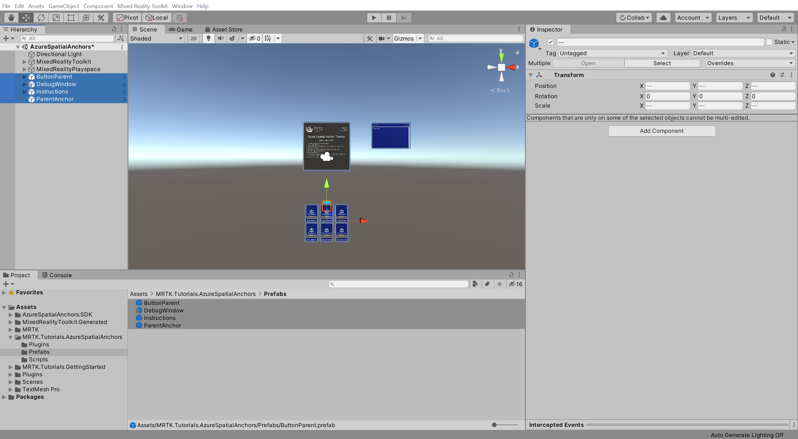
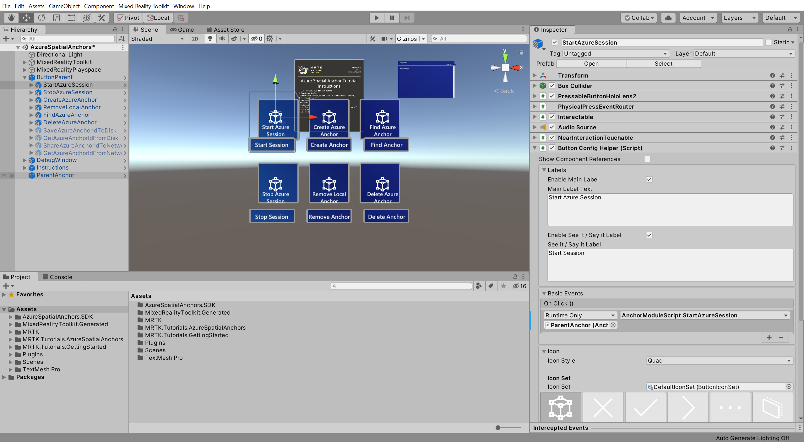
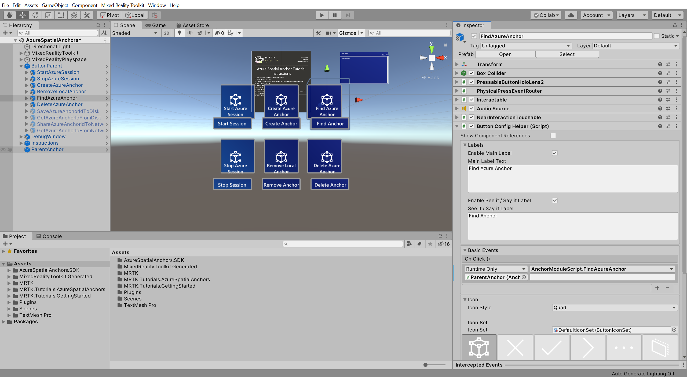
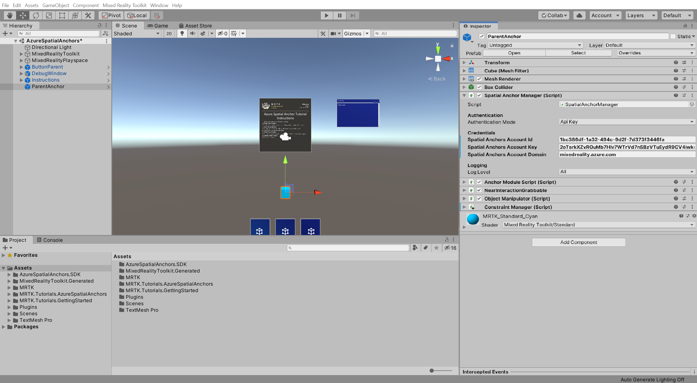
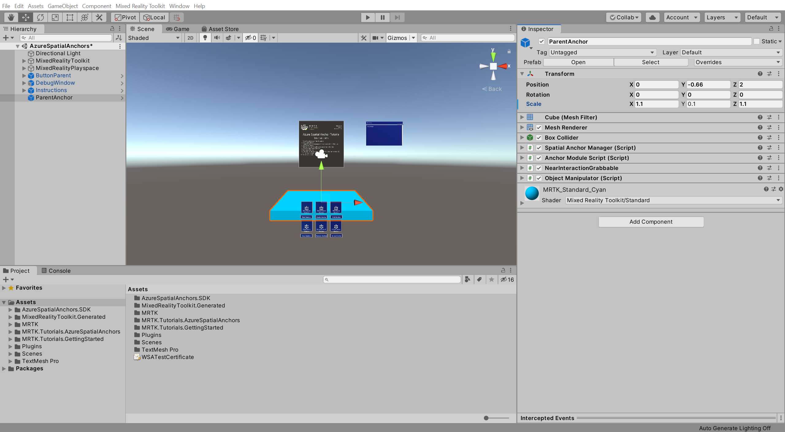
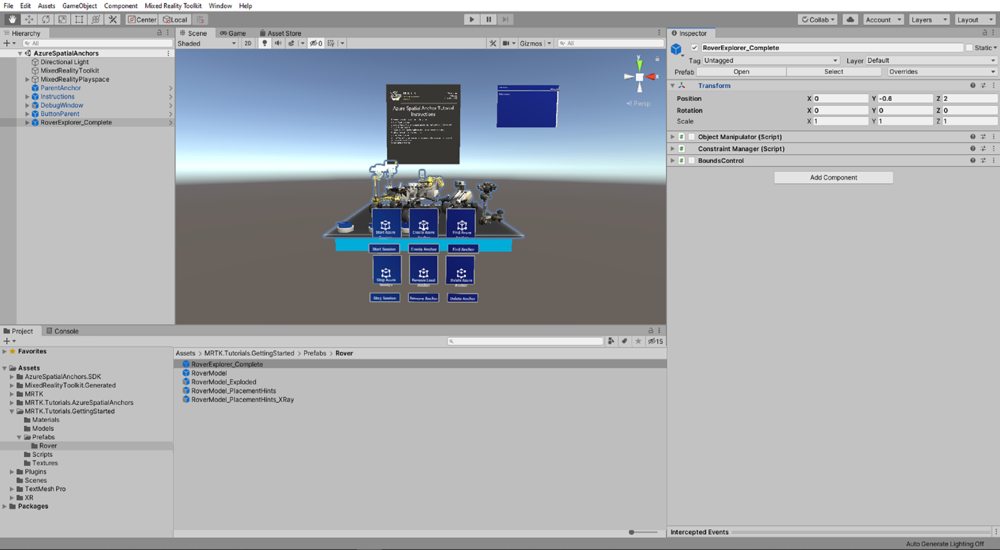
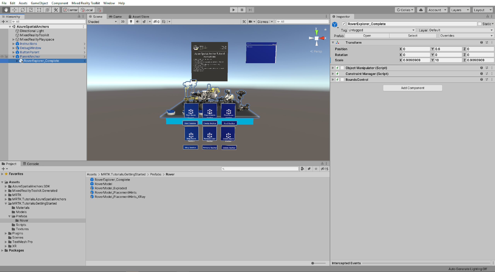

In this tutorial, you'll explore the various steps required to start and stop an Azure Spatial Anchors session and to create, upload, and download Azure Spatial Anchors on a single device.

## Create and prepare the Unity project

In this section, you'll create a new Unity project and get it ready for MRTK development.

First, follow the Initializing your project and deploying your first application in the learn introduction module, excluding the Build your application to your device instructions, which includes the following steps:

1. Creating the Unity project and give it a suitable name, for example, MRTK Tutorials
2. Switching the build platform
3. Importing the TextMeshPro Essential Resources
4. Importing the Mixed Reality Toolkit and Configuring the Unity project
5. Creating and configuring the scene and give the scene a suitable name, for example, AzureSpatialAnchors

Then changing the Spatial Awareness Display Option to ensure the MRTK configuration profile for your scene is DefaultHoloLens2ConfigurationProfile and change the display options for the spatial awareness mesh to Occlusion.

## Install in-built Unity packages and Import the tutorial assets

[!INCLUDE]

## Prepare the scene

In this section, you'll prepare the scene by adding some of the tutorial prefabs.

1. In the Project window, navigate to the **Assets** > **MRTK.Tutorials.AzureSpatialAnchors** > **Prefabs** folder, then click-and-drag the following prefabs into the Hierarchy window to add them to your scene:

    * **ButtonParent** prefabs
    * **DebugWindow** prefabs
    * **Instructions** prefabs
    * **ParentAnchor** prefabs

    

    > [!Tip]
    > If you find the large icons in your scene, for example, the large framed 'T' icons distracting, you can hide these by [toggling the Gizmos](https://docs.unity3d.com/2019.1/Documentation/Manual/GizmosMenu.html) to the off position, as shown in the image above.

2. Select **MixedRealityToolkit** object in the Hierarchy window, use the **Add Component** button in the Inspector window to add the following components:

    * AR Anchor Manager (Script)
    * DisableDiagnosticsSystem (Script)

    

    > [!Warning]
    > There's a known issue with ASA v2.9.0 and v2.10.0-preview.1 that requires two additional objects to be placed in the scene. Please use the Add Component button in the inspector window to add an AR Camera Manager (Script) and an AR Session (Script) to the **MixedRealityToolkit** object. Be sure to disable the Camera that is created automatically while adding the AR Camera Manager (Script) by unchecking the checkbox next to the Camera object in the inspector window. This issue will be addressed in the full release of ASA v2.10.0.

    > [!Note]
    > When you add the AR Anchor Manager (Script) component, the AR Session Origin (Script) component is automatically added because it's required by the AR Anchor Manager (Script) component.

## Configure the buttons to operate the scene

In this section, you'll add scripts to the scene to create a series of button events that demonstrate the fundamentals of how both local anchors and Azure Spatial Anchors behave in an app.

1. In the Hierarchy window, expand the **ButtonParent** object and select the first child object named **StartAzureSession**, in the Inspector window, configure the **Button Config Helper (Script)** component's **On Click ()** event as follows:

    * Assign the **ParentAnchor** object to the **None (Object)** field
    * From the **No Function** dropdown, select **AnchorModuleScript** > **StartAzureSession** () to set this function as the action to be executed when the event is triggered

    

2. In the Hierarchy window, select the next button named **StopAzureSession**, then in the Inspector window, configure the **Button Config Helper (Script)** component's **On Click ()** event as follows:

    * Assign the **ParentAnchor** object to the **None (Object)** field
    * From the **No Function** dropdown, select **AnchorModuleScript** > **StopAzureSession** () to set this function as the action to be executed when the event is triggered

    

3. In the Hierarchy window, select the next button named **CreateAzureAnchor**, then in the Inspector window, configure the **Button Config Helper(Script)** component's **On Click ()** event as follows:

    * Assign the **ParentAnchor** object to the **None (Object)** field
    * From the **No Function** dropdown, select **AnchorModuleScript** > **CreateAzureAnchor** () to set this function as the action to be executed when the event is triggered
    * Assign the **ParentAnchor** object to the empty **None (Game Object)** field to make it the argument for the **CreateAzureAnchor ()** function

    

4. In the Hierarchy window, select the next button named **RemoveLocalAnchor**,then in the Inspector window, configure the **Button Config Helper (Script)** component's **On Click ()** event as follows:

    * Assign the **ParentAnchor** object to the **None (Object)** field
    * From the **No Function** dropdown, select **AnchorModuleScript** > **RemoveLocalAnchor** () to set this function as the action to be executed when the event is triggered
    * Assign the **ParentAnchor** object to the empty **None (Game Object)** field to make it the argument for the **RemoveLocalAnchor** () function
    Unity with **RemoveLocalAnchor** button **OnClick** event configured

    

5. In the Hierarchy window, select the next button named **FindAzureAnchor**,then in the Inspector window, configure the **Button Config Helper (Script)** component's **On Click ()** event as follows:

    * Assign the **ParentAnchor** object to the **None (Object)** field
    * From the No Function dropdown, select **AnchorModuleScript** > **FindAzureAnchor** () to set this function as the action to be executed when the event is triggered

    

6. In the Hierarchy window, select the next button named **DeleteAzureAnchor**, then in the Inspector window, configure the **Button Config Helper (Script)** component's **On Click** () event as follows:

    * Assign the **ParentAnchor** object to the **None (Object)** field
    * From the No Function dropdown, select **AnchorModuleScript** > **DeleteAzureAnchor** () to set this function as the action to be executed when the event is triggered

    

## Connect the scene to the Azure resource

In the Hierarchy window, select the **ParentAnchor** object, then in the Inspector window, locate the **Spatial Anchor Manager** (Script) component. Configure the **Credentials** section with the credentials from the Azure Spatial Anchors account created as part of the Prerequisites for this tutorial series:

* In the **Spatial Anchors Account ID** field, paste the **Account ID** from your Azure Spatial Anchors account
* In the **Spatial Anchors Account Key** field, paste the primary or secondary **Access Key** from your Azure Spatial Anchors account
* In the **Spatial Anchors Account Domain** field, paste the **Account Domain** from your Azure Spatial Anchors account

## Try the basic behaviors of Azure Spatial Anchors

Azure Spatial Anchors can not run in Unity, so to test the Azure Spatial Anchors functionality, you need to build the project and deploy the app to your device.

> [!Tip]
> For a reminder on how to build and deploy your Unity project to HoloLens 2, you can refer to the Building your application to your HoloLens 2 instructions.

When the app runs on your device, follow the on-screen instructions displayed on the Azure Spatial Anchor Tutorial Instructions panel:

1. Move the cube to a different location
2. Start Azure session
3. Create Azure anchor (creates an anchor at the location of the cube).
4. Stop Azure session
5. Remove Local Anchor (allows the user to move the cube)
6. Move the cube somewhere else
7. Start Azure session
8. Find Azure anchor (positions the cube at the location from step 3)
9. Delete Azure anchor
10. Stop Azure session

>[!Caution]
>Azure Spatial Anchors uses the internet to save and load the anchor data, so make sure your device is connected to the internet.

## Anchor an experience

In the previous sections, you learned the fundamentals of Azure Spatial Anchors. We used a cube to represent and visualize the parent game object with the attached anchor. In this section, you'll learn how to anchor an entire experience by placing it as a child of the ParentAnchor object.

1. In the Hierarchy window, select the **ParentAnchor** object, then in the Inspector window, configure the Transform components as follows:

    * Change **Scale X** to 1.1
    * Change **Scale Z** to 1.1

    

2. In the Project window, navigate to the **Assets** > **MRTK.Tutorials.GettingStarted** > **Prefabs** > **Rover** folder, then click-and-drag the **RoverExplorer_Complete** prefab into the Hierarchy window to add it to the scene:

    

3. With the newly added RoverModule_Complete object still selected in the Hierarchy window, drag it onto the **ParentAnchor** object to make it a child of the ParentAnchor object:

    

    If you now rebuild the project and deploy the app to your device, you can now reposition the entire Rover Explorer experience by moving the resized cube.

    >[!Tip]
    >A variety of user experience flows for repositioning experiences, including the use of a repositioning object (such as the cube used in this tutorial), the use of a button to toggle a bounds control that surrounds the experience, the use of position and rotation gizmos, and more.
