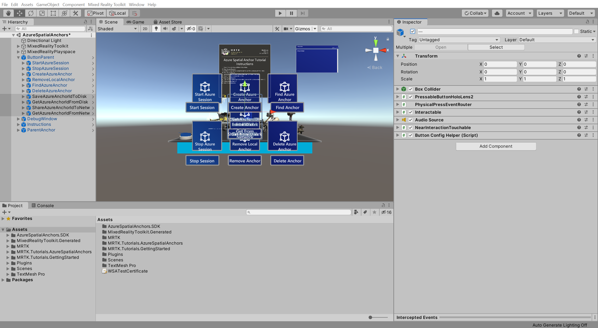
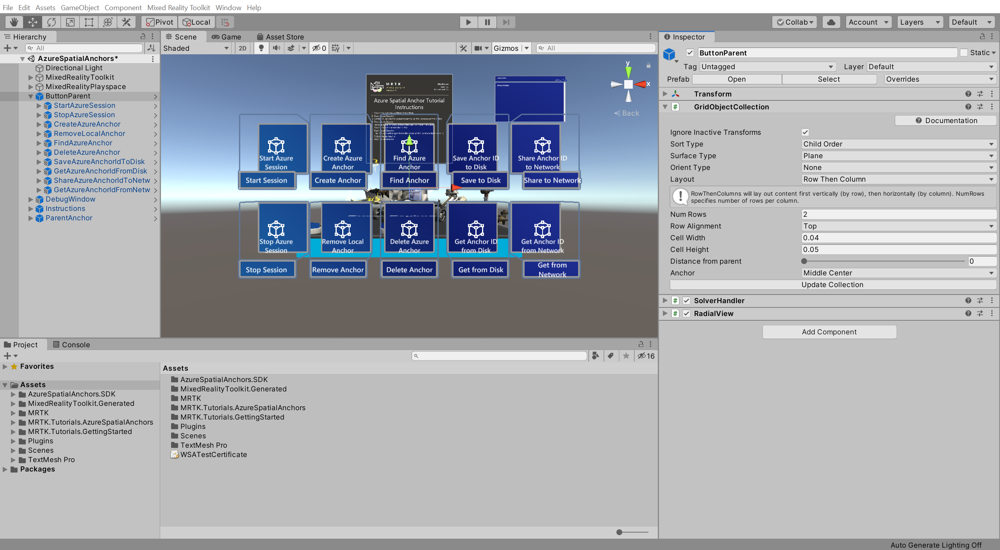
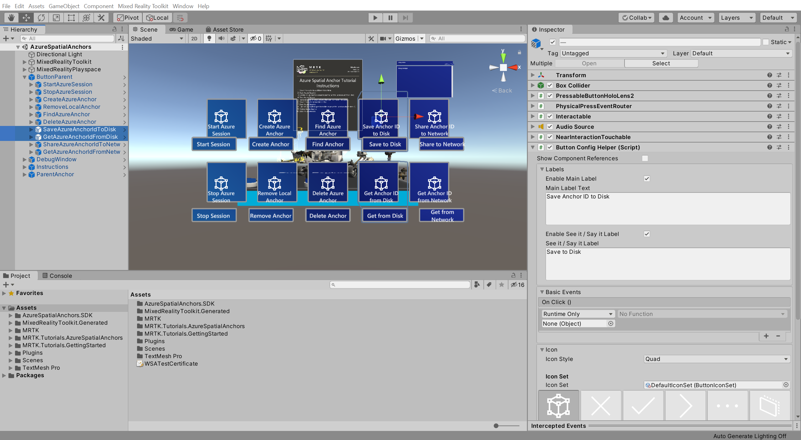
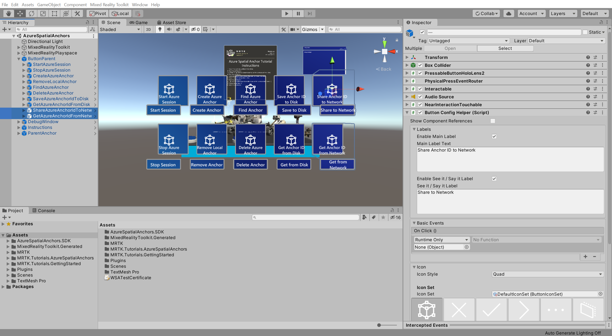

# 5. Exercise: Saving, retrieving, and sharing Azure Spatial Anchors

In this tutorial, you will learn how to save Azure Spatial Anchors across multiple app sessions by saving the anchor ID to the HoloLens 2's storage. You will also learn how to share this anchor ID to other devices for a multi-device anchor alignment.

## Preparing the scene

1. In the Hierarchy window, expand the **ButtonParent** object. Select the last four child button objects. In the Inspector window, check the checkbox next to the name field to make all the objects active.

2. In the Hierarchy window, select the **ButtonParent** objects. Then in the Inspector window, locate the **GridObjectCollection** component and click the **Update Collection** button to update the position of all the ButtonParent object's child objects.

## Persisting Azure Spatial Anchors between app sessions

In this section, you will learn how to save and retrieve the Azure Anchor ID to and from the HoloLens' local disk. This will allow you to query Azure for the same anchor ID between different app sessions. It will enable the anchored holograms to be positioned at the same location as in the previous app session.

1. In the Hierarchy window, expand the **ButtonParent** object and locate the two buttons named **SaveAzureAnchorIdToDisk** and **GetAzureAnchorIdFromDisk**:

2. Follow the same steps as in the [configuring the buttons to operate the scene](../../) instructions from the previous tutorial to configure the **Interactable (Script)** component on each of the two buttons:

* For the **SaveAzureAnchorIdToDisk** button object, assign the **AnchorModuleScript** > **SaveAzureAnchorIdToDisk ()** function.
* For the **GetAzureAnchorIdFromDisk** button object, assign the **AnchorModuleScript** > **GetAzureAnchorIdFromDisk ()** function.

If you build the updated app to your HoloLens, you can now persist Azure Spatial Anchors between app sessions by saving the Azure Anchor ID. To test it out, you can follow these steps:

1. Move the Rover Explorer to the desired location
2. Start Azure Session
3. Create Azure Anchor (creates anchors at the location of the Rover Explorer)
4. Save Azure Anchor ID to Disk
5. Restart the app
6. Get Azure Anchor from Disk (loads the anchor ID you just saved)
7. Start Azure Session
8. Find Azure Anchor (positions the Rover Explorer at the location from step 3)

>[!Note]
>To fully restart the app, after exiting the immersive app view, the app window in the mixed reality home needs to be closed before relaunching it from the Start menu. For additional details, you can refer to the Using apps on HoloLens documentation.

## Sharing Azure Spatial Anchors between devices

In this section, you will learn how to share the Azure Anchor ID between multiple devices. This will allow multiple devices to query Azure for the same anchor ID, allowing the anchored holograms to be spatially aligned. Spatial alignment, i.e., seeing the same holograms in the same physical location between multiple devices, is key to local shared experiences in the HoloLens 2.

There are many ways to transfer Azure Anchor IDs between devices. In this example, you will use a simple web service to upload and download anchor IDs between devices.

1. In the Hierarchy window, expand the **ButtonParent** object. Locate the two buttons named **ShareAzureAnchorIdToNetwork** and **GetAzureAnchorIdFromNetwork**:

2. Follow the same steps as in the [configuring the buttons to operate the scene](3-exercise-getting-started-with-azure-spatial-anchors.md) instructions from the previous tutorial to configure the **Interactable (Script)** component on each of the two buttons:

* For the ShareAzureAnchorIdToNetwork object, assign the AnchorModuleScript > ShareAzureAnchorIdToNetwork () function.
* For the GetAzureAnchorIdFromNetwork object, assign the AnchorModuleScript > GetAzureAnchorIdFromNetwork () function.

If you build the updated app to two HoloLens devices, you can now achieve spatial alignment by sharing the Azure Anchor ID. To test it out, you can follow these steps:

1. On HoloLens device 1: Move the Rover Explorer to the desired location.
2. On HoloLens device 1: Start Azure Session.
3. On HoloLens device 1: Create Azure Anchor (creates anchors at the location of the Rover Explorer).
4. On HoloLens device 1: Share Azure Anchor ID to Network.
5. On HoloLens device 2: Start the app.
6. On HoloLens device 2: Get Shared Anchor ID from Network (fetches the anchor ID just shared from HoloLens device 1).
7. On HoloLens device 2: Start Azure Session.
8. On HoloLens device 2: Find Azure Anchor (positions the Rover Explorer at the location from step 3).

>[!Tip]
>If you only have one HoloLens, you can still test the functionality by restarting the app instead of using a second HoloLens device.

