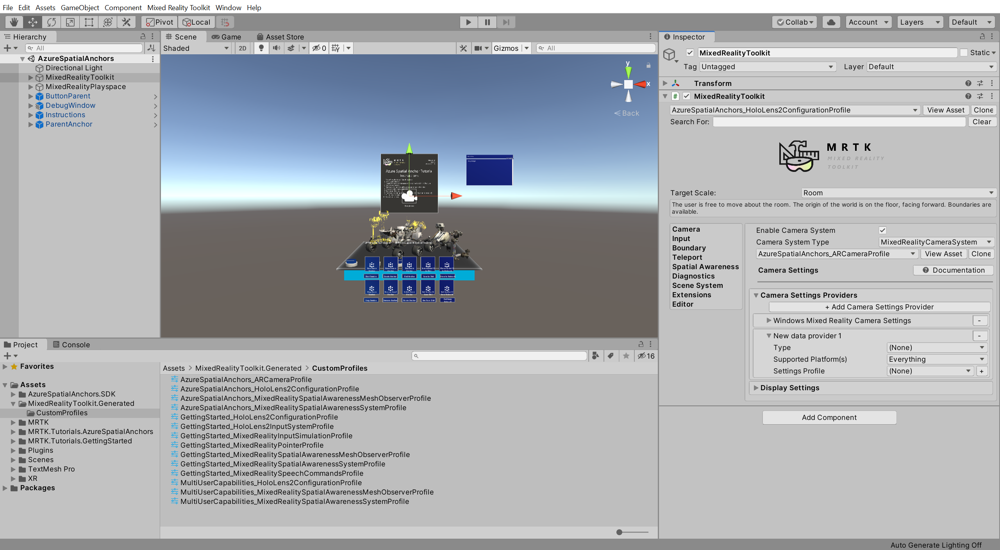
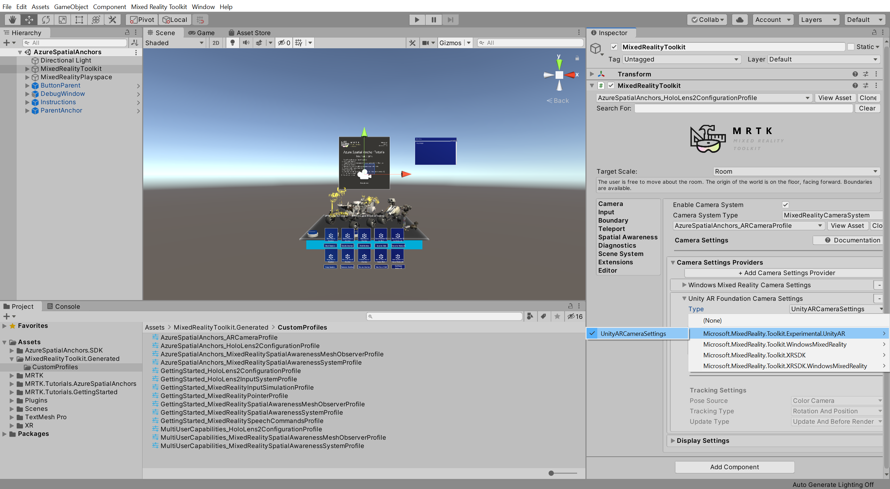
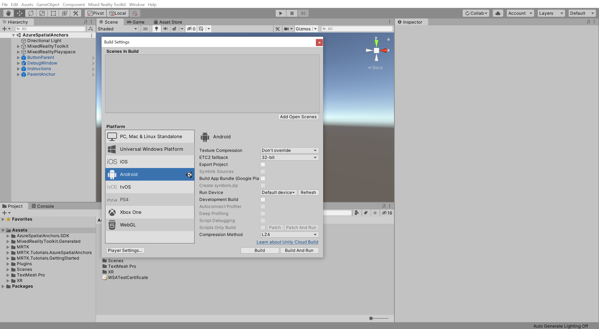
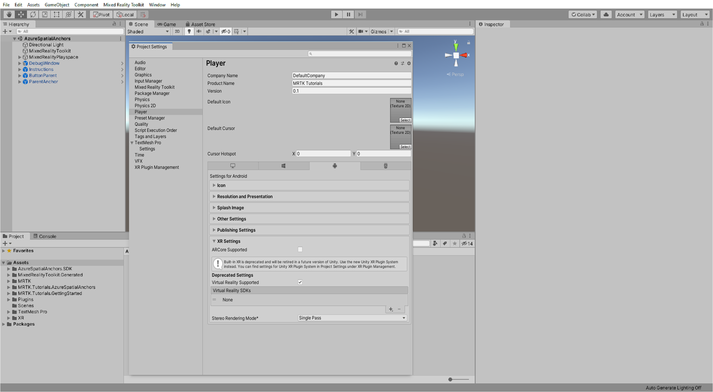
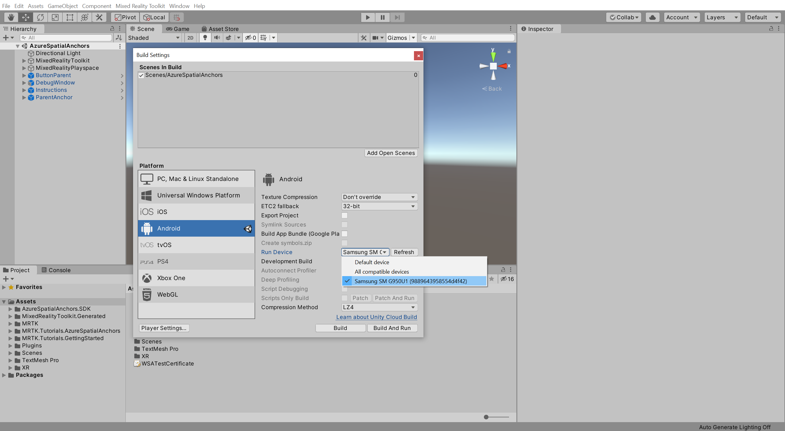
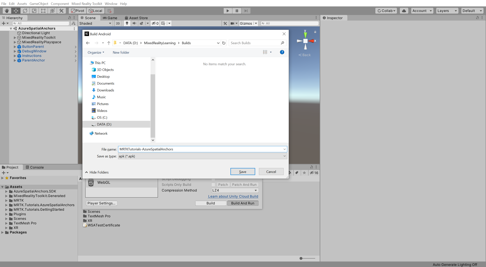
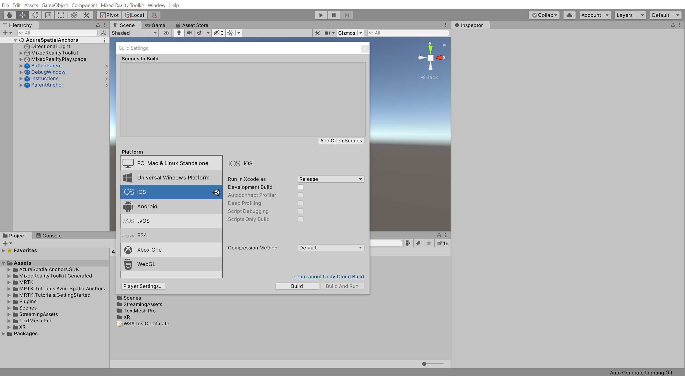
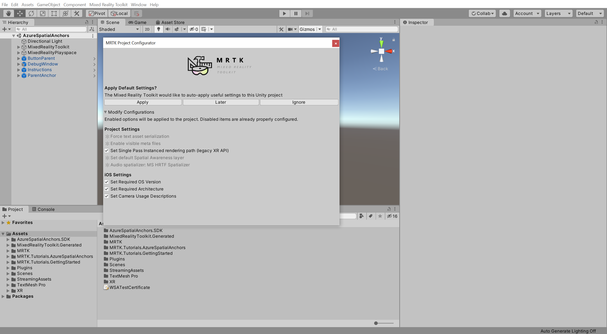
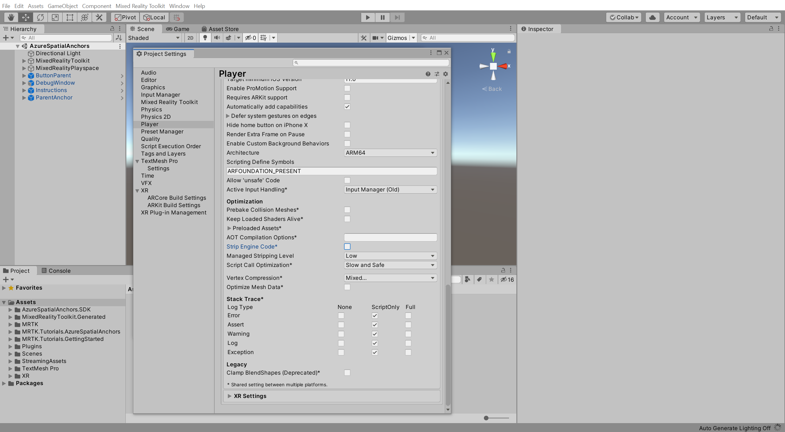
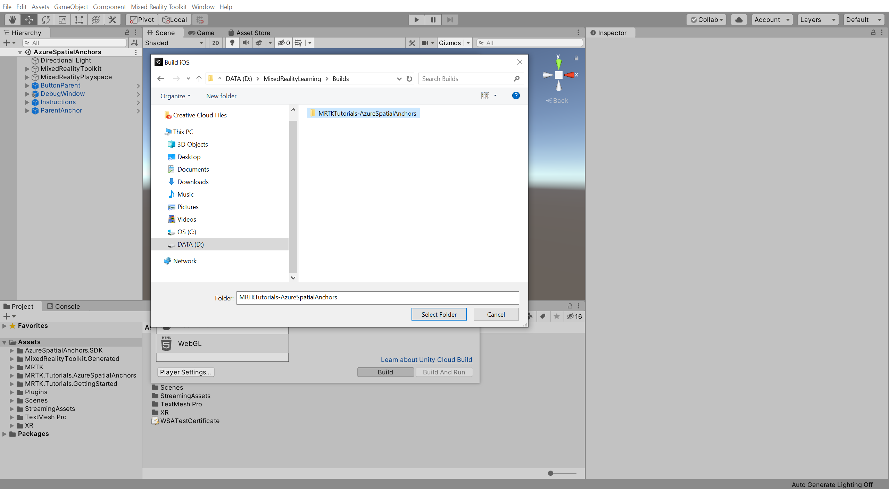

In this tutorial, you'll learn how to build your project to Android and iOS devices using AR Foundation, ARCore XR Plugin, and ARKit XR Plugin.

## Install in-built Unity packages

[!INCLUDE]

## Configure MRTK for AR Foundation Camera

In this section, you'll learn how to configure MRTK for deploying to a mobile device.

1. In the Hierarchy window, select the **MixedRealityToolkit** object. Then in the Inspector window, select the **Camera** tab, clone the camera profile, and give it a suitable name, for example,
**AzureSpatialAnchors_ARCameraProfile**:
    

    > [!Tip]
    > For a reminder on how to clone MRTK profiles, you can refer to the Configuring the Mixed Reality Toolkit profiles instructions.

2. With the **Camera** tab still selected in the Inspector window, expand the **Camera Setting** Providers and by clicking the "-" remove the **Windows Mixed Reality Camera Setting** or **XR SDK Windows Mixed Reality Camera Setting**:

    

3. Click the + **Add Camera Setting Provider** button, then expand the newly added **New data provider**:

    

4. Using the **Type** dropdown, change the type to **Microsoft.MixedReality.Toolkit.Experimental.UnityAR** > **UnityARCameraSettings**:

    

5. Update the MRTK UnityAR scripting defines by invoking the menu item: **Mixed Reality** > **Toolkit** > **Utilities** > **UnityAR** > Update Scripting Defines

## Build your application to your Android device

In this section, you'll learn how to configure your project to build and deploy it to an Android device.

1. In the Unity menu, select **File** > **Build Settings**... to open the Build Settings window and then switch the platform to Android:

    

    >[!Tip]
    >For a reminder on how to switch build platform, you can refer to the Switching the build platform instructions.

    Close the Build Settings window.

2. In the Unity menu, select **Mixed Reality** > **Toolkit** > **Utilities** > **Configure Project for MRTK** to open the **MRTK Project Configurator** window, ensure all options are selected, then click the **Apply** button to apply the settings:

    

3. In the Unity menu, select **Edit** > **Project Settings**... to open the Player Settings window, then locate the **Player** > **Other Settings** section, select **Vulkan** and remove it by clicking the "-" symbol:

    

    [!INCLUDE]

4. In the Build Settings window, click the **Add Open Scenes** button to add your current scene to the **Scenes In Build** list. Then, use a USB cable, connect your Android device to your computer and select it from the **Run Device** dropdown:

    

    >[!Note]
    >If your device doesn't appear in the Run Device dropdown, you might need to press the Refresh button next to the dropdown.

5. In the Build Settings window, click the **Build And Run** button to open the Build Android window.

6. Choose a suitable location to store your build, for example, D:\MixedRealityLearning\Builds, then give the apk a suitable name, for example, MRTKTutorials-AzureSpatialAnchors, and click the **Save** button to start the build process:

    

    >[!Note]
    >If you get any error in the Unity Console window related to Android SDK, NDK, or JDK modules, you need to open Unity Hub and install the associated Android Build Support modules.

    When the build process is complete, your apps should automatically load on your Android device.

## Build your application to your iOS device

In this section, you'll learn how to configure your project, to build and deploy it to your iOS device.

1. In the Unity menu, select **File** > **Build Settings**... to open the Build Settings window and switch platform to iOS:

    

    >[!Tip]
    >For a reminder on how to switch build platform, you can refer to the Switching the build platform instructions.

    Close the Build Settings window.

2. In the Unity menu, select **Mixed Reality** > **Toolkit** > **Utilities** > **Configure Project** for MRTK to open the **MRTK Project Configurator** window, ensure all options are selected, then click the **Apply** button to apply the settings:

    

    [!INCLUDE]

3. In the Unity menu, select **Edit** > **Project Settings**... to open the Player Settings window, then locate the **Player** > **Other Settings** section, uncheck the **Strip Engine Code** checkbox to disable it:

    

    Close the Player Settings window and open the **Build Settings** window again.

4. In the Build Settings window, click the **Add Open Scenes** button to add your current scene to the **Scenes In Build** list:

    

5. In the Build Settings window, click the **Build** button to open the Build iOS window.

6. Choose a suitable location to store your Xcode project, for example, D:\MixedRealityLearning\Builds, create a new folder and give it a suitable name, for example, MRTKTutorials-AzureSpatialAnchors, and then click the **Select Folder** button to start the build process:

    

    When the build process is complete, follow the Export the Xcode project instructions to learn to deploy your Xcode project to your iOS device.
