### Deploy Azure SQL Database using the Azure portal

In this activity, you'll deploy Azure SQL Database deployment using the Azure portal. Throughout this exercise, you'll also get to explore the various options that are available to you.

> **Important Note!** In order to simplify the network configuration of these exercises, it is recommended to **disable** VPN connectivity while you complete the exercises.  

1. Select the Azure SQL deployment option  

    Sign into the [Azure portal](https://portal.azure.com/learn.docs.microsoft.com) using the same account you activated the sandbox with. In the top search bar, type **Azure SQL** and review what appears:  

    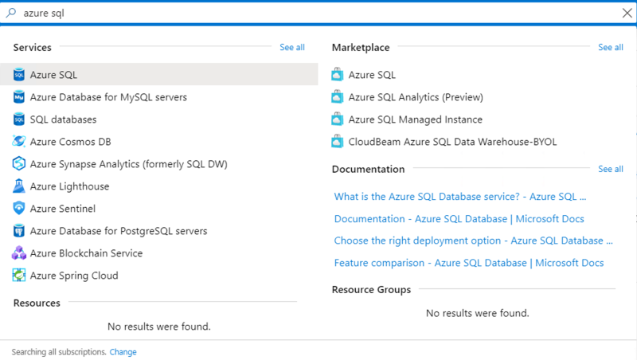  

    There are a lot of different items and categories here, but basically this menu gives you filters for what you can search on. Let's break them down:
    * **Services**: if you select Services, then you're able to see the existing resources (i.e. already deployed) that you have all together. For example, if you clicked Azure SQL, you would see all of your SQL VMs, Databases, Logical servers, Managed Instances, and pools.
    * **Resources**: this searches based on existing resource names. For example, if you searched for "adventureworks" any resources with "adventureworks" in the name would return here.
    * **Marketplace**: this allows you to deploy new resources from the marketplace.
    * **Documentation**: this searches docs.microsoft.com for relevant documentation
    * **Resource groups**: this allows you to search based on resource group name.

    Next, select **Azure SQL** under **Marketplace**. This will bring you to the Azure SQL create experience. Take a few moments to click around and explore.

    

    Next, select **Single database** and click **Create**.

    >**NOTE**: There are various methods to deploy a single Azure SQL Database. Our [Quickstart](https://docs.microsoft.com/azure/sql-database/sql-database-single-database-get-started) shows options for the portal, Powershell, and Azure CLI.

2. Select the Subscription, Resource group, and Database name  

    Select the **Subscription** and **Resource group** the sandbox provisioned (there should only be one), then enter a database name **AdventureWorksID** where ID is a unique identifier that you will use for all of your resources in this module (e.g. if you pick a unique identifier or ID `0406`, your database name would be **AdventureWorks0406**).  

3. Select or create the Server  

    When you create an Azure SQL Managed Instance, supplying the server name is the same as in SQL Server. However, for databases and elastic pools, an Azure SQL Database server is required. This is a *logical* server that acts as a central administrative point for single or pooled database and includes logins, firewall rules, auditing rules, threat detection policies, and failover groups (more on these topics later). This logical server does not expose any instance-level access or features as with Azure SQL Managed Instance. For Azure SQL Database servers, the server name must be unique across all of Azure. You can read more on SQL Database servers [here](https://docs.microsoft.com/azure/sql-database/sql-database-servers).  

    Select **Create new** next to **Server** and provide the following information:  
    * *Server name*: **aw-serverID** where ID is the same identifier you used for the database (e.g. **0406**).  
    * *Server admin login*: **cloudadmin**. This is the equivalent to a member of the sysadmin role in SQL Server. This account connects using SQL authentication (username and password) and only one of these accounts can exist. You can read more about Administrator accounts for Azure SQL Database [here](https://docs.microsoft.com/azure/sql-database/sql-database-manage-logins#unrestricted-administrative-accounts).
    * *Password*: A complex password that meets [strong password requirements](https://docs.microsoft.com/sql/relational-databases/security/strong-passwords).  
    > **TIP**: As you type in your password you are given hints as to the requirements. You are also asked to confirm your password. Make a note or be sure to remember this password.  
    * *Location*: Use the same location as your resource group or the region that is close to where you are located.  

    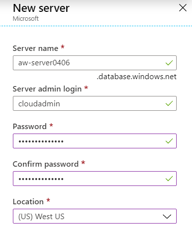  

    If there are other checkboxes here, accept the defaults.

    Then, select **OK**.

4. Choose not to opt-in for elastic pools

    In Azure SQL DB, you then decide if you want this database to be a part of an Elastic Pool (new or existing). In Azure SQL Managed Instance, [creating an instance pool (public preview) currently requires a different flow](https://docs.microsoft.com/azure/sql-database/sql-database-instance-pools-how-to#create-an-instance-pool) than the Azure SQL create experience in the Azure portal. For this activity, select **No**.  

5. Select a purchasing model  

    Next to **Compute + storage** select **Configure Database**.  The top bar, by default shows the different service tiers available in the vCore purchasing model.

    For the purposes of this exercise, we'll focus on the vCore purchasing model (recommended), so there is no action in this step. You can optionally review the DTU model by selecting **Looking for basic, standard, premium?** and by [comparing vCores and DTUs in-depth here](https://docs.microsoft.com/azure/sql-database/sql-database-purchase-models
    ).  

6. Select a service tier  

    The next decision is choosing the service tier for performance and availability. Generally, we recommend you start with the General Purpose and adjust as needed. For the purposes of this exercise, be sure to select **General Purpose** here (should be the default).  

7. Select the hardware generation

    For the exercise, you can leave the default hardware selection of **Gen5**, but you can select **Change configuration** to view the other options available (may vary by region).  

8. Select the compute and storage

    One of the final steps is to determine how many vCores and the Data max size. For the exercise, select **2 vCores** and **32 GB Data max size**.  

    Generally, if you're migrating, you should use a similar size as to what you use on-premises. You can also leverage tools, like the [Data Migration Assistant SKU Recommender](https://docs.microsoft.com/sql/dma/dma-sku-recommend-sql-db?view=sql-server-ver15) to estimate the vCore and Data max size based on your current workload.  

    The Data max size is not necessarily the database size of your data today. It is the maximum amount of data space that can be allocated for your database. For more information about the difference between data space used, data space allocated, and data max size, refer to this [explanation in the documentation](https://docs.microsoft.com/azure/sql-database/sql-database-file-space-management#understanding-types-of-storage-space-for-a-database). This will also help you understand the log space allocated, which scales with your data max size.  

    Before you select **Apply**, confirm your selections look similar to those below (your resource group, Database name, and Server will be specific to your choices):  

    

    The **Basics** pane should now look similar to the image below:  

    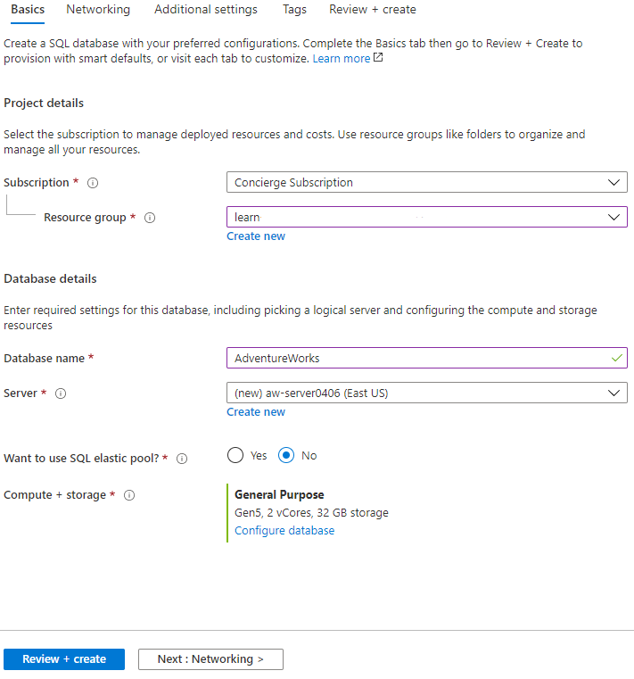

9. Select the networking configuration

    Select **Next : Networking**.  

    Choices for networking for Azure SQL Database and Azure SQL Managed Instance are different. When you deploy an Azure SQL Database, currently the default is **No access**.  

    You can then choose to select Public endpoint or Private endpoint (preview). In this exercise, we'll use the public endpoint and set the **Allow Azure services and resources to access this server** option to yes, meaning that other Azure services (e.g. Azure Data Factory or an Azure Virtual Machine) can access the database if you configure it. You can also select **Add current client IP address** if you want to be able to connect from the IP address from the client computer you used to deploy Azure SQL Database, which you do. Make sure your settings match below:

    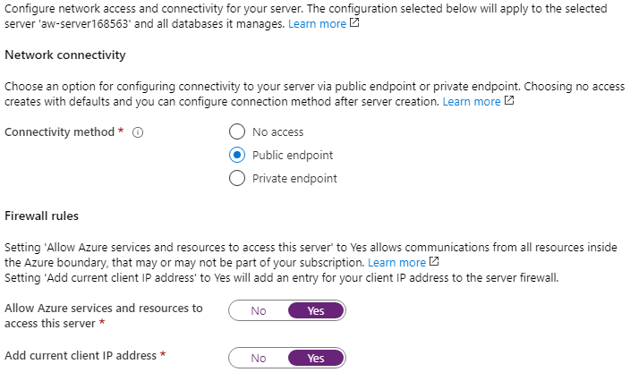

    With Azure SQL Managed Instance, you deploy it inside an Azure virtual network and a subnet that is dedicated to managed instances. This enables you to have a completely secure, private IP address. Azure SQL Managed Instance provides the ability to connect an on-prem network to a managed instance, connect a managed instance to a linked server or other on-prem data store, and connect a managed instance to other resources. You can additionally enable a public endpoint so you can connect to managed instance from the Internet without a Virtual Private Network (VPN). This access is disabled by default.  

    The principle of private endpoints through virtual network isolation is available for Azure SQL Database through a  **private link**, and you can learn more [here](https://docs.microsoft.com/azure/private-link/private-link-overview).

    More information on connectivity for Azure SQL Database can be found [here](https://docs.microsoft.com/azure/sql-database/sql-database-connectivity-architecture) and for Azure SQL Managed Instance [here](https://docs.microsoft.com/azure/sql-database/sql-database-managed-instance-connectivity-architecture). There will also be more on this topic in upcoming sections/modules.  

    For now, select **Next : Additional settings**.

10. Select a data source

    In Azure SQL Database, upon deployment you have the option to select the AdventureWorksLT database as the sample in the Azure portal. In Azure SQL Managed Instance, however, you deploy the instance first, and then databases inside of it, so there is not an option to have the sample database upon deployment (similar to SQL Server). You can learn more about the AdventureWorks sample databases on [GitHub](https://github.com/Microsoft/sql-server-samples/releases/tag/adventureworks).

    You can also deploy a blank database or create a database based the restore of a backup from a geo-replicated backup. You can learn more on this option from the [documentation](https://docs.microsoft.com/azure/sql-database/sql-database-recovery-using-backups#geo-restore).

    For this exercise, select **Sample**.  

11. Database collations

    Since we're using the AdventureWorksLT sample, the **database collation is already set**. For a review of collations and how they apply in Azure SQL, continue reading, otherwise **you can skip to Step 12**.

    Collations in SQL Server and Azure SQL tell the Database Engine how to treat certain characters and languages. A collation provides the sorting rules, case, and accent sensitivity properties for your data. When you're creating a new Azure SQL Database or Managed Instance, it's important to first take into account the locale requirements of the data you're working with, because the collation set will affect the characteristics of many operations in the database. In the SQL Server box product, the default collation is typically determined by the OS locale. In Azure SQL Managed Instance, you can set the server collation upon creation of the instance, and it cannot be changed later. The server collation sets the default for all of the databases in that instance of Azure SQL Managed Instance, but you can modify the collations on a database and column level. In Azure SQL Database, you cannot set the server collation, it is set at the default (and most common) collation of `SQL_Latin1_General_CP1_CI_AS`, but you can set the database collation. If we break that into chunks:  

    * `SQL` means it is a SQL Server collation (as opposed to a Windows or Binary collation)  
    * `Latin1_General` specifies the alphabet/language to use when sorting
    * `CP1` references the code page used by the collation
    * `CI` means it will be case insensitive, where `CS` is case-sensitive
    * `AS` means it will be accent sensitive, where `AI` is accent-insensitive

    There are other options available related to character widths, UTF-8, etc., and more details about what you can and can't do with Azure SQL [here](https://docs.microsoft.com/sql/relational-databases/collations/collation-and-unicode-support?view=sql-server-ver15).

12. Opt-in for Advanced Data Security

    When you deploy Azure SQL Database in the portal, you are prompted if you'd like to enable [Advanced Data Security (ADS)](https://docs.microsoft.com/azure/sql-database/sql-database-advanced-data-security) on a free trial. Select **Start free trial**. After the free trial, it is billed according to the [Azure Security Center Standard Tier pricing](https://azure.microsoft.com/pricing/details/security-center/). If you choose to enable it, you get functionality related to data discovery and classification, identifying/mitigating potential database vulnerabilities, and threat detection. You'll learn more about these capabilities in the next security module of this learning path. In Azure SQL Managed Instance, you can enable it on the instance after deployment.  

    Your **Additional settings** pane should now look similar to the image below.

    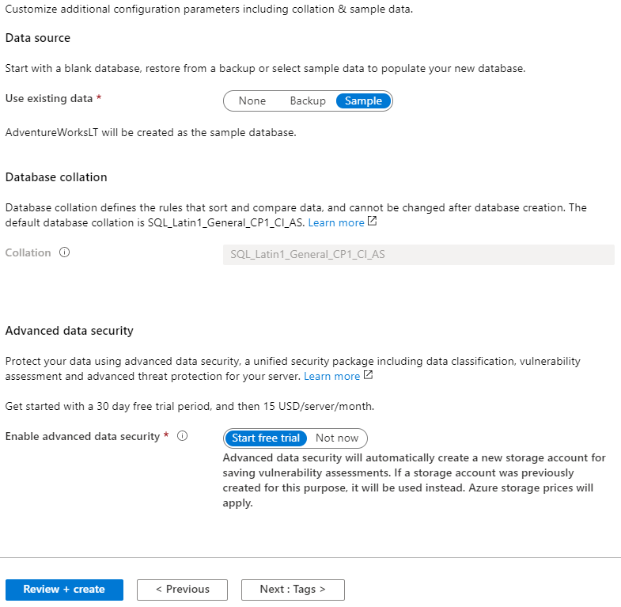

13. Tags

    Select **Next : Tags**.  

    Tags can be used to logically organize Azure resources across a subscription. For example, you can apply the name "Environment" and the value "Development" to this SQL database and Database server, but you might use the value "Production" for production resources. This can be helpful for organizing resources for billing or management. You can read more [here](https://docs.microsoft.com/azure/azure-resource-manager/management/tag-resources).

      

14. Review and create

    Finally, select **Next : Review + create**. Here you can review your deployment selections and the [Azure Marketplace terms](https://go.microsoft.com/fwlink/?linkid=2045624).  

    > You also have the option to **Download a template for automation**. This exercise will not cover that method, but if you're interested, you can [learn more](https://docs.microsoft.com/azure/azure-resource-manager/).

    Take time here to ensure all of your selections match the exercise instructions.

    Finally, select **Create** to deploy the service.  

    Soon after selecting Create, you will be redirected to a page that looks like this (below), and where you can monitor the status of your deployment. This deployment option and configuration typically takes less than five minutes to deploy. Some images of what you might see are below.  

    While you're waiting, you can open SSMS. It takes a while to open if you are opening it for the first time. 

    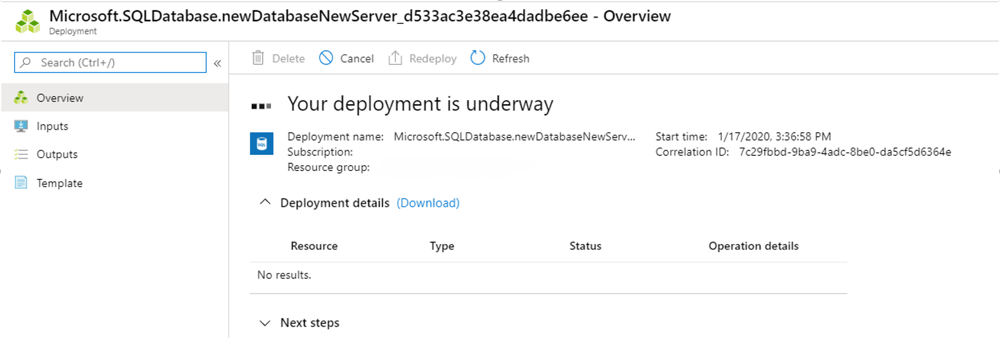

    And some time later ...

    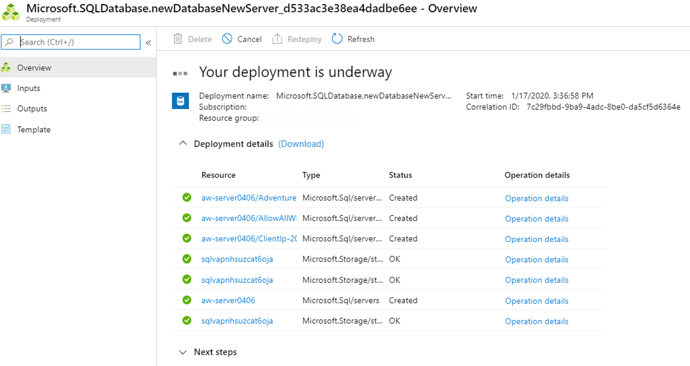

    And finally...

    

    If for whatever reason, you get lost from this page and the deployment has not completed, you can navigate to your resource group, and select **Deployments**. This will give you the various deployments, their status, and more information.  

    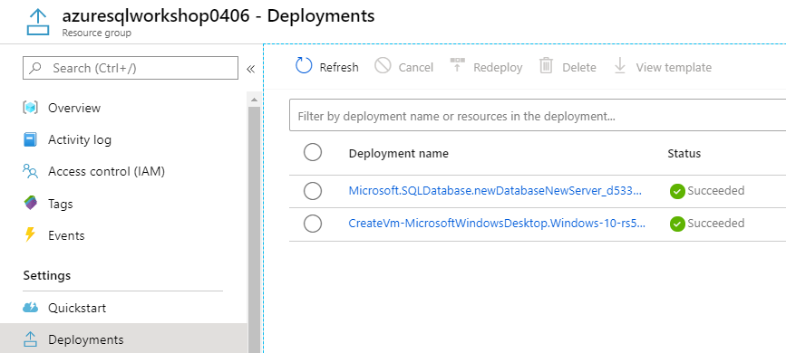

    Once your resource has deployment, review the **Overview** pane for the SQL database in the Azure portal and confirm that the Status is **Online**.  

### Connecting to Azure SQL Database

In this portion of the exercise you will learn the basics of connecting to your deployed Azure SQL Database and compare that experience to connecting to SQL Server.

**What would connecting to SQL Server 2019 look like?**  

Before you look at the Azure SQL Database you just deployed, let's review what connecting to an instance of SQL Server 2019 may look like. Typically, you'd open SSMS and connect, using Windows Authentication perhaps, to the local instance of SQL Server 2019, similar to the image below.  

  

You would then see a view that looks similar to the following.  
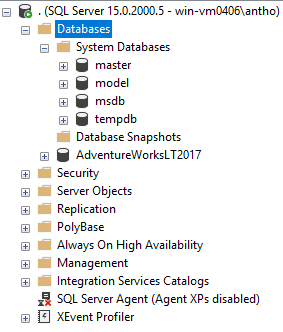  

Keep that in mind as a reference for comparison as you complete the following steps.

1. Locate the resource in the Azure portal to obtain the logical server name  
    For SSMS you'll need the server name in order to connect. You may need to refer to your Azure SQL Database server in the Azure portal to get this, e.g. *aw-server0406.database.windows.net*.  

    If you're new to the portal, there are a few ways you can locate resources, and depending on who you talk to, they may use a different method. Here are a few options to get you started:  

    1. In the search bar type the **resource name** and select it under "Resources". For example, in the below image a search for a SQL Database "adventureworks" was made, and the desired resource can be selected.  
        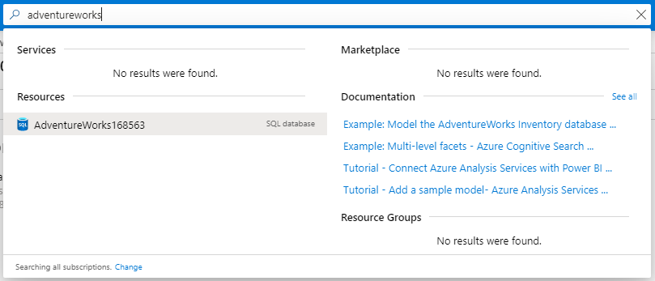  
    2. Additionally, if you select the **Microsoft Azure** text in the top left corner of the Azure portal, it will take you to "Home". From here, you can select **Resource groups** and then select your resource group.  
        This will bring you to a view of all the resources that you deploy in the resource group.  
        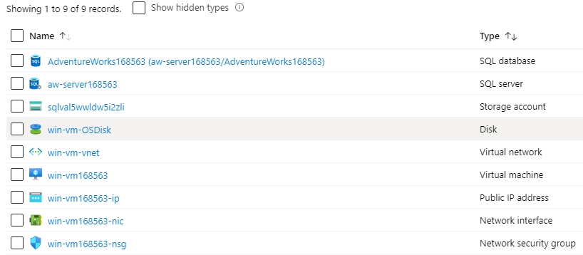
        You could alternatively select SQL Databases or Virtual machines, depending what you are looking for.  

 
1. Connect to Azure SQL Database  

    Next, let's connect to your Azure SQL Database logical server and compare. Open SSMS (if it is not open already), and create a new connection. One way to do this is to select **Connect > Database Engine**.  

    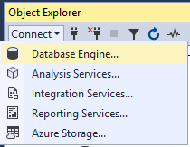  

    For server name, input the name of your Azure SQL Database logical server.

    Change the authentication to **SQL Server Authentication**, and input the corresponding Server Admin Login and Password (the one you provided during deployment in the previous exercise).  

    Check the **Remember password** box and select **Connect**.  

    > **TIP**: Depending on your local configuration (e.g. VPN), your client IP address may differ from the IP address the Azure portal used during deployment. If it does, you'll get a pop-up which reads "Your client IP address does not have access to the server. Sign in to an Azure account and create a new firewall rule to enable access." If you get this message, sign-in using the account you're using for the sandbox, and add a firewall rule for your client IP address. You can complete all of these steps using the pop-up wizard in SSMS.  

    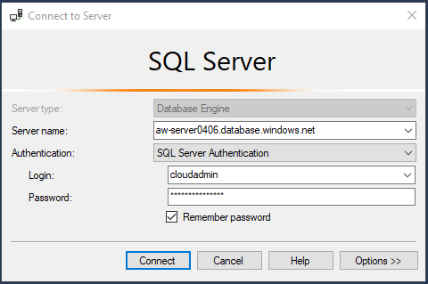  

    Expanding the databases and system databases should result in a view similar to the following.  

      

    Spend a few minutes clicking around and exploring the differences, at first glance, between the Azure SQL Database logical server and SQL Server. You won't deploy an Azure SQL Managed Instance as part of this exercise, but the image below shows how Azure SQL Managed Instance would appear in SSMS.  

    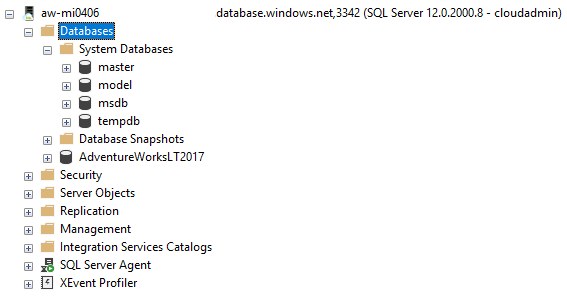  

In this exercise, you saw how to deploy and connect to Azure SQL Database, and how it compares (at first glance) to SQL Server and Azure SQL Managed Instance. In the next exercise, you will continue this comparison, going deeper and exploring various methods to verify your deployment/installation.  
