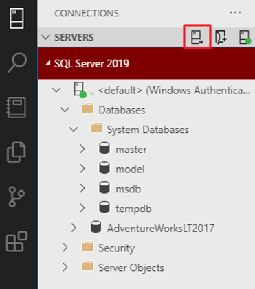
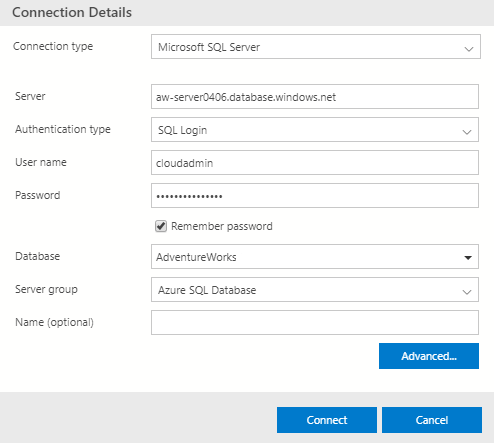
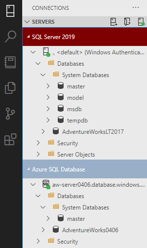

### Verify deployment queries

Now that you've seen how Azure SQL appears in SSMS, let's explore a tool that may be new to you called Azure Data Studio (ADS). ADS is a source-open tool that provides a lightweight editor and other tools (including Notebooks which you'll see soon) for interacting with Azure Data Services (including SQL Server on-prem, Azure SQL, Azure Database for PostgreSQL, and more). Let's take a brief tour to get acquainted.  

**Step 1 - Open Azure Data Studio and Connect**  

Open Azure Data Studio (ADS). When opening for the first time, you'll first be prompted to make a connection.  

>**NOTE**: If you get prompted to enable preview features, select **Yes**.  

  

If you don't see this window, or at any time want to add an additional connection, you can select the **New connection** button in the **Servers** bar.  
> Note: in the example below, you also get a preview of what a SQL Server connection would look like, but in this exercise you will not connect to SQL Server.  

  

Now, connect to your Azure SQL Database logical server, just as you did in SSMS, but putting it in a new Server group called **Azure SQL Database**. Note you need to use Authentication type **SQL Login** and supply your Server Admin login name and password. Check **Remember Password** and select **Connect**.

  

In your **Connections** tab, under **Servers**, you should now see your Azure SQL Database connection (SQL Server connection shown in image for comparison only).  

   

Finally, to run queries in ADS, it's very similar to SSMS. Right-click on a database or server name and select **New query**. For Azure SQL Database, since you are not really getting a full "server", **`USE [DatabaseName]`** is not supported to change the database context. You must either change the connection to specifically connect to the database you want to run a query on or use the drop-down. Change to the context of your **AdventureWorksID** database by selecting the drop-down box next to "master" and run `SELECT @@VERSION`.  

**Step 2 - Set up easy file access with ADS**  

Now that you're connected, you might want an easy way to access scripts and Jupyter notebooks. A Jupyter notebook (often referred to just as "Notebooks") is a way of integrating runnable code with text. If you aren't familiar with Jupyter notebooks, you will be soon, and you can check out more details later in the [documentation](https://docs.microsoft.com/en-us/sql/big-data-cluster/notebooks-guidance?view=sql-server-ver15).  

First, in ADS, select **File > Open Folder**.  

  

Next, navigate to where you extracted the zip file of the resources for this exercise. If you followed the prerequisites, the path should be similar to `C:\Users\<machine-username>\mslearn-azuresqlfundamentals`. Once you're there, select **Select Folder**.  

Next, select the **Explorer** icon from the left taskbar to navigate through the files in the module. Note that this zip file contains all of the resources needed for the Azure SQL Fundamentals learning path, so you only need to download and configure this once!    

  

Throughout the module's exercises, you'll be instructed at various points to open a notebook (file ending in `.ipynb`), and you can access those from here directly.   

**Step 3 - Verify deployment queries**  

Once you've deployed an instance of SQL (be it Azure SQL or SQL Server), there are typically some queries you would run to verify your deployment. In Azure SQL, some of these queries vary from SQL Server. In this step, you'll see what and how things change from SQL Server, and what is new.   

For this step, you'll use the notebook **VerifyDeployment.ipynb** which is under `azuresqlworkshop\02-DeployAndConfigure\verifydeployment\VerifyDeployment.ipynb`. Navigate to that file in ADS to complete this activity, and then return here.  
