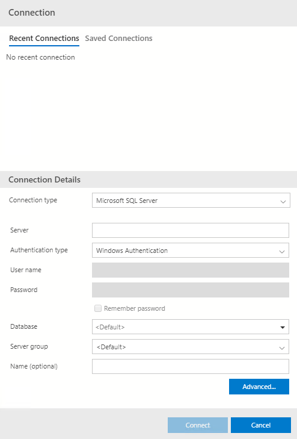
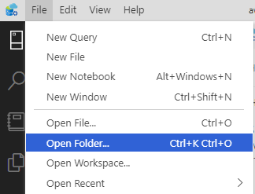

Now that you've seen how Azure SQL appears in SSMS, let's explore a tool that may be new to you called Azure Data Studio (ADS). ADS is a source-open tool that provides a lightweight editor and other tools (including Notebooks which you'll see soon) for interacting with Azure Data Services (including SQL Server on-prem, Azure SQL, Azure Database for PostgreSQL, and more). Let's take a brief tour to get acquainted.  

## Connect with Azure Data Studio

1. On your local device open Azure Data Studio (ADS). When opening for the first time, you'll first be prompted to make a connection.  

    If you are prompted to enable preview features, select **Yes**.  

    [!div class="mx-imgBorder"]
      

    If you don't see this window, or at any time want to add an additional connection, you can select the **New connection** button in the **Servers** bar. In the example below, you also get a preview of what a SQL Server connection would look like, but in this exercise you will not connect to SQL Server.  

    [!div class="mx-imgBorder"]
      

1. Next, connect to your Azure SQL Database logical server. Complete the login box with the following values and select **Connect**.

    |Parameter  |Value  |
    |---------|---------|
    |**Connection type**     | Microsoft SQL Server       |
    |**Server**     | Enter the name of your logical server        |
    |**Authentication type**     | SQL Login        |
    |**User name**     |  cloudadmin       |
    |**Password**     | Enter the password for the cloudadmin account        |
    |**Remember password**     | Selected        |
    |**Database**     | AdventureWorks        |
    |**Server group**     | Azure SQL Database        |
    |**Name (optional)**     |  Leave blank       |

    [!div class="mx-imgBorder"]
      

1. In the **Connections** tab, under **Servers**, you should now see your Azure SQL Database connection (SQL Server connection shown in image for comparison only).  

    [!div class="mx-imgBorder"]
      

1. Finally, to run queries in ADS, it's very similar to SSMS. Right-click on a database or server name and select **New query**.

1. For Azure SQL Database, since you are not really getting a full "server", **`USE [DatabaseName]`** is not supported to change the database context. You must either change the connection to specifically connect to the database you want to run a query on or use the drop-down. Change to the context of your **AdventureWorks** database by selecting the drop-down box next to **master** and run `SELECT @@VERSION`.  

    [!div class="mx-imgBorder"]
    

## Set up easy file access with ADS  

Now that you're connected, you might want an easy way to access scripts and Jupyter notebooks. A Jupyter notebook (often referred to just as "Notebooks") is a way of integrating runnable code with text. If you aren't familiar with Jupyter notebooks, you will be soon.

1. First, in ADS, select **File > Open Folder**.  

    [!div class="mx-imgBorder"]
      

1. Next, navigate to where you extracted the zip file of the resources for this exercise. If you followed the prerequisites, the path should be similar to `C:\Users\<machine-username>\mslearn-azure-sql-fundamentals`. Once you're there, select **Select Folder**.  

1. Next, select the **Explorer** icon from the left taskbar to navigate through the files in the module. Note that this zip file contains all of the resources needed for the Azure SQL Fundamentals learning path, so you only need to download and configure this once!  

    [!div class="mx-imgBorder"]
      

    Throughout the module and learning path exercises, you'll be instructed at various points to open a notebook (file ending in `.ipynb`), and you can access those from here directly. Alternatively, you can access them from the Notebook icon.  

1. Once you've deployed an instance of SQL (Azure SQL or SQL Server), there are typically some queries you would run to verify your deployment. In Azure SQL, some of these queries vary from SQL Server. In this step, you'll see what and how things change from SQL Server, and what is new.  

    For this step, you'll use the notebook **VerifyDeployment.ipynb** which is under `02-DeployAndConfigure\verifydeployment\VerifyDeployment.ipynb` in the GitHub repository or zip file you downloaded earlier. Navigate to that file in ADS to complete this activity, and then return here.  

    If you are unable to complete the exercise for any reason, you can review the results in the [corresponding notebook file on GitHub](https://github.com/MicrosoftDocs/mslearn-azure-sql-fundamentals/blob/master/02-DeployAndConfigure/verifydeployment/VerifyDeployment.ipynb).
