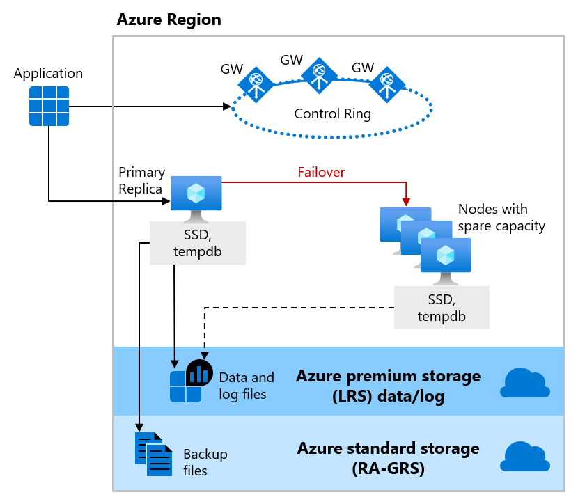
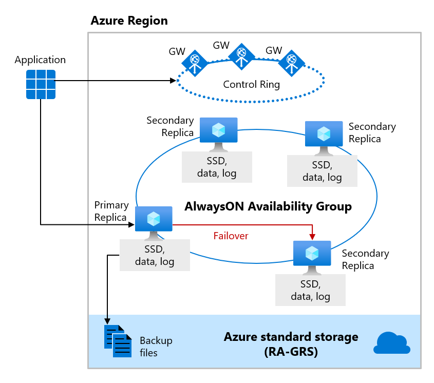

TODO

## General purpose

## Business critical

You've seen some of the capabilities that Azure SQL offers generally as far as high availability goes in Azure SQL. In this topic, you'll move to the Business critical service tier, which is meant to obtain the highest performance and availability of all Azure SQL service tiers (General purpose, Hyperscale, Business critical). Business critical is meant for mission-critical applications that need low latency and minimal downtime.  

You may recall from [Module 1](./01-IntroToAzureSQL.md) that Business critical is very similar to deploying an Always on Availability Group (AG) behind the scenes.  

Unlike the General purpose tier, in Business critical the compute and storage is on directly attached SSDs, which reduces network latency significantly (General purpose uses remote storage). In this AG, there are three replicas, and one of them can be used as a read-only endpoint (at no additional charge). One important note is that with Business critical, you get one read-only replica for free with no configuration, but with Hyperscale you have the ability to set up **multiple** read-only replicas. If any type of failure occurs, failing over to a secondary replica is very fast, because it already exists and has the data attached to it.  

Additionally, in the Business critical tier, you can opt-in (for no additional fee) for a [zone redundant configuration](https://docs.microsoft.com/en-us/azure/sql-database/sql-database-high-availability#zone-redundant-configuration) if your [region supports that](https://docs.microsoft.com/en-us/azure/availability-zones/az-overview#services-support-by-region). You can read more in the documentation, but at a high level, the four replicas (one primary and three secondary) are deployed to three different availability zones (AZ) within a region, meaning three different datacenters with some distance between them. This protects against catastrophic failures that may occur in a region to a datacenter. There is a small increase in network latency, since now they are spread across datacenters with some distance between them, so you have the choice to opt for what's commonly called "multi-az" or "single-az".  

More information about Business critical can be found [here](https://docs.microsoft.com/en-us/azure/sql-database/sql-database-service-tier-business-critical).  

## Hyperscale

