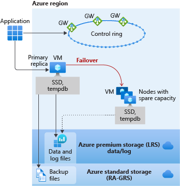
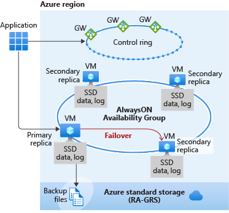

A critical piece of understanding the availability options and capabilities in Azure SQL include the service tier. The service tier you select will determine the underlying architecture of the database or managed instance that you deploy. 

While there are two purchasing models to consider, DTU and vCore, this unit will focus on the vCore service tiers and their architectures for high availability. However, in the DTU model, you can equate Basic and Standard tiers to General purpose, and Premium tiers to Business critical.  

## General purpose

Databases and managed instances in the General purpose service tier have the same availability architecture. Leveraging the figure below as a guide, first consider the *Application* and *Control Ring*. The application will connect to the server name which will then go off to a Gateway (GW) pointing the application to the server to connect to running on a VM. With General purpose, the primary replica leverages locally-attached SSD for tempdb, and the data and log files are stored in Azure premium storage, which is locally redundant storage (multiple copies in one region). The backup files are then stored in Azure standard storage which is considered RA-GRS, meaning it is globally redundant storage (copies in multiple regions).

As discussed in an earlier module in the learning path, all of Azure SQL is built on Azure Service Fabric, which serves as the Azure backbone. If Azure Service Fabric determines that a failover needs to occur, the failover will be similar to that of a Failover Cluster Instance (FCI) where the service fabric will look for a node with spare capacity and spin up a new SQL Server instance. Then, the database files will be attached, recovery will be run, and gateways are updated to point applications to the new node. Note that there is no virtual network or listener or updates required, this just comes built-in.

## Business critical

The next service tier to consider is Business critical, which is meant to obtain the highest performance and availability of all Azure SQL service tiers (General purpose, Hyperscale, Business critical). Business critical is meant for mission-critical applications that need low latency and minimal downtime.  

Business critical is very similar to deploying an Always on Availability Group (AG) behind the scenes. Unlike the General purpose tier, in Business critical the tempdb, data and log files are all running on directly attached SSDs, which reduces network latency significantly (General purpose uses remote storage). In this AG, there are three secondary replicas, and one of them can be used as a read-only endpoint (at no additional charge). One secondary replica must sync for a commit.

Read scale-out with one of the secondary replicas supports session-level consistency. That means if the read-only session reconnects after a connection error caused by replica unavailability, it may be redirected to a replica that is not 100% up-to-date with the read-write replica. Likewise, if an application writes data using a read-write session and immediately reads it using a read-only session, it is possible that the latest updates are not immediately visible on the replica. The latency is caused by an asynchronous transaction log redo operation.

If any type of failure occurs and the service fabric decides a failover needs to occur, failing over to a secondary replica is very fast, because it already exists and has the data attached to it. In a failover, the pointers are changed quickly and then the service fabric takes care of spinning up another secondary.  

## Hyperscale

The Hyperscale service tier is only available in Azure SQL Database, but is in the process of being developed for Azure SQL Managed Instance. This service tier has a unique architecture.

The architecture leverages paired page servers and the ability to scale horizontally to put all of the data in caching layers. The log and data files are stored using a combination of Azure Premium Storage and Azure Standard Storage. One interesting piece in this architecture is how the log service was pulled out. The log service is used to feed the replicas as well as the page servers. Transactions can commit when the log service hardens to the landing zone, which means the consumpution of the changes by a secondary compute replica is not required for a commit. Unlike other service tiers, the existence of secondary replicas is up to you to determine. You can configure zero to four secondary replicas, which can all be used for read-scale. 

An automatic failover will happen if service fabric determines it needs to, but the recovery time will depend on the existence of secondary replicas. For example, if you have zero replicas and a failover occurs, it will be similar to the General purpose service tier where it first needs to find spare capacity. If you have one or more replicas, recovery is faster and more closely aligns to the Busines critical service tier.