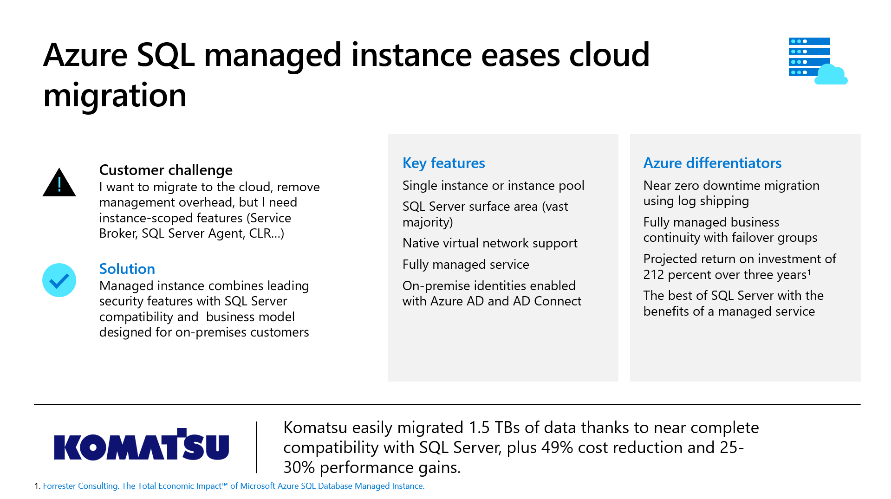
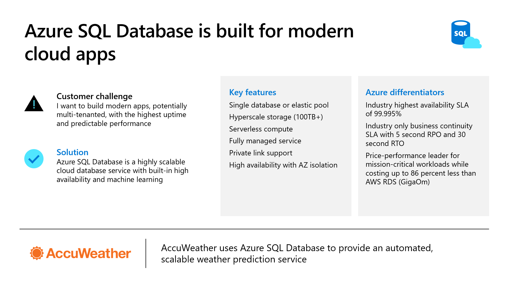
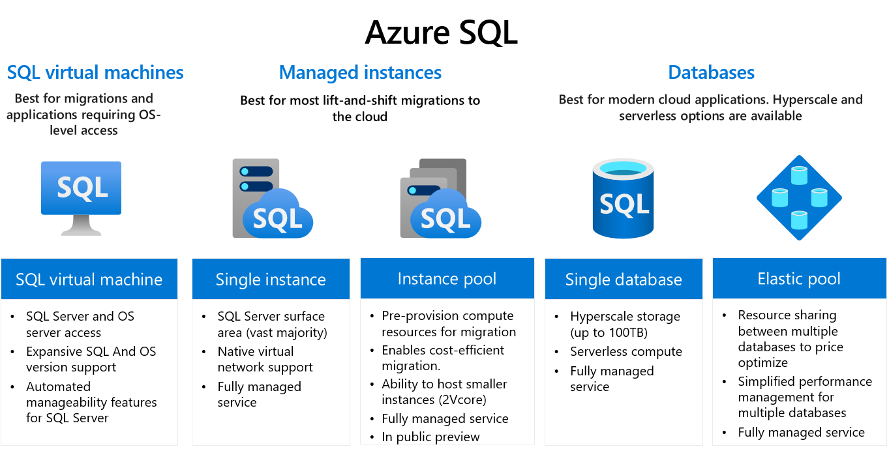

In this unit, you'll dive deeper into what Azure SQL is and what the deployment options are.  

## What is Azure SQL  

Within the umbrella of the "Azure SQL" term, there are many deployment options and choices to be made in order to tailor to various customers' needs. While there are many options, it is not meant to confuse or complicate things, but rather to give customers the flexibility to get and pay for exactly what they need. This topic will cover some of the challenges and scenarios that lead to choosing various Azure SQL deployment options, as well as some of the technical specifications for each of those options. The deployment options discussed in this topic include SQL Server on Azure virtual machines, Azure SQL managed instances, Azure SQL Databases, and Azure SQL "pools" (Azure SQL Instance Pools and Azure SQL Elastic Pools).  

  

At the highest level, when you're considering your options, the first question you may ask is, "What level of scope do I want?" As you move from virtual machines to managed instances to databases, your management scope decreases. With virtual machines, you not only get access to but are also responsible for the OS and the SQL Server. With managed instance, the OS is abstracted from you and now you have access to only the SQL Server. And the highest abstraction is SQL database where you just get a database, and you don't have access to instance-level features or the OS.  

## SQL Server on Azure virtual machine

  

*[Extended Security Updates](https://www.microsoft.com/cloud-platform/extended-security-updates) worth 75% of license every year for the next three years after End of Service (July 9, 2019). Applicable to Azure Marketplace images, customers using customer SQL Server 2008/R2 custom images can download the Extended Security Updates for free and manually apply.  
**[GigaOm Performance Study](https://gigaom.com/report/sql-transaction-processing-price-performance-testing/)

SQL Server on Azure Virtual Machines is simply a version of SQL Server that you specify running in an Azure VM. It is just SQL Server, so all of your SQL Server skills should directly transfer, though Azure can help automate backups and security patches. SQL Server on an Azure virtual machine is referred to as Infrastructure as a Service (IaaS). You are responsible for updating and patching the OS and SQL Server (apart from critical SQL security patches), but you have access to the full capabilities of SQL Server.

There are some considerations for optimally deploying and managing SQL Server on Azure Virtual Machines, and several resources are provided at the end of this module. While the focus of this module and learning path is not SQL Server on Azure virtual machines, a few key things to consider include:  

- Deploy specific SQL Server/OS versions from preinstalled Azure gallery images. If you self-install SQL Server on an Azure VM, you can take advantage of Resource Provider for licensing flexibility and to enable automatic backups and updates.
- Consider the Memory or Storage optimized Virtual Machine sizes for maximum performance requirements.
- Use the right storage configuration including taking advantage of Azure Blob Storage Read Caching.
- Integrate your Azure Virtual Machines to on-premises networks using Azure Virtual Networks.
- Take advantage of Automated Backups, Backups to Azure Blog Storage, and integration with Azure Backup.
- Always On Failover Cluster Instance is supported with Azure Premium File Share.
- Always On Availability Groups are supported including a Cloud Witness.

The customer example for SQL Server on Azure Virtual Machine is Allscripts. Allscripts is a leading healthcare software manufacturer, serving physician practices, hospitals, health plans, and Big Pharma. To transform its applications frequently and host them securely and reliably, Allscripts wanted to move to Azure quickly. In just three weeks, the company lifted and shifted dozens of acquired applications running on ~1,000 virtual machines to Azure with Azure Site Recovery.

## IaaS vs PaaS

SQL Server on Azure virtual machines are considered IaaS. The other deployment options in the Azure SQL umbrella (Azure SQL managed instance and Azure SQL Database) are Platform as a Service (PaaS) deployments. These PaaS Azure SQL deployment options contain a fully managed Database Engine that automates most of the database management functions such as upgrading, patching, backups, and monitoring. Throughout this module (and the Azure SQL fundamentals learning path), you'll learn much more about the benefits and capabilities that the PaaS deployment options enable and how to optimally configure, manage, and troubleshoot them, but some highlights with references for more information are listed below:  

- *Business continuity* enables your business to continue operating in the face of disruption, particularly to its computing infrastructure.
- *High availability* guarantees your databases are up and running 99.99% of the time, no need to worry about maintenance/downtimes.
- *Automated backups* are created and use Azure read-access geo-redundant storage (RA-GRS) to provide geo-redundancy.
- *Long-term backup retention* enables you to store specific full databases for up to 10 years.
- *Geo-replication* by creating readable replicas of your database in the same or different data center (region).
- *Scale* by easily adding more resources (CPU, memory, storage) without long provisioning.
- *Network Security*
  - Azure SQL Database (single database and elastic pool) provides firewalls to prevent network access to the database server until access is explicitly granted based on IP address or Azure Virtual Network traffic origin. Recently, general availability was announced for Private Link, which also enables a completely private connection to Azure SQL Database.  
  - Azure SQL Managed Instance has an extra layer of security in providing native virtual network implementation and connectivity to your on-premises environment using Azure ExpressRoute or VPN Gateways.
- *Advanced security* detects threats and vulnerabilities in your databases and enables you to secure your data.
- *Automatic tuning* analyzes your workload and provides you the recommendations that can optimize performance of your applications by adding indexes, removing unused indexes, and automatically fixing the query plan issues.
- *Built-in monitoring* capabilities enable you to get the insights into performance of your databases and workload, and troubleshoot the performance issues.
- *Built-in intelligence* automatically identifies the potential issues in your workload and provides you the recommendations that can help you to fix the problems.  

### Versionless  

One additional difference that is significant between IaaS and PaaS is the idea of *versionless* SQL. Unlike IaaS, which is tied to a specific SQL Server version (for example, 2019), Azure SQL Database and Managed Instance (all PaaS SQL services) are versionless. The main "branch" of the SQL Server engine code base powers SQL Server 2019, Azure SQL Database, and Azure SQL Managed Instance.  

While SQL Server versions come out every few years, PaaS services allow Microsoft to constantly update the SQL databases/instances. Microsoft rolls out fixes and features as appropriate on what they call "trains". As a consumer of the service, you don't have control over this, and the result of `@@VERSION` will not line up to a specific SQL Server version. However, this allows for *worry-free patching for both the underlying OS and SQL Server* and for Microsoft to give you the latest bits, taking the responsibility to also not break you.  

As new features are developed, some customers can be whitelisted for specific features (Microsoft calls this Private Preview). New features, after Private Preview, will become Public Preview, where everyone can access them, but there is limited support and often discount pricing (if applicable). Some new features are applicable to Azure and SQL Server, while some are specific to Azure. For updates, some things make it to a Cumulative Update first and some to Azure first.  

## Azure SQL managed instance

  

Azure SQL managed instance is a PaaS deployment option of Azure SQL that basically gives you an evergreen instance of SQL Server. Most of the features available in the SQL Server box products are available in Azure SQL managed instance (Azure SQL MI). This option is ideal for customers who want to leverage instance-scoped features (features that are tied to an instance of SQL Server as opposed to features that are tied to a database in an instance of SQL Server) like SQL Server Agent, Service Broker, Common Language Runtime (CLR), etc. and want to move to Azure without rearchitecting their applications. While Azure SQL MI allows customers to access the instance-scoped features, customers do not have to worry about (nor do they have access to) the OS or the infrastructure underneath.  

> **Fun fact**: You might be wondering why it is called *Managed Instance*. Let's break it down:  
>
> - It is called an *Instance* because it is equivalent to a Database Engine Instance of SQL Server which is defined in our [documentation](https://docs.microsoft.com/sql/database-engine/configure-windows/database-engine-instances-sql-server?view=sql-server-ver15). The term Database Engine Instance is important because other instance types for SQL Server are things like SSAS.  
>- It's called *Managed* because it is a PaaS version of a Database Engine Instance where we manage several things including install of SQL Server, scaling, and high-availability.  

A good customer example comes from Komatsu. Komatsu is a manufacturing company that produces and sells heavy equipment for construction. They had multiple mainframe applications for different types of data, which they wanted to consolidate to get a holistic view. Additionally, they wanted a way reduce overhead. Because Komatsu uses a large surface area of SQL Server features, they chose to move to **Azure SQL Managed Instance**. They were able to move about 1.5 terabytes of data smoothly, and start enjoying benefits like automatic patching and version updates, automated backups, high availability, and reduced management overhead. After migrating, they reported ~49% cost reduction and ~25-30% performance gains.  

## Azure SQL Database

  

Azure SQL Database is a PaaS deployment option of Azure SQL that abstracts both the OS and the SQL Server instance away from the users. Azure SQL Database has the industry's highest availability SLA, along with other intelligent capabilities related to monitoring and performance, due in part to the fact that Microsoft is managing the instance. This deployment option allows you to just 'get a database' and start developing applications. Azure SQL Database (Azure SQL DB) is also the only deployment option that currently supports scenarios related to needing unlimited database storage (Hyperscale) and autoscaling for unpredictable workloads (Serverless).  

AccuWeather is a great example of using Azure SQL Database. AccuWeather has been analyzing and predicting the weather for more than 55 years. They wanted access to the rich and rapidly advanced platform of Azure that includes big data, machine learning, and AI capabilities. They want to focus on building new models and applications, not managing databases. They selected **Azure SQL Database** to use with other services, like Azure Data Factory and Azure Machine Learning Services, to quickly and easily deploy new internal applications to make sales and customer predictions.  

## Azure SQL "pools"

You've now learned about the three main deployment options within Azure SQL: virtual machines, managed instances, and databases. For the PaaS deployment options (Azure SQL MI and Azure SQL DB), there are additional options for if you have multiple instances or databases, and these options are referred to as "pools". Using pools can help at a high level because they allow you to share resources between multiple instances/databases and cost optimize.  

**Azure SQL Instance Pools** (currently in public preview) allow you to host multiple Azure SQL MIs and share resources. You can pre-provision the compute resources, which can reduce the overall deployment time and thus make migrations easier. You can also host smaller Azure SQL MIs in an Instance Pool than in just a single Azure SQL MI (more on this in future sections).

**Azure SQL Database Elastic Pools** (Generally Available) allow you to host many databases that may be multi-tenanted. This is ideal for a Software as a Service (SaaS) application or provider, because you can manage and monitor performance in a simplified way for many databases.  

A good example for where a customer leveraged Azure SQL Database Elastic Pools is Paychex. Paychex is a human capital management firm that serves more than 650,000 businesses across the US and Europe. They needed a way to separately manage the time and pay management for each of their customers, and cut costs. They opted for Azure SQL Database Elastic Pools, which allowed them to simplify the management and enable resource sharing between separate databases to lower costs.  

## Azure SQL Deployment Options

A brief visual that summarizes all the deployment options for Azure SQL is below. Next, you'll go through deploying and configuring Azure SQL and how it compares to deploying and configuring the box SQL Server.  

