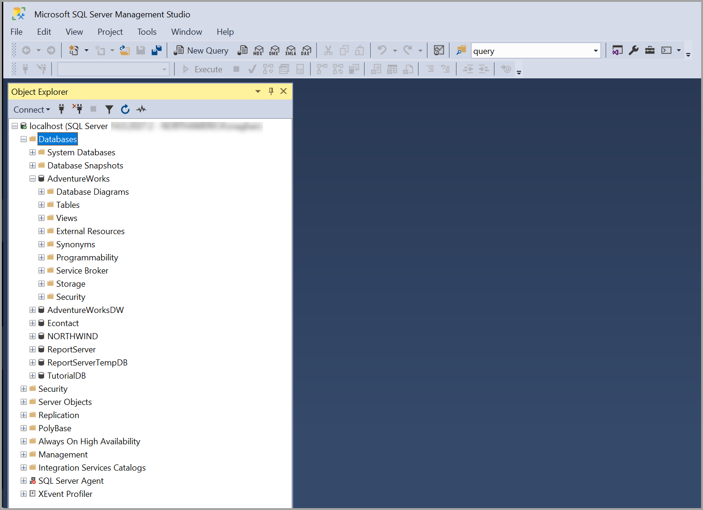
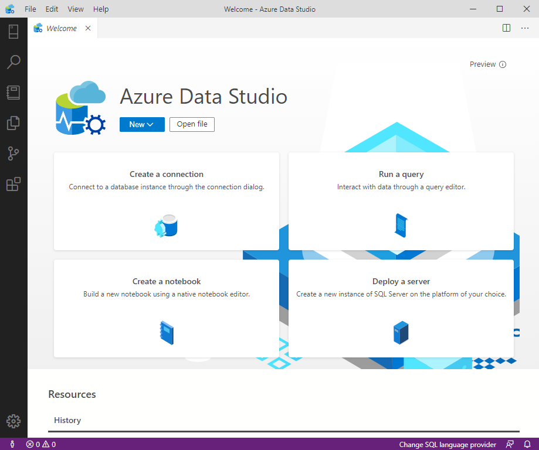

As you deploy, use, and manage Azure SQL resources you will use a variety of interfaces and tools. In this unit, you'll get a survey of what's available, with links to learn more.  

### Azure portal  

The Azure portal is well integrated for Azure SQL resources including virtual machines, managed instances, and databases.  

The concept of *Azure SQL* is also baked into the portal experience for both managing resources and deploying Azure SQL options.

  
### SQL Server Management Studio (SSMS)  

SQL Server Management Studio (SSMS) is the most famous and popular tool for SQL Server in the world. SSMS is integrated to understand how to visualize and work with Azure SQL including SQL Server in Virtual Machines, Managed Instances, or Databases. When necessary, SSMS will only show options that work for a specific Azure service.

### Azure Data Studio (ADS)  

Azure Data Studio (ADS) is a fairly new open-source, cross-platform tool to query and work with various Azure Data sources including SQL Server and Azure SQL. ADS supports a powerful concept called notebooks that you will use in some of the exercises throughout the learning path. Notebooks allow you to mix runnable code cells and formatted text in one place, which you can optionally save the results for future reference or analysis.

### APIs  

Since all Azure SQL services are based on the SQL Server engine, Azure SQL supports the T-SQL language and TDS protocol. Therefore, all drivers that normally work with SQL Server work with Azure SQL.

In addition, Azure SQL supports specific REST APIs for management of Managed Instances and Databases.

### CLIs  

Popular command-line interfaces such as sqlcmd and bcp are supported with Azure SQL services.

In addition, the az CLI and Azure PowerShell cmdlets are supported for specific Azure SQL service scenarios. All of these CLIs are supported across Windows, macOS, and Linux clients. In addition, tools like sqlcmd and az are pre-installed in the Azure Cloud Shell.

## What to use when

There are several different interfaces you can use to interact with Azure SQL. Many of the capabilities are available in each of the interfaces. Which one you choose will depend on a combination of preference and what you're trying to accomplish. Throughout the learning path, you'll get exposure to many of the interfaces above, but the end of this module will also provide resources for you to go deeper in the ones that interest you.  
