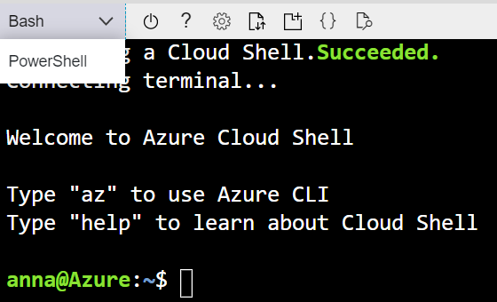

As you deploy, use, and manage Azure SQL resources you will use a variety of interfaces and tools. Here, we'll look at the tools available, what their capabilities are, and when to use them.  

### Azure portal  

The Azure portal provides a broad set of features for Azure SQL resources including virtual machines, managed instances, and databases. Through the Azure portal, you can deploy resources, administer resources, and even connect to databases and execute queries.

  
### SQL Server Management Studio

SQL Server Management Studio (SSMS) is the most famous and popular tool for SQL Server in the world. SSMS is integrated to understand how to visualize and work with Azure SQL including SQL Server in Virtual Machines, SQL Managed Instances, or SQL Databases. When necessary, SSMS will only show options that work for a specific Azure service.

### Azure Data Studio

Azure Data Studio is an open-source, cross-platform tool to query and work with various Azure data sources including SQL Server and Azure SQL. Azure Data Studio supports a powerful concept called notebooks that you will use in some of the exercises throughout the learning path. Notebooks allow you to mix runnable code cells and formatted text in one place, which you can optionally save the results for future reference or analysis.

### Languages and API's  

Since all Azure SQL services are based on the SQL Server engine, Azure SQL supports the Transact-SQL (T-SQL) language and Tabular Data Stream (TDS) protocol. Therefore, all drivers that normally work with SQL Server work with Azure SQL.

In addition, Azure SQL supports REST APIs for management of SQL Managed Instances and SQL Databases.

### Command-line interfaces 

Popular command-line interfaces such as *sqlcmd* and *bcp* are supported with Azure SQL services.

In addition, the Azure CLI and Azure PowerShell cmdlets are supported for specific Azure SQL service scenarios. All of these CLIs are supported across Windows, macOS, and Linux clients. In addition, tools like *sqlcmd* and *az* are pre-installed in the Azure Cloud Shell.

## What to use when

There are several different interfaces you can use to interact with Azure SQL. Many of the capabilities are available in each of the interfaces. Which one you choose will depend on a combination of preference and what you're trying to accomplish. Throughout the learning path, you'll get exposure to many of the interfaces above, but the end of this module will also provide resources for you to go deeper in the ones that interest you.  
