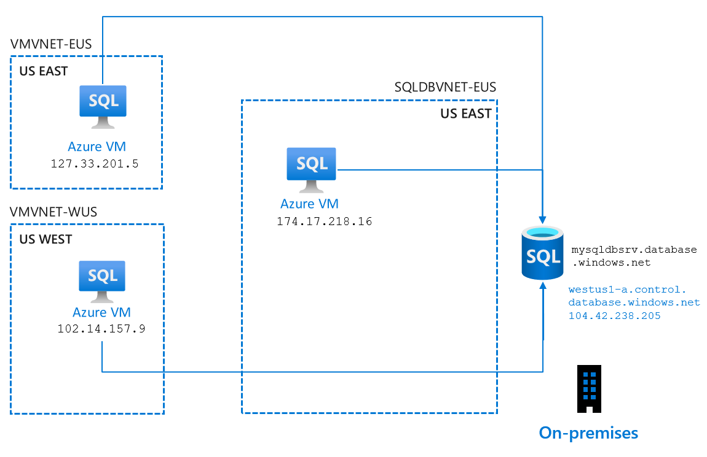
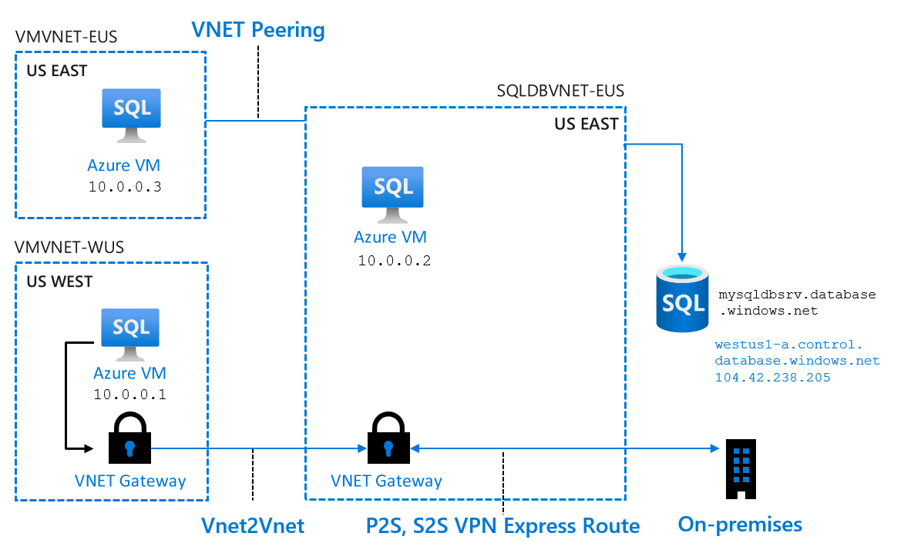
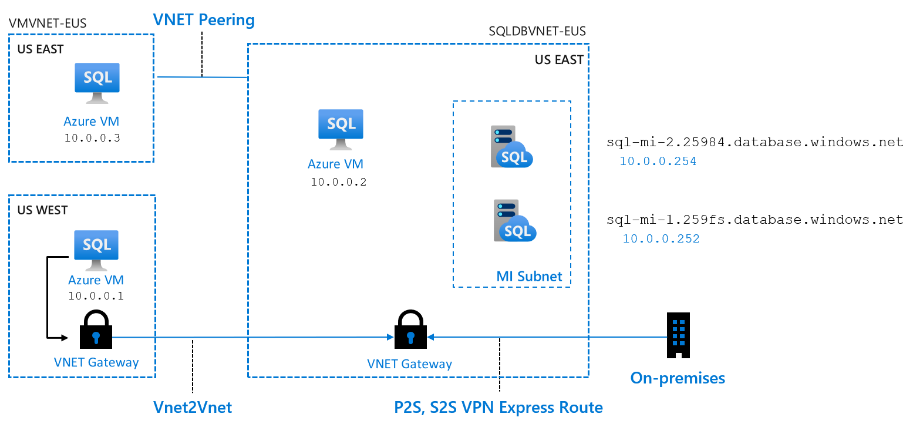

SQL Server and Azure SQL services has been known for the importance it puts on security, specifically as being enterprise-class. In this unit, you'll learn about the various security capabilities related to network security and identity and access. In the units that follow, you'll get hands on with some of these capabilities.


## Network security

### Azure SQL Database

There are four main choices you have when you're securing your network for Azure SQL Database:

* Allow access to Azure services
* Firewall rules
* Virtual network rules
* Private Link

In addition to these main choices, you have the opportunity to block all public access (only with Private Link) and the option to force a minimum TLS version. For more information on these topics, you should refer to the documentation.

#### Allow access to Azure services

During deployment of Azure SQL Database, you have the option to set **Allow Azure services and resources access to this server** to **Yes**. If you choose this option, you're allowing any resource from any region or subscription the possibility to access your resource. This makes it very easy to get up and running with getting Azure SQL Database connected to other services like Azure VMs or Azure App Services, because you're allowing anything that comes through Azure to have the potential to connect.



This does not, however, allow anything outside of Azure (for example, your on-premises environment) to have access.

If you can, switching it to **No** is the most secure configuration of the public endpoint, because it will block all connections/networks apart from ones you've explicitly added with the various options that follow.

#### Firewall rules

The next option you have is to leverage firewall rules. Your results can be similar to those of Allow Azure access, except for each service to connect (in the example below, a VM) you will need to add a unique firewall rule to allow the VM to connect. This also enables your on-premises environment because you can add firewall rules for machines and applications in your on-premises environment.


Note that it is possible to Allow access to Azure services so you get connectivity in Azure, and then add firewall rules for just your on-premises connectivity. As previously mentioned, the Allow access to Azure services is not as secure since it allows all Azure traffic, so the recommendation would be to instead use firewall rules exclusively.

Let's take the example above with firewall rules configured. From a tool supporting T-SQL, you could run the following query from your Azure VM in the virtual network "SQLDBVNET-EUS":

```sql
SELECT client_net_address FROM sys.dm_exec_connections WHERE session_id=@@SPID;
```  

The result would be `174.17.218.16`. This is the public IP address of the Azure VM. Even though we're using firewall rules, all the connections being made are public.

#### Virtual network rules

If you wanted to use only firewall rules, setting this up can be complicated, since it means you'll have to specify a range of IP addresses for all your connections (which can sometimes have dynamic IP addresses). A much easier alternative is to use Virtual network (VNet) rules to establish and to manage access from specific networks that contain VMs or other services that need to access the data.

If you configure access from a VNet with a Virtual Network rule, then any resources in that VNet can access the Azure SQL Database logical server, which can simplify the challenge of configuring access to all the IP addresses (static and dynamic) that need to access the data. This could allow you to specify one or multiple virtual networks, encompassing all of the resources within. You can also start to leverage VNet technologies to connect networks across regions in Azure and even to on-premises.  



In this example, you could run the same query as in the previous section from your Azure VM in the virtual network "SQLDBVNET-EUS":

```sql
SELECT client_net_address FROM sys.dm_exec_connections WHERE session_id=@@SPID;
```  

The result would now be `10.0.0.2`. This is the private IP address of the Azure VM. This gets you one step closer to making private connections to your Azure SQL Database logical server, since now resources are connecting through the VNet.

Another common strategy for analyzing your connection is to examine the DNS hierarchy. In the same Azure VM, in a command prompt you could run the following command:

```cmd
nslookup aw-server.database.windows.net  
```

This command allows you to understand details related to the DNS infrastructure. Your results would be something similar to the following:  

```cmd
Server: Unknown
Address: 168.63.129.16

Non-authoritative answer:
Name:   cr2.eastus1-a.control.database.windows.net
Address:    174.17.218.16
Aliases:    aw-server.database.windows.net
            dataslice2.eastus.database.windows.net
```

The important things to look at are under the Non-authoritative answer:  

* **Name**: The endpoint starting with `cr2` is part of the public DNS hierarchy. Without getting too much into the hierarchy, `cr2` is the Control Ring 2 and then there are multiple data "slices" below it.  
* **Address**: The IP address returned here should match the public IP address of your Azure VM. So even though a tool like SSMS' final hop might be through your VM's private IP address, the public IP address of your VM is still being used to connect in some capacity.  
* **Aliases**: These are just various points within the DNS hierarchy, in this case the specific data "slice" and the endpoint you connect to.  

**Fun fact**: the **Address: 168.63.129.16** is a virtual public IP address used to facilitate a communication channel to Azure platform resources. It's the case for all regions and all national clouds, and it will not change.

Even though the connection through T-SQL is coming through the private IP address of the Azure VM, you are still ultimately connecting through a public endpoint.

### Private Link for Azure SQL Database

You've seen how to configure the most secure network using Azure SQL Database with the public endpoint. This method of securing Azure SQL Database has been used for years. However, in 2019, Azure began moving towards a concept of a Private Link, which is more similar to the way that Azure SQL Managed Instance is deployed. Private Link allows you to connect to Azure SQL Database (and several other PaaS services) using a private endpoint, which means it has a private IP address within a specific VNet.  
  


In the example above, what you'll notice is that the general networking infrastructure did not change, you can still leverage the VNet connectivity strategies from VNet rules. However, you will not have to create VNet rules. Resources that need to connect to the database server simply have to have access to the VNet where the endpoint resides (in this case "SQLDBVNET-EUS"). Only connections going through the private endpoint will have access, all other connections (for example, from the internet) will be denied.

Continuing with this example, on the Azure VM in VNet "SQLDBVNET-EUS", you could once again run the following TSQL:

```sql
SELECT client_net_address FROM sys.dm_exec_connections WHERE session_id=@@SPID;
```

By adding access from your specific VNet, connections to Azure SQL Database from your VM will appear to come through the private IP address of your VM. This is the same result you saw with virtual network rules.  

However, if you leverage the command prompt to look at the DNS hierarchy, using the follow command:

```cmd
nslookup aw-server.database.windows.net  
```

Your results will be slightly different with the private endpoint configured:  

```cmd
Server: Unknown
Address: 168.63.129.16

Non-authoritative answer:
Name:   aw-server.privatelink.database.windows.net
Address:    10.0.0.5
Aliases:    aw-server.database.windows.net
```

The important things to look at are under the Non-authoritative answer, and let's examine the differences:  

* **Name**: Note that you're no longer pointing to the public DNS hierarchy, only to the Private Link DNS. This means less information is revealed about your database server.  
* **Addresses**: For VNet rules, the address returned was the public IP address of your VM, but it should now be one or more *private* IP addresses within the Private Link hierarchy (one is the private endpoint of your Azure SQL Database).
* **Aliases**: Similar to the Name field, you're not seeing anything related to the DNS hierarchy, except that you can still connect to the server name (e.g. `aw-server.database.windows.net`).  

One thing you might be wondering, is if you are connecting to the private endpoint, **why are you still using the same server name?** In the backend, when you use solely the Private Link method of connecting (i.e. no firewall or virtual network rules), the information is processed as follows:  

* `aw-server.database.windows.net`  
  * Resolved by service to `aw-server.privatelink.database.net`  
    * Resolved by service to `10.0.0.5` (the IP address of your private endpoint)  

Additionally, the service will block you from directly connecting using anything apart from `aw-server.database.windows.net`.  

### Azure SQL Managed Instance

TODO



## Identity and access

TODO

## Other capabilities

After getting hands on with some of the network and authentication capabilities, later in the module you will examine other capabilities (and their related tasks) for data protection, monitoring, logging, and auditing.
