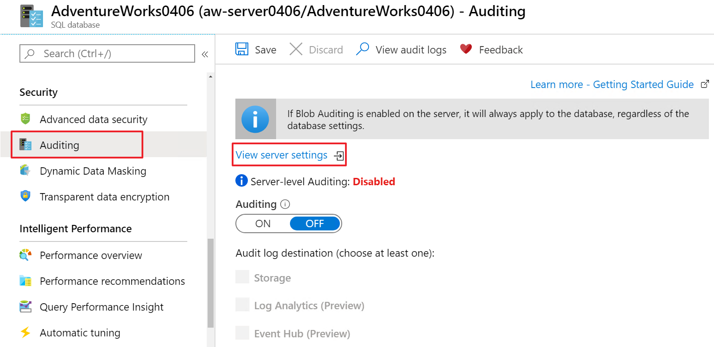
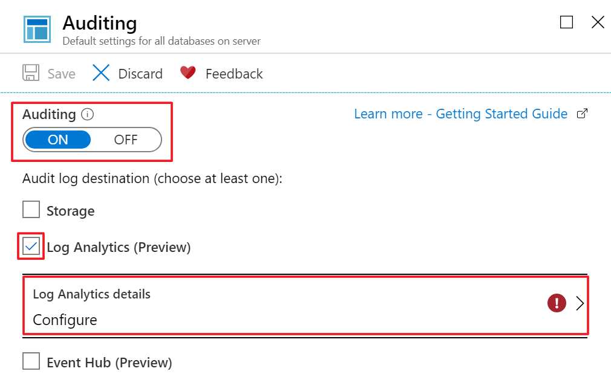
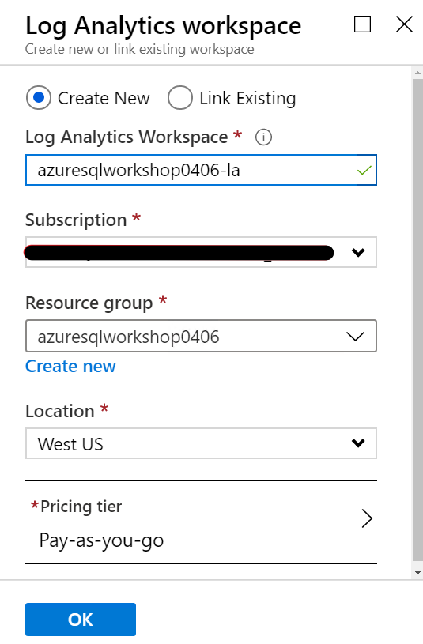
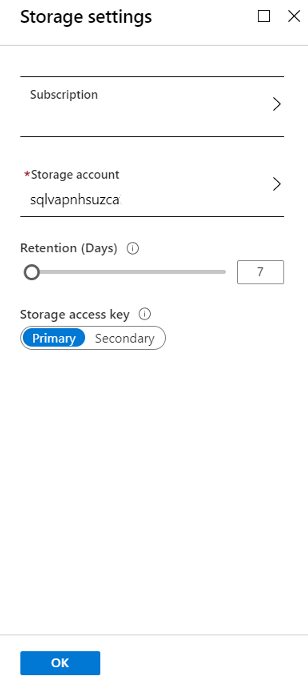

# Activity 1: Configure Auditing

>Note: This activity may appear slightly out of place. However, we want to enable auditing as soon as possible, so you have more to "audit" in later activities.  

The auditing feature tracks database and server events and writes events to an audit log in either Azure storage, Azure Monitor logs (also called Log Analytics), or to an Event hub. Auditing helps maintain regulatory compliance, understand database activity, and gain insight into discrepancies and anomalies that could indicate potential security violations. In this activity, you'll set up Auditing at the server level (also available at the database level).  

The main differences between auditing in Azure SQL and auditing in SQL Server are:  

* Auditing for Azure SQL (using XEvents) supports Azure Blog Storage only for file targets  
* Traditional [SQL Server Auditing](https://docs.microsoft.com/sql/relational-databases/security/auditing/sql-server-audit-database-engine?view=sql-server-ver15) using T-SQL is only available (with some differences) in Azure SQL Managed Instance. The primary differences are:  
  * With `CREATE AUDIT`, you have new syntax `TO URL` and `TO EXTERNAL MONITOR` allow you to specify an Azure Blob storage container and enable Event Hub and Azure Monitor logs target, respectively.  
  * `TO FILE`, shutdown option, and `queue_delay`=0 are not supported in Azure SQL.  
  * For a complete list of differences, refer to the [documentation](https://docs.microsoft.com/azure/sql-database/sql-database-managed-instance-transact-sql-information#auditing).  
* As an alternative to SQL Server Audit, there is *SQL Database Audit*  (available for SQL Managed Instance and SQL Database). Over the course of the module, you'll learn more about its capabilities. For more information, refer to the [SQL Database Audit documentation](https://docs.microsoft.com/azure/sql-database/sql-database-auditing).  

### Steps

#### Step 1 - Enable auditing on the Azure SQL Database logical server  

Open the Azure portal and navigate to your Azure SQL Database. In the left-hand task menu, under Security, select **Auditing**. Review the options and then select **View server settings**. You can apply auditing at the server level, which then applies to all databases within the Azure SQL Database logical server. If you also apply at the database level (you won't do that today), that would mean the two audits would happen in parallel (one does not override the other). You could alternatively only audit at the database level.  

  

Next, set **Auditing** to **ON**. Notice you have different options for your log destination, depending how you want to audit your data. In this lab, you'll configure Storage and Log Analytics. In a later activity in this module, you'll get to look at the logs in both. You can also explore the implementations by reviewing [the documentation](https://docs.microsoft.com/azure/sql-database/sql-database-auditing).  

Select **Log Analytics (Preview)** and the **Configure** button.  

  

Next, select **+ Create New Workspace**.  

  

Fill in the information according to the subscription, resource group, and location, that you are using to complete this workshop. We recommend naming your Log Analytics Workspace **azuresqlworkshopID-la**, using your unique ID for your resources. Select **OK**.  

  

This may take a few moments to validate and create. You should now see your Log Analytics account.  

Next, select **Storage**. This option allows you to collect XEvent log files in an Azure Blob storage account. In a later activity, you'll see more on how this differs from Log Analytics. Select **Configure**.  

  

Next, select the subscription you're using for this workshop as well as the storage account in the resource group with your ID that was created in Module 02 when you selected the Advanced Data Security Free Trial (should be *sql* + *a random string of letters and numbers*). In this storage account, auditing logs will be saved as a collection of blob files within a container named **sqldbauditlogs**.  

> Note: depending on your organization, in production you may consider having a separate storage account for the audit logs.

You also have options for the number of days you want to retain data. The default, **0**, means to retain data forever. You can change this to something else, if you want to cut back on the storage that may be generated and charged here. For this exercise, input **7**.  

Finally, you can make a decision of which storage access key to use. Note you can use this to switch between keys when it's time to rotate them. Select **Primary**.  

After you've configured your options, select **OK**.  

  

Select **Save**.  

  

Once it saves, you can select the **X** button to close the server level Auditing pane.  

Navigate back to your Azure SQL Database (not logical server) and under Security, select **Auditing**. In the Azure SQL Database Auditing overview, you may notice that the **Auditing** option says **OFF**. It's important to note that if auditing is enabled on the server, it will always apply to the database.  

  

This is the end of this activity. You can select **Overview** in the left hand menu to navigate back to the overview of your database. In a later activity in this module, you'll see how to analyze the audit logs to view all of the changes you've made throughout the module, as well as some other interesting use cases.  
