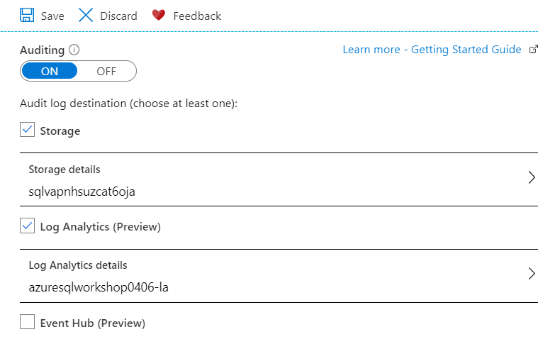
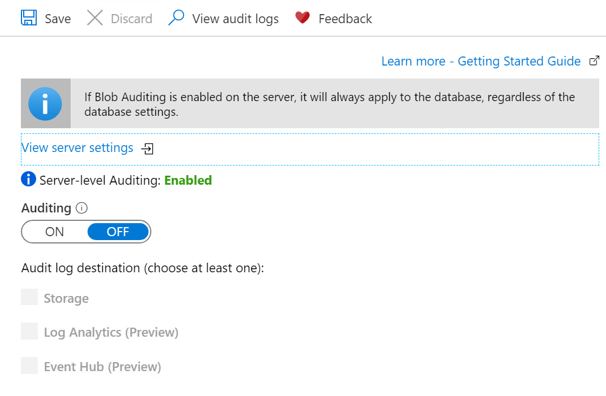

The following exercise may appear slightly out of place. However, we want to enable auditing as soon as possible, so you have more to "audit" in a later exercise.  

The auditing feature tracks database and server events and writes events to an audit log in either Azure storage, Azure Monitor logs (also called Log Analytics), or to an Event hub. Auditing helps maintain regulatory compliance, understand database activity, and gain insight into discrepancies and anomalies that could indicate potential security violations. In this activity, you'll set up Auditing at the server level (also available at the database level).  

The main differences between auditing in Azure SQL and auditing in SQL Server are:  

* Auditing for Azure SQL (using XEvents) supports Azure Blog Storage only for file targets  
* Traditional [SQL Server Auditing](https://docs.microsoft.com/sql/relational-databases/security/auditing/sql-server-audit-database-engine?view=sql-server-ver15) using T-SQL is only available (with some differences) in Azure SQL Managed Instance. The primary differences are:  
  * With `CREATE AUDIT`, you have new syntax `TO URL` and `TO EXTERNAL MONITOR` allow you to specify an Azure Blob storage container and enable Event Hub and Azure Monitor logs target, respectively.  
  * `TO FILE`, shutdown option, and `queue_delay`=0 are not supported in Azure SQL.  
  * For a complete list of differences, refer to the [documentation](https://docs.microsoft.com/azure/sql-database/sql-database-managed-instance-transact-sql-information#auditing).  
* As an alternative to SQL Server Audit, there is *SQL Database Audit*  (available for SQL Managed Instance and SQL Database). Over the course of the module, you'll learn more about its capabilities. For more information, refer to the [SQL Database Audit documentation](https://docs.microsoft.com/azure/sql-database/sql-database-auditing).  

### Set up: Use scripts to deploy Azure SQL Database

In the right-hand terminal, you'll see the Azure Cloud Shell, which is a way to interact with Azure using a browser. Before you start the labs, you will run a script there in order to create your environment, an Azure SQL Database with the AdventureWorks database. In the script, there will be some prompts, for a password and your local IP address.  

In order to get the IP address required, you must disconnect from any VPN service and run `(Invoke-WebRequest -Uri "https://ipinfo.io/ip").Content` in a local PowerShell window (not in this browser).  

This script should take 3-5 minutes to complete. Make sure to note your password, unique ID, and region as it will not be shown again.

**Don't forget to note your password, unique ID, and region. You will need these throughout the module.**  

```powershell
# Prompt for username and password
$adminSqlLogin = "cloudadmin"
$password = Read-Host "Your username is 'cloudadmin'. Please enter a password for your Azure SQL Database server that meets the password requirements"
# Prompt for local ip address
$ipAddress = Read-Host "Disconnect your VPN, open PowerShell on your machine and run '(Invoke-WebRequest -Uri "https://ipinfo.io/ip").Content'. Please enter the value (include periods) next to 'Address': "
# Get resource group and location and random string
$resourceGroup = Get-AzResourceGroup | Where ResourceGroupName -like learn* | Select-Object -Property ResourceGroupName | Select-Object -Index 0
$resourceGroupName = $resourceGroup.ResourceGroupName
$randomString = Get-Random -Minimum 100000 -Maximum 1000000
$storageAccountName = "mslearnsa"+$randomString
$rg = Get-AzResourceGroup | Where ResourceGroupName -like learn*
$location = $rg.Location
# The logical server name has to be unique in the system
$serverName = "aw-server$($randomString)"
# The sample database name
$databaseName = "AdventureWorks"
# The storage account name has to be unique in the system
$storageAccountName = $("sql$($randomString)")
# Create a new server with a system wide unique server name
$server = New-AzSqlServer -ResourceGroupName $resourceGroupName `
    -ServerName $serverName `
    -Location $location `
    -SqlAdministratorCredentials $(New-Object -TypeName System.Management.Automation.PSCredential -ArgumentList $adminSqlLogin, $(ConvertTo-SecureString -String $password -AsPlainText -Force))
# Create a server firewall rule that allows access from the specified IP range and all Azure services
$serverFirewallRule = New-AzSqlServerFirewallRule `
    -ResourceGroupName $resourceGroupName `
    -ServerName $serverName `
    -FirewallRuleName "AllowedIPs" `
    -StartIpAddress $ipAddress -EndIpAddress $ipAddress 
$allowAzureIpsRule = New-AzSqlServerFirewallRule `
    -ResourceGroupName $resourceGroupName `
    -ServerName $serverName `
    -AllowAllAzureIPs
# Create a database 
$database = New-AzSqlDatabase  -ResourceGroupName $resourceGroupName `
    -ServerName $serverName `
    -DatabaseName $databaseName `
    -SampleName "AdventureWorksLT" `
    -Edition "GeneralPurpose" -Vcore 2 -ComputeGeneration "Gen5"
# Enable Advanced data security
$advancedDataSecurity = Enable-AzSqlServerAdvancedDataSecurity `
    -ResourceGroupName $resourceGroupName `
    -ServerName $serverName
# Create a Storage Account 
$storageAccount = New-AzStorageAccount -ResourceGroupName $resourceGroupName `
    -AccountName $storageAccountName `
    -Location $location `
    -Type "Standard_LRS"
Write-Host "Please note your unique ID for future exercises in this module:"  
Write-Host $randomString
Write-Host "Your resource group name is:"
Write-Host $resourceGroupName
Write-Host "Your resources were deployed in the following region:"
Write-Host $location
Write-Host "Your server name is:"
Write-Host $serverName
```

Open SSMS and create a new connection to your logical server.  

For server name, input the name of your Azure SQL Database logical server. You may need to refer to the [Azure portal](https://portal.azure.com/learn.docs.microsoft.com) to get this, e.g. *aw-server`<unique ID>`.database.windows.net*.  

Change the authentication to **SQL Server Authentication**, and input the corresponding Server Admin Login and Password (the one you provided during deployment in the previous exercise).  

Check the **Remember password** box and select **Connect**.  

> **Note**: Depending on your local configuration (e.g. VPN), your client IP address may differ from the IP address the Azure portal used during deployment. If it does, you'll get a pop-up which reads "Your client IP address does not have access to the server. Sign in to an Azure account and create a new firewall rule to enable access." If you get this message, sign-in using the account you're using for the sandbox, and add a firewall rule for your client IP address. You can complete all of these steps using the pop-up wizard in SSMS.  

  

### Configure auditing

1. Enable auditing on the Azure SQL Database logical server  

    Open the [Azure portal](https://portal.azure.com/learn.docs.microsoft.com) and navigate to your Azure SQL Database. In the left-hand task menu, under Security, select **Auditing**. Review the options and then select **View server settings**. You can apply auditing at the server level, which then applies to all databases within the Azure SQL Database logical server. If you also apply at the database level (you won't do that today), that would mean the two audits would happen in parallel (one does not override the other). You could alternatively only audit at the database level.  

      

    Next, set **Auditing** to **ON**.  

2. Configure auditing with Log Analytics  

    Notice you have different options for your log destination, depending how you want to audit your data. In this lab, you'll configure Storage and Log Analytics. In a later activity in this module, you'll get to look at the logs in both. You can also explore the implementations by reviewing [the documentation](https://docs.microsoft.com/azure/sql-database/sql-database-auditing).  

    Select **Log Analytics (Preview)** and the **Configure** button.  

      

    Next, select **+ Create New Workspace**.  

      

    Fill in the information according to the subscription, resource group, and location, that you are using to complete this module.  We recommend naming your Log Analytics Workspace **azuresql`<unique ID>`-la**, using your unique ID for your resources. Select **OK**.  

      

    This may take a few moments to validate and create. You should now see your Log Analytics account.  

3. Configure auditing with Azure Storage  

    Next, select **Storage**. This option allows you to collect XEvent log files in an Azure Blob storage account. In a later activity, you'll see more on how this differs from Log Analytics. Select **Configure**.  

      

    Next, select the subscription you're using for this module as well as the storage account in the resource group with your ID that was created for you (should be *sqlva* + *a random string of letters and numbers*). In this storage account, auditing logs will be saved as a collection of blob files within a container named **sqldbauditlogs**.  

    Depending on your organization, in production you may consider having a separate storage account for the audit logs.

    You also have options for the number of days you want to retain data. The default, **0**, means to retain data forever. You can change this to something else, if you want to cut back on the storage that may be generated and charged here. For this exercise, input **7**.  

    Finally, you can make a decision of which storage access key to use. Note you can use this to switch between keys when it's time to rotate them. Select **Primary**.  

    After you've configured your options, select **OK**.  

      

    Select **Save**.  

      

    Once it saves, you can select the **X** button to close the server level Auditing pane.  

    Navigate back to your Azure SQL Database (not logical server) and under Security, select **Auditing**. In the Azure SQL Database Auditing overview, you may notice that the **Auditing** option says **OFF**. It's important to note that if auditing is enabled on the server, it will always apply to the database.  

      

This is the end of this exercise. You can select **Overview** in the left hand menu to navigate back to the overview of your database. In a later exercise in this module, you'll see how to analyze the audit logs to view all of the changes you've made throughout the module, as well as some other interesting use cases.  
