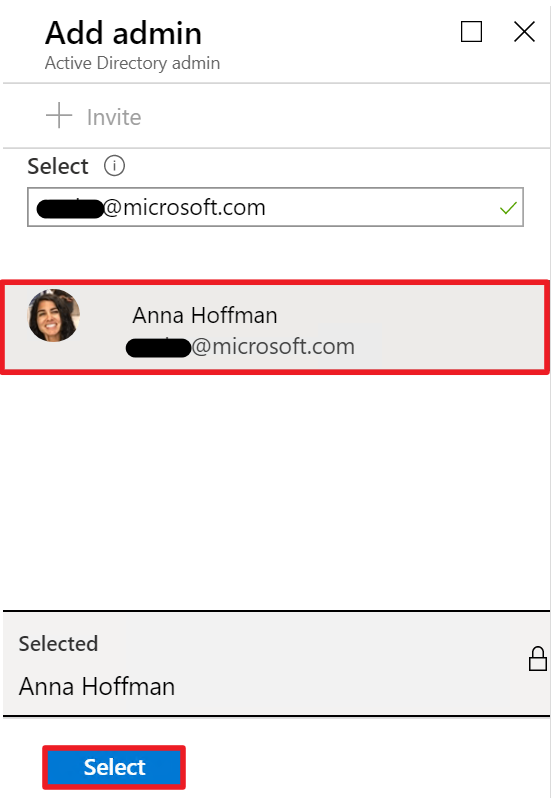
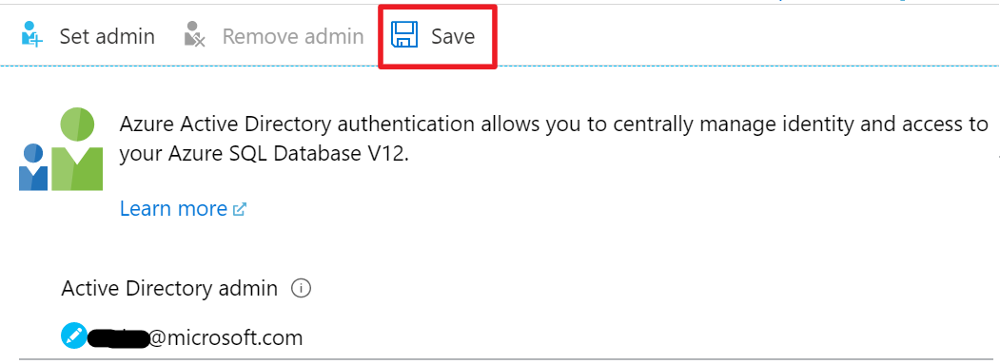
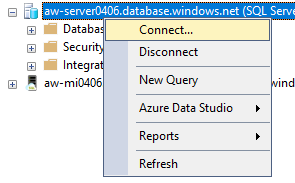
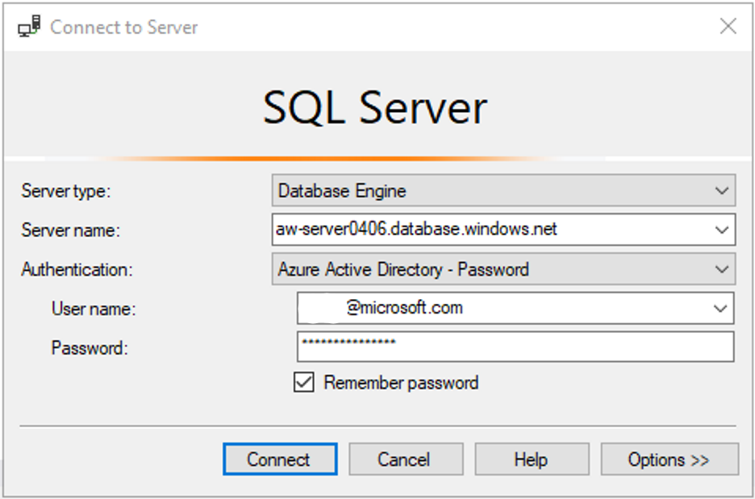
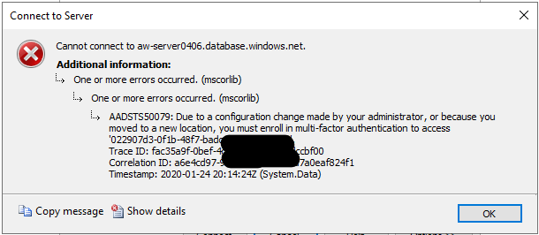

### 3.2 Access management and Authorization

### Activity 4: Getting started with Azure AD authentication

In this activity, you'll learn how to configure an Azure AD administrator on a server level for Azure SQL Database. Next, you'll change your connection in SSMS from SQL authentication to Azure AD authentication, and you'll see how to grant other Azure AD users access to the database like normal users in SQL Server. 

To learn more about authentication, here are a few resources from the documentation:  

* [Azure SQL Security Playbook: Authentication](https://docs.microsoft.com/azure/sql-database/sql-database-security-best-practice#authentication)
* [Configure Azure AD](https://docs.microsoft.com/azure/security/fundamentals/database-best-practices#enable-database-authentication)    
* [Azure RBAC roles](https://docs.microsoft.com/azure/role-based-access-control/built-in-roles)
* [Security best practices related to RBAC](https://docs.microsoft.com/azure/security/fundamentals/database-best-practices#protect-your-data-by-using-encryption-and-row-level-security)
  

### Steps

#### Step 1 - Create an Azure AD admin  

In the Azure portal, navigate to your Azure SQL Database logical server. In the left-hand task menu, select **Active Directory Admin** and **Set Admin**.  

  

Search for you account. The easiest way is to enter in your full account that's associated with your subscription (e.g. `odl_user_160186@....com`). Click your user and then choose **Select**.  

  

You might think that's it, but you still have to select **Save** to confirm your actions.  

  

#### Step 2 - Authenticate using Azure AD  

Now that you've configured access for yourself to your Azure SQL Database logical server, let's update the connection in SSMS and ADS.  

First, in SSMS, right-click on your Azure SQL Database logical server and select **Connect**.  

  

Notice that under *Authentication*, there are several different Azure Active Directory authentication methods, which will depend on how your organization is set up. There are three methods available. An overview of each is provided below, but the links in the titles will point you to additional details.  

* [*Azure Active Directory - Integrated*](https://docs.microsoft.com/azure/sql-database/sql-database-aad-authentication-configure?tabs=azure-powershell#active-directory-integrated-authentication): A non-interactive method, which you can use if you are logged in to Windows using your Azure AD credentials from a federated domain.  
* [*Azure Active Directory - Password*](https://docs.microsoft.com/azure/sql-database/sql-database-aad-authentication-configure?tabs=azure-powershell#active-directory-password-authentication): A non-interactive method that allows you to connect with an Azure AD principal name using the Azure AD managed domain. From the documentation: *This can apply to native or federated Azure AD users. A native user is one explicitly created in Azure AD and being authenticated using user name and password, while a federated user is a Windows user whose domain is federated with Azure AD. The latter method (using user & password) can be used when a user wants to use their windows credential, but their local machine is not joined with the domain (for example, using a remote access). In this case, a Windows user can indicate their domain account and password and can authenticate to SQL DB/DW using federated credentials.*  
* [*Azure Active Directory - Universal with MFA*](https://docs.microsoft.com/azure/sql-database/sql-database-ssms-mfa-authentication): An interactive method that will safeguard access to data while meeting demand for a single sign-in process with Multi-factor Authentication (MFA).

For this workshop, select **Azure Active Directory - Password**.  

  

Next, you'll need to select your AdventureWorks database, which you can do by selecting **Options** > **Connect Properties** > **Connect to database** > **Browse server**.  

Finally, select **Connect**.  

> Note: If you get the following error, this indicates your organization requires you to select **Azure Active Directory - Universal with MFA**. Connect accordingly.  
>
> 

Next to the server name, you should now be able to see that you are authenticated using your Azure AD account and not the `cloudadmin` SQL user as before.  

  

#### Step 3 - Grant other users access (SQL)  

Now that you're authenticated using Azure AD, your next step might be to add other users. Just as in SQL Server, you can add new logins and users. In SSMS, using your Azure AD connection, right-click on your database **server** and create a new query. Run the following.

> Note: For most queries in Azure SQL Database, you must right-click on the **database** within your Azure SQL Database logical server. In SQL Server and Azure SQL managed instance, you can query at the server level and use `USE DatabaseName`, but in Azure SQL Database, you must query the database directly, the `USE` statement is not supported. There are a few exceptions to querying Azure SQL Database, and one is logins. You must connect to the **master** database to create and alter logins. For more details, see [this page](https://docs.microsoft.com/azure/sql-database/sql-database-manage-logins#administrator-access-path).  

```sql
-- Create a new SQL login and give them a password
CREATE LOGIN ApplicationUser WITH PASSWORD = 'YourStrongPassword1';
```

Now you have a login at the server-level. The next step is to create a user in the AdventureWorks database and give them read/write access (if needed). Right-click on your AdventureWorks **database** and create a new query. Run the following.  

```sql
-- Create a new SQL user from that login
CREATE USER ApplicationUser FOR LOGIN ApplicationUser;

-- Until you run the following two lines, ApplicationUser has no access to read or write data
ALTER ROLE db_datareader ADD MEMBER ApplicationUser;
ALTER ROLE db_datawriter ADD MEMBER ApplicationUser;
```

The best practice is to create non-admin accounts at the database level, unless they need to be able to execute administrator tasks.  

#### Step 4 - Contained database users  

In SQL Server, you may be familiar with the concept of a contained database user. This means that a user has access to only specific database(s), but does not have a login to the server. In Azure SQL Database, you can create contained database users with SQL authentication or Azure AD authentication. You must be in the context of the user database you want to create user access in (as opposed to being in master). In Azure SQL Managed Instance, the T-SQL and behavior are the same as in SQL Server, and you can use the `USE DatabaseName` to switch contexts (which is not supported in Azure SQL Database). For detailed information on contained database users (in SQL Server and Azure), refer to the [documentation](https://docs.microsoft.com/sql/relational-databases/security/contained-database-users-making-your-database-portable?view=sql-server-ver15).  

In this step, you'll create a contained database user using SQL authentication, and then attempt to authenticate to that database as the user.  

In SSMS, using your Azure AD connection, right-click on your **database** and create a new query. Run the following.

```sql
CREATE User BobLovesTN WITH PASSWORD = 'Tanehill1!'
```

Now, select **Connect** > **Database Engine** and configure the main page so you are connecting to your Azure SQL Database logical server with Login `BobLovesTN` and Password `Tanehill1!`.  

**You must also set the database name**. You can do this by going to **Options** > **Connection Properties** and selecting **Reset All**. Then, in **Additional Connection Parameters**, enter `Initial Catalog=AdventureWorks0406` replacing `0406` with the ID you're using for the workshop. You have to do this manually, because BobLovesTN doesn't have access to scan the server to select a database.  

Select **Connect** and confirm you're able to access the database.  

As a clean-up step, right-click on the connection from BobLovesTN and select **Disconnect**.  

**Step 5 - Grant other users access (Azure AD) - *Demo/Whiteboard only***  

Azure AD authentication is a little different. From the documentation, "*Azure Active Directory authentication requires that database users are created as contained. A contained database user maps to an identity in the Azure AD directory associated with the database and has no login in the master database. The Azure AD identity can either be for an individual user or a group*."  

Additionally, the Azure portal can only be used to create administrators, and Azure RBAC roles don't propagate to Azure SQL Database logical servers, Azure SQL Databases, or Azure SQL Managed Instances. Additional server/database permissions must be granted using T-SQL.  

If you are attending in-person, your instructor will demo/whiteboard how to add Azure AD users and give them access. If you are attending this self-paced, you can review the scripts below. This scenario involves giving *Person B* access to *Person A*'s Azure SQL Database logical server from an Azure VM.  

```sql
-- Create the Azure AD user with access to the server
CREATE USER "Person B Azure AD account" FROM EXTERNAL PROVIDER;

-- Until you run the following two lines, the user has no access to read or write data
ALTER ROLE db_datareader ADD MEMBER "Person B Azure AD account";

-- Create firewall to allow Person B's Azure VM
EXECUTE sp_set_firewall_rule @name = N'AllowPersonB',
    @start_ip_address = 'Person B VM Public IP',
    @end_ip_address = 'Person B VM Public IP';
```

*Person B* should now be able to connect to the server from their Azure VM. Read commands should work, but write commands should fail.  

```sql
-- Example of a read command
SELECT *
  FROM [SalesLT].[ProductCategory];

-- Example of a write command
UPDATE [SalesLT].[ProductCategory]
    SET ModifiedDate = GETDATE()
    WHERE ProductCategoryID = 1;
```  

In the real-world, scenarios can get complex quickly, because not only do users need the correct access to the server and/or databases, but they also need access to the network. For more information, please refer to the [documentation](https://docs.microsoft.com/azure/sql-database/sql-database-vnet-service-endpoint-rule-overview) and the [Azure SQL Security best practices](https://docs.microsoft.com/azure/sql-database/sql-database-security-best-practice#network-security).
