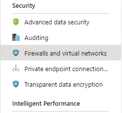
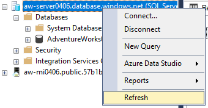

In this exercise, you'll see how to review and manage your firewall rules using the Azure portal. You'll also see how to configure the most secure connection while using the public endpoint.  

### Description

During deployment of Azure SQL Database, the script run selected **Allow Azure services and resources access to this server** to **Yes**. By leaving this **Yes**, you're allowing any resource from any region or subscription the possibility to access your resource. If you can, switching it to **No** is the most secure configuration of the public endpoint, because it will block all connections/networks apart from ones you've added. In this exercise, you'll see how to view and edit your firewall rules. Setting this up can be complicated, since it means you'll have to specify a range of IP addresses for all your connections (which can sometimes have dynamic IP addresses). Some alternative methods for securing your network are provided in a demonstration video that follows the exercise.  

#### Part 1: Managing firewall rules in the Azure portal

1. Restrict access from all Azure services and resources  
Navigate to the [Azure portal](https://portal.azure.com/learn.docs.microsoft.com), specifically to your Azure SQL Database logical **server**.  

    Select **Firewalls and virtual networks** under **Security** from the left-hand menu.  

      

    Switch **Allow Azure services and resources to access this serve**r to **No**. During deployment, you should have added your Client IP address already, but if one of the Rules do not match your Client IP displayed (see below), select **Add Client IP**.  

      

    Finally, select **Save**. You can select **Overview** in the left-hand menu to navigate back to the overview of your database.  

2. Confirm access remains

    To confirm you still have access from your local machine, navigate to SSMS and refresh your connection to the Azure SQL Database logical server. If no errors occur, you have successfully configured access to your Azure SQL Database logical server for your IP address only.  

      

3. Check connection to Azure SQL Database

    Optionally, you can create a new query and check how you're connecting to Azure SQL Database by running the following T-SQL query:  

    ```sql
    SELECT client_net_address FROM sys.dm_exec_connections WHERE session_id=@@SPID;
    ```  

    The result should be the **public** IP address of your local machine. You can confirm this opening a PowerShell terminal on your local machine and running `(Invoke-WebRequest -Uri "https://ipinfo.io/ip").Content` (similar to how you did at the beginning of the module). The two IP addresses should match.  

#### Part 2: Managing firewall rules with the Azure Cloud Shell  

You can also use commands `az sql server firewall-rule` to create, delete, and view server-level firewall rules. You can use the Azure CLI through the command-line of your Azure VM or through a PowerShell notebook. For this part of the exercise, you'll experiment with the Azure Cloud Shell.  

1. Configure the Azure Cloud Shell

    You can access the Azure Cloud Shell through the portal, but in this unit, you'll leverage the built-in terminal to your right, which is essentially the same thing.

    In order to configure your environment, run the following:  

    ```powershell
    $database_name = "AdventureWorks"
    $server = Get-AzureRmSqlServer -ResourceGroupName <rgn>Sandbox resource group name</rgn>
    $logical_server = $server.ServerName
    ```

1. Review firewall rules

    Now that you're set up, you can list your server's firewall settings with the following command, after filling in your resource group name (e.g. learn-2e3155n-fjj5302...) and server name (e.g. aw-server443651):  

    > Tip: You can use the **Tab** key on Windows to autocomplete. E.g. for Resource Group, if you only have one, you can type `L` + `Tab`.  

    ```bash
    az sql server firewall-rule list -g <rgn>Sandbox resource group name</rgn> -s $logical_server
    ```

    Your client IP address rule should match what you saw in the previous step using the Azure portal.  

    

    There are other commands available for creating, deleting, and updating rules, which you can explore [here](https://docs.microsoft.com/cli/azure/sql/server/firewall-rule?view=azure-cli-latest).  

    Note that this method of setting the firewall rules (using the Azure portal or Azure Cloud Shell) grants your client IP address access to all of the databases that are in that logical server. After you've configured the server-level firewall rule, which you did above, you can optionally configure database-level firewall rules that apply to individual databases. This can only be done with T-SQL, using the command `EXECUTE sp_set_database_firewall_rule`. For more information, see the references in the summary of this module.  

### Dive deeper

You've now seen how to update firewall rules for specific IP addresses or ranges of IP addresses on the server or database level. If you were running in production, you may also need access from various virtual networks, resources (e.g. Azure Apps or Azure VMs). If you take an Azure VM as an example, they have dynamic IP addresses (they change). You can set up static IP addresses, but even this can be difficult to maintain using firewall rules. You can, alternatively, use virtual network (VNet) rules to manage access from specific subnet(s) that contain your VMs or other services. Alternatively, you could configure Private Endpoint, the most secure way to connect to an Azure SQL Database.

In the video that follows, you can see how to create, configure and compare all the various methods of connecting to Azure SQL Database: Allow access to Azure resources, Firewall rules, Virtual Network rules.

TODO Embed Demo video


