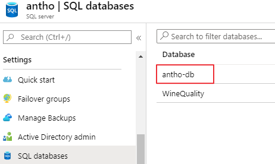
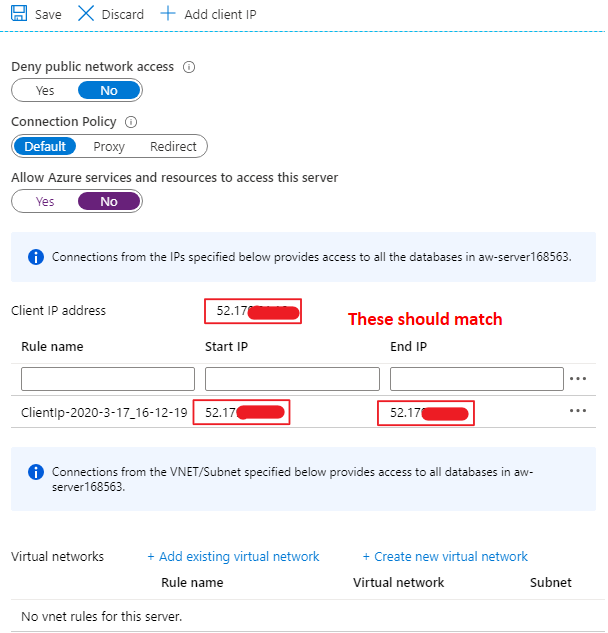
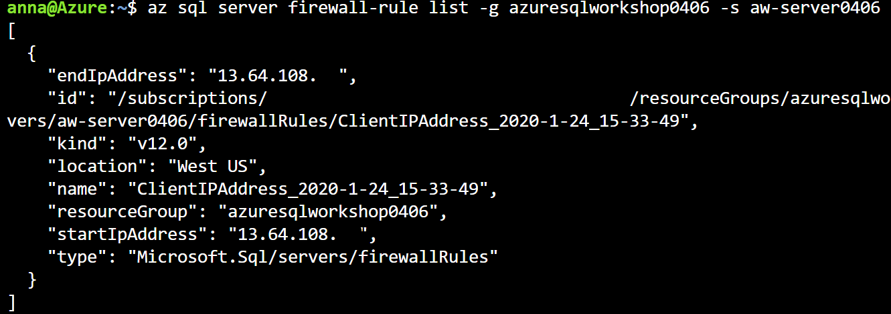
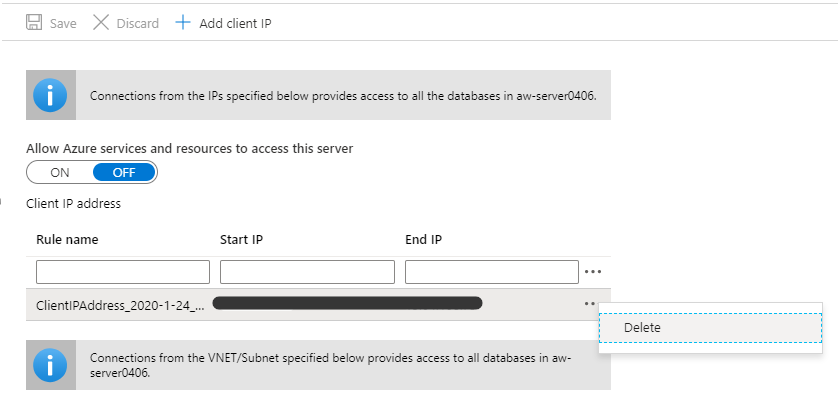
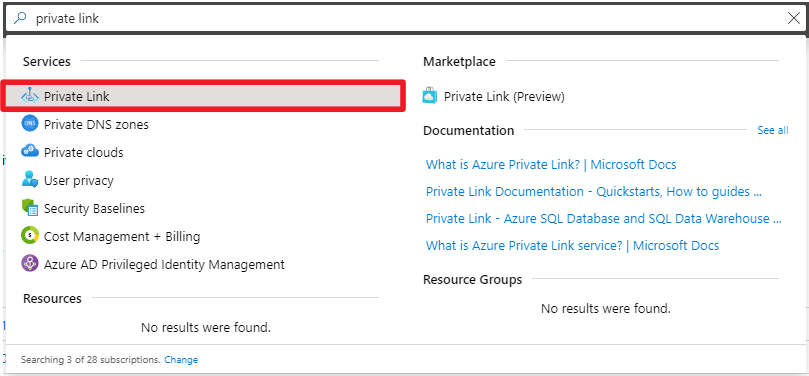
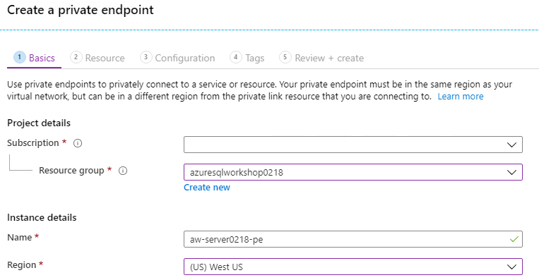

### Activity 2: Create and manage firewall/VNet rules for Azure SQL Database's public endpoint

In this activity, you'll see how to review and manage your firewall rules using the Azure portal. You'll also see how to configure the most secure connection while using the public endpoint.  

### Description

During deployment of Azure SQL Database, you selected **Allow Azure services and resources access to this server** to **Yes**. By leaving this **Yes**, you're allowing any resource from any region or subscription the possibility to access your resource. If you can, switching it to **No** is the most secure configuration of the public endpoint, because it will block all connections/networks apart from ones you've added. In this activity, you'll see how to view and edit your firewall rules. Setting this up can be complicated, since it means you'll have to specify a range of IP addresses for all your connections (which can sometimes have dynamic IP addresses). A much easier alternative is to use Virtual network (VNet) rules to establish and to manage access from specific subnet(s) that contain VMs or other services that need to access the data. You'll walk through setting this up next.  

In reality, you'll want to partner with your networking team to ensure you have the most secure, functional network. A few handy resources include:  

* [Azure SQL Database network access controls](https://docs.microsoft.com/azure/sql-database/sql-database-networkaccess-overview)
* [Connecting your applications to Managed Instance](https://docs.microsoft.com/azure/sql-database/sql-database-managed-instance-connect-app)
* [IP firewall rules for Azure SQL Database](https://docs.microsoft.com/azure/sql-database/sql-database-firewall-configure)
* [Data exfiltration prevention](https://docs.microsoft.com/azure/sql-database/sql-database-private-endpoint-overview#data-exfiltration-prevention)  
* [VNet endpoints and rules](https://docs.microsoft.com/azure/sql-database/sql-database-vnet-service-endpoint-rule-overview#anchor-how-to-by-using-firewall-portal-59j)  

### Steps

**Step 1 - create and manage firewall rules with the Azure portal**  
In your Azure virtual machine, navigate to the Azure portal, specifically to your Azure SQL Database logical **server**.  

> **Tip**: You're hopefully familiar on how search for resources in the Azure portal by now (there is a tip on this in Module 2, Activity 2, Step 2 if you need to review). But how do you get from the context of a database to the logical server and vice versa?  
>  
> 1. When you're in your Azure SQL Database view in the portal, select **Overview** from the left-hand menu. Under the title of your resource, you'll see that you're in the context of *SQL database* and in parenthesis, you'll see `ServerName/DatabaseName`. In order to get to the server, you can click on the full server name next to *Server name* to navigate to the logical server.  
>   
> 2. When you're in your Azure SQL Database logical server, under the title of your resource, you'll see you're in the context of *SQL Server*. In order to get to a database in that server, you can select **SQL Databases** under *Settings* in the left-hand menu, and click on a database.  
>   

Select **Firewalls and virtual networks** under **Security** from the left-hand menu.  

  

Switch **Allow Azure services and resources to access this serve**r to **No**. During deployment, you should have added your Client IP address already, but if one of the Rules do not match your Client IP displayed (see below), select **Add Client IP**.  

  

Finally, select **Save**. You can select **Overview** in the left-hand menu to navigate back to the overview of your database.  

To confirm you still have access from your Azure VM, navigate to SSMS and refresh your connection to the Azure SQL Database logical server. If no errors occur, you have successfully configured access to your Azure SQL Database logical server for your IP address only.  

  

Optionally, you can create a new query and check how you're connecting to Azure SQL Database by running the following T-SQL query:  

```sql
SELECT client_net_address FROM sys.dm_exec_connections WHERE session_id=@@SPID;
```  

The result should be the **public** IP address of your Azure VM. You can confirm this by navigating to your Azure VM in the Azure portal, and comparing the result of the query to the information in the Overview of your Azure VM.  

#### Step 2 - Create and manage firewall rules with the Azure Cloud Shell  

You can also use commands `az sql server firewall-rule` to create, delete, and view server-level firewall rules. You can use the Azure CLI through the command-line of your Azure VM or through a PowerShell notebook. For this step, you'll experiment with the Azure Cloud Shell.  

Return to the Azure portal in your Azure VM. In the top bar, select the Azure Cloud Shell button.  

  

Then, you can select Bash or PowerShell. Select **Bash**.  

If this is your first time using the Azure Cloud Shell, you may be prompted to select a storage account. If you are, select **Show advanced settings**, and select an existing storage account in **your** existing resource group for the workshop. For "File share" select **Create new** and call it **fsID** where ID is your unique ID for the workshop. Finally, select **Create Storage**.  

  

More information about the Azure Cloud Shell can be found in the [documentation](https://docs.microsoft.com/azure/cloud-shell/overview).  


You should now see a view similar to below.  

  

Run `az account show`. If you were provided an environment to use, you can continue, because this is the only subscription you have access to. 

> Note: if you were **not** provided an environment or have multiple subscriptions, you should run `az account list` to find the name of the subscription you are using for the workshop. The subscripition name is the string next to the field **"name"**.  
> Then, run `az account set --subscription 'my-subscription-name'` (don't include the quotes) to set the default subscription for this Azure Cloud Shell session. You can confirm this worked by running `az account show`.  

Now that you're set up, you can list your server's firewall settings with the following command, after filling in your resource group name (e.g. azuresqlworkshop0406) and server name (e.g. aw-server0406):  

> Tip: You can use the **Tab** key on Windows to autocomplete. E.g. for Resource Group, if you only have one, you can type `A` + `Tab`.  

```bash
az sql server firewall-rule list -g <ResourceGroup> -s <Server>
```

Your client IP address rule should match what you saw in the previous step using the Azure portal.  



There are other commands available for creating, deleting, and updating rules, which you can explore [here](https://docs.microsoft.com/cli/azure/sql/server/firewall-rule?view=azure-cli-latest).  

Note that this method of setting the firewall rules (using the Azure portal or Azure Cloud Shell) grants your client IP address access to all of the databases that are in that logical server. After you've configured the server-level firewall rule, which you did above, you can optionally configure database-level firewall rules that apply to individual databases. This can only be done with T-SQL, using the command `EXECUTE sp_set_database_firewall_rule`. For more information, see the references in the **Description** of this activity.  

You can close the Azure Cloud Shell now. In the next step, you'll use the portal.  

#### Step 3 - Create a VNet rule using the Azure portal  

You've now seen how to update firewall rules for specific IP addresses or ranges of IP addresses. However, VMs in Azure have dynamic IP addresses (they change). You can set up static IP addresses, but even this can be difficult to maintain. You can, alternatively, use virtual network (VNet) rules to manage access from specific subnet(s) that contain your VMs or other services. Let's see how.  

In the Azure portal, navigate to your Azure SQL Database logical server (e.g. `aw-server0406`). In the left-hand menu, under Security, select **Firewalls and virtual networks**. This is where you added your Client IP address and turned **Allow Azure services and resources access to this server** to **OFF**. You can also manage access to VNets from here.  

At the bottom, select **+ Add existing virtual network**. For the options, input the following:  

* Name: **VmVnet**
* Subscription: *Select the subscription you're using for this workshop*  
* Virtual network: Select the only virtual network that appears under **your resource group for the workshop**.  
* Subnet name / Address prefix : *Default is fine*  
* `Microsoft.Sql` service endpoint: Note that it has not yet been enabled. By **leaving the box unchecked**, you are choosing to enable the service endpoint. Once this service endpoint is enabled, all access to your Azure SQL Database will come through private IP addresses. To learn more about service endpoints, see the [documentation](https://docs.microsoft.com/azure/virtual-network/virtual-network-service-endpoints-overview).

  

Select **Enable**, then **Count to 10** (i.e. wait a few seconds), then select **OK**.  
> Note: The warning says this takes up to 15 minutes, but in testing for the workshop, it usually takes <1 minute. If you get an error, simply close the Create/Update window and start Step 3 from the beginning.  

Next, remove your Client IP address by selecting the **...** next to the End IP and select **Delete**.  

  

Finally, select **Save** to apply your changes. You can select **Overview** in the left-hand menu to navigate back to the overview of your database.  

  

To confirm you still have access from your Azure VM, navigate to SSMS and refresh your connection to the Azure SQL Database logical server.  

  

If no errors occur, you have successfully configured access to your Azure SQL Database logical server from resources in your VNet, which can simplify the challenge of configuring access to all the IP addresses (static and dynamic) that need to access the data. This could allow you to specify one or multiple subnets within a virtual network or networks, encompassing all of the resources within.  

Optionally, you can create a new query and check how you're connecting to Azure SQL Database by running the following T-SQL query:  

```sql
SELECT client_net_address FROM sys.dm_exec_connections WHERE session_id=@@SPID;
```  

The result should now be the **private** IP address of your Azure VM. You can confirm this by navigating to your Azure VM in the Azure portal, and comparing the result of the query to the information in the Overview of your Azure VM. By doing this, you've configured more secure and private access to your Azure SQL Database.  

### (Bonus) Activity 3: Create and manage Private Link for Azure SQL Database

In this activity, you'll see how to configure the most secure connection with a new feature called Private Link.  

### Description

You've learned and seen how to configure the most secure network using Azure SQL Database with the public endpoint. This method of securing Azure SQL Database has been used for years. However, in 2019, Azure began moving towards a concept of a Private Link, which is more similar to the way that Azure SQL Managed Instance is deployed. Private Link allows you to connect to Azure SQL Database (and several other PaaS services) using a private endpoint, which means it has a private IP address within a specific VNet and Subnet. You can learn more about Private Link [in the documentation](https://docs.microsoft.com/azure/sql-database/sql-database-private-endpoint-overview).  
  
In this activity, you'll use the Azure portal to configure Private Link for your existing Azure SQL Database logical server. You could alternatively use PowerShell or the Azure CLI. Since this is a bonus activity, it's important you follow the clean-up steps at the end of the activity. All future activities in this workshop are configured with the public endpoint.  

> Note: If you complete this activity, you must complete up until the last step, otherwise you may have issues in future activities. If you're not sure if you will have time to complete, most of the screenshots and results are included below, so you can simply read and review the activity.  

### Steps

In this activity, you will complete the following steps:  

0. Examine the current connection
1. Navigate to the private endpoint experience in the Azure portal  
2. Create a private endpoint - Basics
3. Create a private endpoint - Resource
4. Create a private endpoint - Configuration
5. Create a private endpoint - Confirm creation
6. Connect to the private endpoint  

#### Step 0: Examine the current connection  

When you deployed Azure SQL Database in Module 2, you set up access for your Azure VM through its public endpoint, and the public IP address of your Azure VM. This means you will connect to the database with the public IP address of your VM.  

By adding access from your specific VNet instead of the public IP address of your VM, connections to Azure SQL Database from your VM will appear to come through the private IP address of your VM (you confirmed this at the end of the last activity by running `SELECT client_net_address FROM sys.dm_exec_connections WHERE session_id=@@SPID;`). You will see the same result once you configure Private Link, so on the surface it may appear that there is no difference. However, there is quite a significant difference, so in this step you will examine how you connect to the database when you have VNet rules configured, and after you configure Private Link, you'll check this again.  

Open the command prompt and run the following command, replacing the `<ID>` with your ID for the workshop.  

```cmd
nslookup aw-server<ID>.database.windows.net  
```

This command allows you to understand details related to the DNS infrastructure. Your results should be similar to below:  

```cmd
Server: Unknown
Address: 168.63.129.16

Non-authoritative answer:
Name:   cr2.eastus1-a.control.database.windows.net
Address:    40.222.222.22
Aliases:    aw-server<ID>.database.windows.net
            dataslice2.eastus.database.windows.net
```

The important things to look at are under the Non-authoritative answer:  

* **Name**: The endpoint starting with `cr2` is part of the public DNS hierarchy. Without getting too much into the hierarchy, `cr2` is the Control Ring 2 and then there are multiple data "slices" below it.  
* **Address**: The IP address returned here should match the public IP address of your Azure VM. So even though SSMS' final hop might be through your VM's private IP address, the public IP address of your VM is still being used to connect in some capacity.  
* **Aliases**: These are just various points within the DNS hierarchy, in this case the specific data "slice" and the endpoint you connect to.  

> Fun fact: the **Address 168.63.129.16** is a virtual public IP address used to facilitate a communication channel to Azure platform resources. It's the case for all regions and all national clouds, and it will not change. You can read more about it in the [documentation](https://docs.microsoft.com/azure/virtual-network/what-is-ip-address-168-63-129-16).

Leave this command prompt open, so you can compare to Private Link in a later step.  

#### Step 1: Navigate to the private endpoint experience in the Azure portal  

In the Azure portal, in the top taskbar search bar, enter **private link** and select **Private Link** under *Services*.  

  

This is the center you can use for managing your various Private Link services across Azure.  

Select **Private endpoints** from the left-hand menu, and select **+ Add**.  


#### Step 2: Create a private endpoint - Basics  

There are several pages you need to configure in order to create a private endpoint: Basics, Resource, Configuration, and Confirm creation. In this first step, fill in the subscription and resource group that you are using for the workshop.  

For name, enter the name of your server + **-pe**. For example, for "aw-server0218", you would enter **aw-server0218-pe**. Finally, select the region that you deployed your Azure SQL Database in.  

  

Next, select **Next : Resource >**.  

#### Step 3: Create a private endpoint - Resource  

In this section, you're asked to connect to the resource you want to set up the private endpoint for. In this case, you want to connect to an Azure resource in your directory. Then, select the subscription, resource type, and resource name that you are using for the workshop.  

> Note: If you were provided an environment for this workshop, be sure to select your assigned Azure SQL Database logical server.  

  

Next, select **Next : Configuration**.  

#### Step 4: Create a private endpoint - Configuration  

In this step, you will configure your private endpoint to be created in the **same virtual network subnet as your Azure VM** for the workshop. This is the easiest way to ensure that you can connect to it from your virtual machine. There are other ways available (virtual network peering, VNet-to-VNet, VPN from on-premises), but you will not use those in this workshop.  

Select your VM virtual network, it should be similar to **azuresqlworkshop<ID>-vnet** or **win-vm-vnet** *under your resource group* and the subnet should be **default**.  

In order to connect privately with the endpoint you create, you'll also need a DNS record. This won't be covered in this activity, but you can learn more [here](https://docs.microsoft.com/azure/private-link/private-endpoint-overview#dns-configuration). You can just leave the defaults.  

Review and confirm your view looks similar to the following.  

   

Then, select **Review + create**. For this activity, you'll skip Tags, but you can add them similar to how you did during deployment.  

#### Step 5: Create a private endpoint - Confirm creation  

Review your deployment selections and then select **Create**.  

The deployment may take 1-2 minutes, but when it is finished, select **Go to resource**.  

In the overview tab, you should now see your Azure SQL Database logical server associated with a Private IP.  

  

#### Step 6: Connect to the private endpoint

In this step, you'll try to connect to the private endpoint. Using SSMS, right-click on your AdventureWorks<ID> database and select **New Query**. Run the following command:  

```sql
SELECT client_net_address FROM sys.dm_exec_connections WHERE session_id=@@SPID;
```

When you deployed Azure SQL Database in Module 2, you set up access for your Azure VM through its public endpoint, and the public IP address of your Azure VM. This means you will connect to the database with the public IP address of your VM.  

By adding access from your specific VNet instead of the public IP address of your VM, connections to Azure SQL Database from your VM will appear to come through the private IP address of your VM. You will see the same result now that you've configured Private Link. So where are the differences?  

Return to the command prompt window that you used in Step 0. If you have since closed this window, open a new command prompt. Run the following command, replacing the `<ID>` with your ID for the workshop.  

```cmd
nslookup aw-server<ID>.database.windows.net  
```

As you saw in Step 0, this command allows you to understand details related to the DNS infrastructure. However, your results will be slightly different now. Your results with Private Link should be similar to below:  

```cmd
Server: Unknown
Address: 168.63.129.16

Non-authoritative answer:
Name:   aw-server<ID>.privatelink.database.windows.net
Address:    10.2.0.5
Aliases:    aw-server<ID>.database.windows.net
```

The important things to look at are under the Non-authoritative answer, and let's examine the differences:  

* **Name**: Note that you're no longer pointing to the public DNS hierarchy, only to the Private Link DNS. This means less information is revealed about your database server.  
* **Addresses**: For VNet rules, the address returned was the public IP address of your VM, but it should now be one or more *private* IP addresses within the Private Link hierarchy (one is the private endpoint of your Azure SQL Database).
* **Aliases**: Similar to the Name field, you're not seeing anything related to the DNS hierarchy, except that you can still connect to the server name (e.g. `aw-server0406.database.windows.net`).  

One thing you might be wondering, is if you are connecting to the private endpoint, **why are you still using the same server name?** In the backend, when you used solely the Private Link method of connecting (i.e. no firewall or virtual network rules), the information is processed as follows:  

* `aw-server<ID>.database.windows.net`  
  * Resolved by service to `aw-server<ID>.privatelink.database.net`  
    * Resolved by service to `10.2.0.5` (the IP address of your private endpoint)  

Additionally, the service will block you from directly connecting using anything apart from `aw-server<ID>.database.windows.net`.  

Microsoft is actively investing heavily in Private Link for SQL and other services, to learn more refer to the [documentation](https://docs.microsoft.com/azure/private-link/index).  
