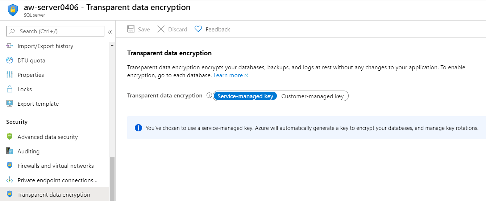

# Data protection: Information protection and encryption

markdown content TODO

include this exercise but not necessarily as an exercise:
### (Bonus) Activity 5: Confirm TDE is enabled

This is a quick activity to show you how easily you can confirm that TDE is enabled, or you can enable it if it is not.  

### Steps

In the Azure portal, navigate to your Azure SQL Database, and in the left-hand menu, under Security, select **Transparent data encryption**. Confirm your database is set to **ON**.  

  

Next, navigate to your Azure SQL Database logical server, and in the left-hand menu, under Security, select **Transparent data encryption**. Notice that you have a different view:  

  

The default is to let the Azure service manage your key. As it says, Azure will automatically generate a key to encrypt your databases, and manage the key rotations. You've seen how to do this with the Azure portal, but you can also use PowerShell, Azure CLI, T-SQL, or REST APIs. For more details, [refer here](https://docs.microsoft.com/azure/sql-database/transparent-data-encryption-azure-sql?tabs=azure-portal).  

You can, alternatively, bring your own key (BYOK) leveraging Azure key vault. In this scenario, you (not Azure) are responsible for and in full control of a key lifecycle management (key creation, rotation, deletion), key usage permissions, and auditing of operations on keys. For more information regarding Azure SQL TDE with BYOK, [refer here](https://docs.microsoft.com/azure/sql-database/transparent-data-encryption-byok-azure-sql?view=sql-server-ver15).  