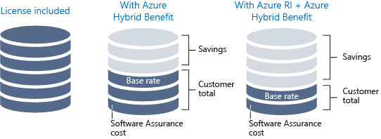
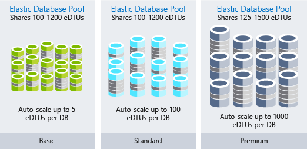

You're a solution architect, and your organization, Lamna Healthcare, has moved its workloads to the cloud. Recently, the bill for these resources and workflows has increased more than Lamna had anticipated. You have been asked to determine whether the increase is the result of natural, efficient growth, or whether the cost can be reduced by being more efficient with the organization's cloud resources.

## How the cloud changes your expenses

One of the differences between the public cloud and on-premises infrastructure is how you pay for the services you use. In an on-premises datacenter, hardware procurement is long process: physical hardware is sized for maximum capacity, and some of the costs - such as computer power and storage space - can be hidden from the business units that are consuming those resources. Purchasing physical infrastructure ties up investments in long-term assets, which hinders your ability to be agile with your resources.

Shifting to the cloud replaces the burgeoning costs of maintaining physical infrastructure with a pay-for-what-you-use cost model. You no longer need to tie up investments in physical assets, and if your resource requirements change, you can respond by adding, moving, or removing resources. Workloads vary between and within services, demand can be unpredictable, and your growth patterns shift over time. Since you only pay for what you use in the cloud, your cost structure can move in sync with the changes in resources.

Cloud infrastructure can handle fluctuating resource usage scenarios. Resources that have significant periods of inactivity can be shut down when not in use, and thereby not incur any cost at all. Resource allocation can grow automatically with a successful service as demand increases, rather than having to wait for the next procurement cycle. Additional resources can be dynamically added and removed to respond to predictable and unpredictable bursts of demand. The following illustration shows why an on-premises infrastructure cannot handle all of these fluctuating scenarios.

In an efficient architecture, resources are provisioned to match the demand. If a virtual machine is less than 10% utilized the majority of the time, you are wasting resources, both in compute and cost. Conversely, a virtual machine that is running 90% utilized is using the majority of the available resources, and is an efficient use of money. Running a system at 100% utilization runs the risk of introducing performance issues. It is important to ensure that maximizing efficiency doesn't negatively impact the performance of your system. Demand is rarely constant, so adjusting resources when possible to match demand is important to ensure efficiency.

<!-- TODO: You mention "scale up" and "scale out" in the Introduction module; is that worth mentioning here? -->

## Optimizing IaaS costs

When using Infrastructure as a Service (IaaS) resources such as virtual machines (VM) as part of your solution, the cost associated with VMs is often the biggest portion of your spending. The compute costs are typically your largest expense, followed by storage costs. Taking time to optimize pay-for-what-you-use resources can have a large impact on the size of your monthly bill.

Let's take a look at best practices to reduce your compute and storage costs.

### Compute

There are several different options available to achieve cost savings for virtual machines:

- Choose a smaller virtual machine instance size.
- Reduce the number of hours a virtual machine runs.
- Use discounts for the compute costs.

#### Right size virtual machines

Right sizing a virtual machine is the process of matching virtual machine sizes with the respective resource demand requirements. If a VM is running 25% idle, reducing the size of the VM will immediately reduce your cost. Virtual machine costs are linear within an instance family; each next size larger will double your cost. Conversely, reducing a VM by a single instance size will reduce your cost by half. The following illustration shows a 50% savings achieved by moving one size down within the same series.

Azure Advisor identifies which virtual machines are underutilized. Azure Advisor monitors your virtual machine usage for 14 days, and then it identifies any underutilized virtual machines. Virtual machines with a CPU utilization of 5 percent or less and network usage of 7 MB or less for four or more days are considered underutilized virtual machines.

#### Implement shutdown schedules for virtual machines

If you have VM workloads that are only used periodically, but are running continuously, you're wasting money. These VMs can be shut down when they're not in use, which saves your compute costs while the VM is deallocated. For example, a development environment is a good candidate for shutdown during your organization's off hours because development generally happens only during business hours.

You have several options to deallocate a VM. For example:

- You can use Azure Automation to run your VMs only during those times that your workloads require.
- You can use the auto-shutdown feature on a virtual machine to schedule a one-off automated shutdown
- You can manually stop a VM in the Azure portal.

Note that you should always use the Azure controls to stop your VMs; shutting down the OS from inside a VM does not deallocate its Azure resource, so you will continue to accrue costs.

#### Apply compute cost discounts

The Azure Hybrid Benefit offers an additional avenue for optimizing the costs of your Windows Server and SQL Server instances, by allowing you to use your licenses for your on-premises Windows or SQL Servers with Software Assurance as a discount toward the compute cost of these VMs, thereby reducing or eliminating the costs for Windows and SQL Server on enabled instances.

Some virtual machines need to be up and running all the time. Perhaps you have a web application server farm for a production workload, or maybe you have a domain controller that is supporting various servers on a virtual network. If you know with certainty that these virtual machines will run continuously throughout the coming year or longer, you can reduce your costs even more by purchasing a reserved instance. Azure Reserved Virtual Machine Instances (RI) allow you to purchase compute capacity for one year or three year commitment, which offers you significant savings - up to 72 percent - when compared to pay-as-you-go compute resources. The following illustration shows savings achieved when you combine your on-premises licenses with the Azure Hybrid Benefit, and when you combine your on-premises licenses with both Azure RI and the Azure Hybrid Benefit.

### Virtual machine disk storage cost optimization

For workloads that do not require high reliability and performance disks, you can use the reduced-cost standard storage. For example: you might choose to use standard storage for your development and test environments that are not required to be an identical match for your production workloads.

Disks that aren't associated with a VM still incur storage costs, so you should make sure you don't have any orphaned disks remaining in your environment. If you've removed a VM but not its associated disks, you can reduce your storage costs by identifying and removing these orphaned disks from your environment.

On a related note, you should make sure that you don't have any orphaned snapshots remaining in your environment. Pricing for snapshots is lower than the disks themselves, but it's still a good practice to eliminate costs for unnecessary resources.

## Optimizing PaaS costs

Platform as a Service (PaaS) services are typically optimized for costs over IaaS services, but there are opportunities to identify waste and optimize for minimal costs in your PaaS services as well. Let's take a look at ways to reduce Azure SQL Database and Azure Blob storage costs.

### Optimizing Azure SQL Database costs

When creating an Azure SQL database, you have to select an Azure SQL Server and decide on a performance tier. Each tier provides a performance level either in database transaction units (DTUs) or virtual cores (vCores). For database loads that are steady, it's easy to optimize by selecting the appropriate tier size for the performance needs. But what if your database has unpredictable bursts or spikes in activity? When dealing with unpredictable workloads, elastic pools can help you reduce your costs.

SQL Database elastic pools are a simple, cost-effective solution for managing and scaling several databases that have varying and unpredictable usage demands. The databases in an elastic pool are on a single Azure SQL Database server, and share a set number of resources at a set price. Pools are well suited for a large number of databases with specific utilization patterns. For a given database, this pattern is characterized by low average utilization, with relatively infrequent utilization spikes.

The more databases you can add to a pool, the greater your savings become. The following illustration shows the capabilities of the three types of Elastic Database Pools: *Basic*, *Standard*, and *Premium*.  Basic auto scales up to 5 eDTUs per DB, Standard auto scales up to 100 eDTUs per DB, and Premium that auto scales up to 1000 eDTUs per DB.

Elastic pools are a great way to spread costs across multiple databases, and can make a significant impact on reducing your Azure SQL Database costs.

### Optimizing Blob storage costs

Blob storage is a cost-effective way to store data, but as the amount of data grows, your bill can benefit from optimizing how the data is stored.

Azure Storage offers three storage tiers for blob object storage:

- **Hot access tier** - Highest storage costs but the lowest access costs; this tier is optimized for storing data that is accessed frequently

- **Cool access tier** - Lower storage costs and higher access costs compared to hot storage; this tier is optimized for storing data that is infrequently accessed and stored for at least 30 days.

- **Archive access tier** - Lowest storage cost and highest data retrieval costs compared to hot and cool storage; this tier is optimized for storing data that is rarely accessed and stored for at least 180 days, with flexible latency requirements (e.g. several hours of retrieval latency).

### Leverage consumption pricing models

Moving to PaaS services can also take the pay-as-you-go model even further into a true consumption pricing model. Services such as Azure Functions have the ability to use _Consumption plans_. When you're using a consumption plan, instances of the Azure Functions host are dynamically added and removed based on the number of incoming events. This serverless plan scales automatically, and you're charged for compute resources only when your functions are running. On a consumption plan, a function execution times out after a configurable period of time. Billing is based on the number of executions, the length of execution time, and the amount of memory used. Billing is aggregated across all functions within a function app.

Moving to services that use a consumption pricing model can bring a new approach to cost savings into your architecture.
