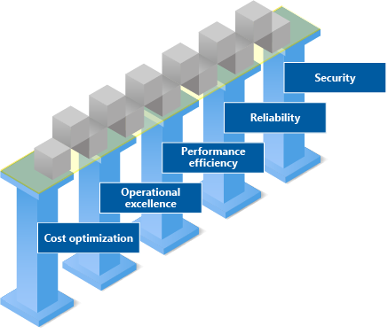
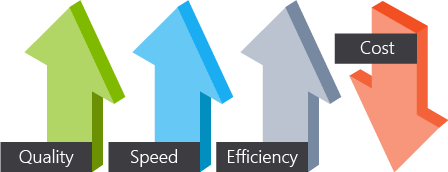
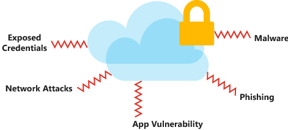

The cloud has changed the way organizations solve their business challenges, and how applications and systems are designed. The role of a solution architect is not only to deliver business value through the functional requirements of the application, but also to ensure the solution is designed in ways that are scalable, resilient, efficient, and secure. Solution architecture is concerned with the planning, design, implementation, and ongoing improvement of a technology system. The architecture of a system must balance and align the business requirements with the technical capabilities that are needed to execute those requirements. The end architecture is a balance of risk, cost, and capability throughout the system and its components.

## Azure Well-Architected framework

The Azure Well-Architected framework is a set of guiding tenants to build high-quality solutions on Azure. While there is no one-size-fits-all approach to designing an architecture, there are some universal concepts that will apply regardless of the architecture, technology, or cloud provider. While these are not all-inclusive, focusing on these concepts will help you build a reliable, secure, and flexible foundation for your application.

The Azure Well-Architected framework consists of five pillars:

- Cost optimization
- Operational excellence
- Performance efficiency
- Reliability
- Security

### Cost optimization

You will want to design your cloud environment so that it's cost-effective for operations and development. Inefficiency and waste in cloud spending should be identified to ensure you're spending money where you can make the greatest use of it. 

### Operational excellence

By taking advantage of modern development practices, such as DevOps, you can enable faster development and deployment cycles. You need to have a good monitoring architecture in place so that you can detect failures and problems before they happen or, at a minimum, before your customers notice. Automation is a key aspect of this pillar to remove variance and error while increasing operational agility.

### Performance efficiency

For an architecture to perform well and be scalable, it should properly match resource capacity to demand. Traditionally, cloud architectures accomplish this balance by scaling applications dynamically based on activity in the application. Demand for services change, so it's important for your architecture to have the ability to adjust to demand as well. By designing your architecture with performance and scalability in mind, you'll provide a great experience for your customers while being cost-effective.

### Reliability

Every architect's worst fear is having your architecture fail with no way to recover it. A successful cloud environment is designed in a way that anticipates failure at all levels. Part of anticipating these failures is designing a system that can recover from the failure, within the time that's required by your stakeholders and customers.

:::image type="content" source="../media/system-failure.png" alt-text="An illustration showing two virtual machines in a virtual network. One of the machines is shown as failed while the other is working to service customer requests." loc-scope="other"::: <!--no-loc -->

### Security

Data is the most valuable piece of your organization's technical footprint. In this pillar, you'll focus on securing access to your architecture through authentication and protecting your application and data from network vulnerabilities. The integrity of your data should be protected as well, by using tools like encryption.

You must think about security throughout for the entire lifecycle of your application; from design and implementation to deployment and operations. The cloud provides protections against a variety of threats, such as network intrusion and DDoS attacks, but you still need to build security into your application, processes, and organizational culture.

## General design principles

In addition to each of these pillars, there are some consistent design principles that you should consider throughout your architecture.

- **Enable architectural evolution**: No architecture is static. Allow for the evolution of your architecture by taking advantage of new services, tools, and technologies when they're available.

- **Use data to make decisions**: Collect data, analyze it, and use it to make decisions surrounding your architecture. From cost data, to performance, to user load, using data will guide you to make the right choices in your environment.

- **Educate and enable**: Cloud technology evolves quickly. Educate your development, operations, and business teams to help them make the right decisions and build solutions to solve business problems. Document and share configuration, decisions, and best practices within your organization.

- **Automate**: Automation of manual activities reduces operational costs, minimizes error introduced by manual steps, and provides consistency between environments.

## Shared responsibility

Moving to the cloud introduces a model of shared responsibility. In this model, your cloud provider will manage certain aspects of your application, leaving you with the remaining responsibility. In an on-premises environment, you are responsible for everything. As you move to infrastructure as a service (IaaS), then to platform as a service (PaaS) and software as a service (SaaS), your cloud provider will take on more of this responsibility. This shared responsibility will play a role in your architectural decisions, as these decisions can have implications on cost, security, and the technical and operational capabilities of your application. By shifting these responsibilities to your provider, you can focus on bringing value to your business and move away from activities that aren't a core business function.

## Design choices

In an ideal architecture, you would build the most secure, high performance, highly available, and efficient environment possible. However, as with everything, there are trade-offs. To build an environment with the highest level of all these pillars, there is a cost. That cost may be in actual money, time to deliver, or operational agility. Every organization will have different priorities that will impact the design choices that are made in each pillar. As you design your architecture, you will need to determine which trade-offs are acceptable, and which are not.

When building an Azure architecture, there are many considerations to keep in mind. You want your architecture to be secure, scalable, available, and recoverable. To make that possible, you'll have to make decisions based on cost, organizational priorities, and risk.
