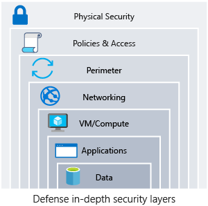

Healthcare organizations store personal and potentially sensitive client data. Financial institutions store account numbers, balances, and transaction history. Retailers store purchase history, account information, and demographic details of customers. A security incident could expose this sensitive data, which could cause personal embarrassment or financial harm. How do you ensure the integrity of their data and ensure your systems are secure?

In this unit, you'll learn about the important elements of the security pillar.

## What is security?

Security is ultimately about protecting the data your organization uses, stores, and transmits. The data your organization stores or handles is at the heart of your securable assets. This data could be sensitive data about customers, financial information about your organization, or critical line-of-business data supporting your organization. Along with data, securing the infrastructure it exists on, and the identities used to access it, are also critically important.

Your data may be subject to additional legal and regulatory requirements depending on where you are located, the type of data you are storing, or the industry that your application operates in. For instance, in the healthcare industry in the US, there is a law called the Health Insurance Portability and Accountability Act (HIPAA). In the financial industry, the Payment Card Industry Data Security Standard is concerned with the handling of credit card data. Organizations that store data that is in scope for these laws and standards are required to ensure certain safeguards are in place for the protection of this data. In Europe, the General Data Protection Regulation (GDPR) lays out the rules of how personal data is protected, and defines individuals' rights related to stored data. Some countries require that certain types of data do not leave their borders.

When a security breach occurs, there can be substantial impacts to the finances and reputation of both organizations and customers. This breaks down the trust customers are willing to instill in your organization, and can impact its long-term health.

### Defense in depth

A multilayered approach to securing your environment will increase the security posture of your environment. Commonly known as _defense in depth_, we can break down the layers as follows:

* Data
* Applications
* VM/compute
* Networking
* Perimeter
* Policies & access
* Physical security

Each layer focuses on a different area where attacks can happen and creates a depth of protection, should one layer fail or be bypassed by an attacker. If we were to focus on just one layer, an attacker would have unfettered access to your environment should they get through this layer. Addressing security in layers increases the work an attacker must do to gain access to your systems and data. Each layer will have different security controls, technologies, and capabilities that will apply. When identifying the protections to put in place, cost will often be of concern, and will need to be balanced with business requirements and overall risk to the business.

There is no single security system, control, or technology that will fully protect your architecture. Security is more than just technology, it's also about people and processes. Creating an environment that looks holistically at security, and making it a requirement by default, will help ensure that your organization is as secure as possible.

### Protect from common attacks

At each layer, there are some common attacks that you will want to protect against. These are not all-inclusive, but can give you an idea of how each layer can be attacked and what types of protections you may need to look at.

- **Data layer**: Exposing an encryption key or using weak encryption can leave your data vulnerable should unauthorized access occur.

- **Application layer**: Malicious code injection and execution are the hallmarks of application-layer attacks. Common attacks include SQL injection and cross-site scripting (XSS).

- **VM/compute layer**: Malware is a common method of attacking an environment, which involves executing malicious code to compromise a system. Once malware is present on a system, further attacks leading to credential exposure and lateral movement throughout the environment can occur.

- **Networking layer**: Unnecessary open ports to the Internet are a common method of attack. These could include leaving SSH or RDP open to virtual machines. When open, these could allow brute-force attacks against your systems as attackers attempt to gain access.

- **Perimeter layer**: Denial-of-service (DoS) attacks are often seen at this layer. These attacks attempt to overwhelm network resources, forcing them to go offline or making them incapable of responding to legitimate requests.

- **Policies & access layer**: This layer is where authentication occurs for your application. This layer could include modern authentication protocols such as OpenID Connect, OAuth, or Kerberos-based authentication such as Active Directory. The exposure of credentials is a risk at this layer, and it's important to limit the permissions of identities. We also want to have monitoring in place to look for possible compromised accounts, such as logins coming from unusual places.

- **Physical layer**: Unauthorized access to facilities through methods such as door drafting and theft of security badges can be seen at this layer.

### Shared security responsibility

Revisiting the model of shared responsibility, we can reframe this in the context of security. Depending on the type of service you select, some security protections will be built in to the service, while others will remain your responsibility. Careful evaluation of the services and technologies you select will be necessary, to ensure you are providing the proper security controls for your architecture.

