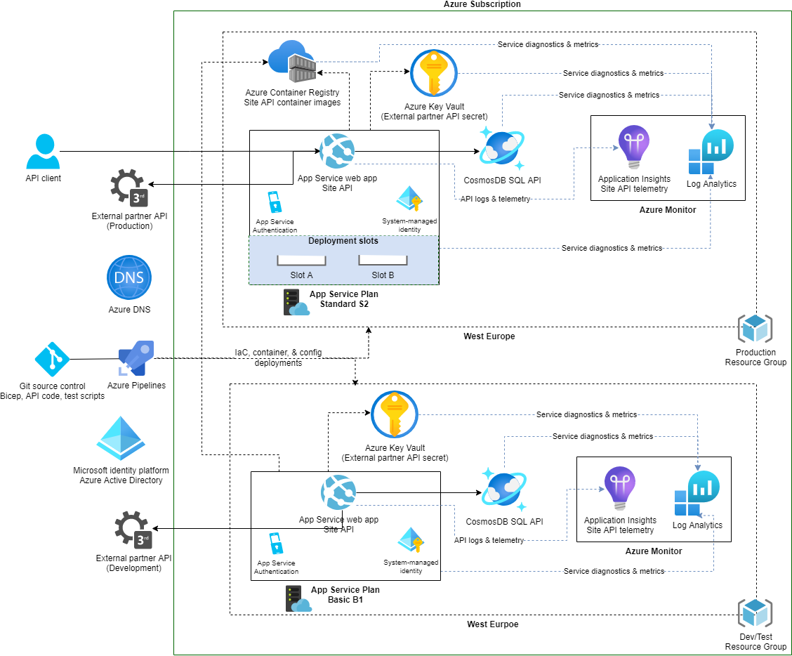

You'll be adding your own enhancements to an existing architecture that meets an organization's high reliability requirements. Here, we'll discuss the things you'll need to get started.

## Project specification

Contoso Shoes wants to be ready for the next launch, which is expected to create an increase in traffic load. In the last six months, there have been several incidents causing the website to be offline for half a day. The system wasn't tested properly in the Dev/Test environment and some bugs crept into production. Troubleshooting took a long time because the operators weren't able to identify the root cause quickly. In a recent incident, West Europe experienced a regional outage. Because the workload was only  running in that region, they had to bear financial loss until the region was back up. 

The company wants to add capabilities to their solution architecture and make it highly reliable. Here are the business requirements:

- Extend the architecture to multiple regions.
- Improve the customer experience by serving clients faster in a region geographically closer to them. 
- Upgrade the Azure services so that they are aligned with the Azure roadmap. 
- Build an overall health model to make sure issues are caught early in the development cycle. 

## Current architecture

For you to complete this challenge, you need to have a good understanding of the current architecture. 

### Components

All components of this architecture are deployed to a single region. 

- **App Service plan** Standard S2 provides the managed virtual machines (VMs) that host your app. Autoscaling is enabled. In preproduction environment, Basic B1 SKU is used.

- **App Service app** provides the application platform that containerizes the API code. Authentication feature is enabled for authorization. 

- **Deployment slots** let you stage a deployment and then swap it with the production deployment. 

- **Azure Container Registry** stores the containerized API code and is made available through Continuous Integration/Continuous Delivery (CI/CD) pipelines that was created and managed by your team. 

- **Azure Cosmos DB with SQL API** stores all state related to the workload. The Cosmos DB database account has a single database that contains a few containers in the Shared throughput model. The Azure Cosmos account uses the Serverless capacity mode.

- **Azure Key Vault** stores secrets needed for the API to make external HTTP POST calls. The application accesses the secrets through a Key Vault reference in the Azure App Service’s app configuration.

- **Azure Log Analytics** is used as a unified sink to store logs and metrics for all Azure Diagnostics settings for all components used in the solution.

- **Application Insights** is used for capturing telemetry and logs in the API.

- **Azure Pipelines** is used for continuous integration/continuous delivery (CI/CD) that builds, tests, and deploys the workload in preproduction and production environments.

### Design choices

System-managed identities are used between the App Service, App Service code and Key Vault, Container Registry, and Cosmos DB.

TODO: need to add details

## Tradeoffs

However, as with everything, there are trade-offs with the current architecture. Business requirements prioritized cost optimization over reliability and operations. To keep within the cost limits, the architecture hasn't evolved. The components aren't aligned with Azure platform roadmaps and fall short in taking advantage of the reliability capabilities offered by the platform. For example, the choice of SKU for compute prevents the workload from using Availability Zones. For telemetry, an older version of Application Insights is used that isn't integrated with Log Analytics. 

Also, access to the workload is overly pervasive. For example, without any virtual network integration, all Azure services can be directly reached over the public internet. 

## Design improvements

In an ideal architecture, you would build the most higly available and efficient environment possible. 

- Multi region - active-active
- Scale unit architecture
- Health model
- Deployment and testing. Prewarming allows the application to be deployed to a slot instead of directly to production. TBD.

## Setup
- Familiarize yourself with Azure Well-Architected Framework guidance for [**mission-critical workloads**](/azure/architecture/framework/mission-critical/mission-critical-overview).
- We recommend that you use the architecture diagramming tool that you're most comfortable with. The existing architecture diagram is available for download in both Visio and Diagramming.net (drawio) format, but you can import this into any tooling you wish.
- You do not need an Azure subscription for this challenge if you're comfortable with the services and their features.

