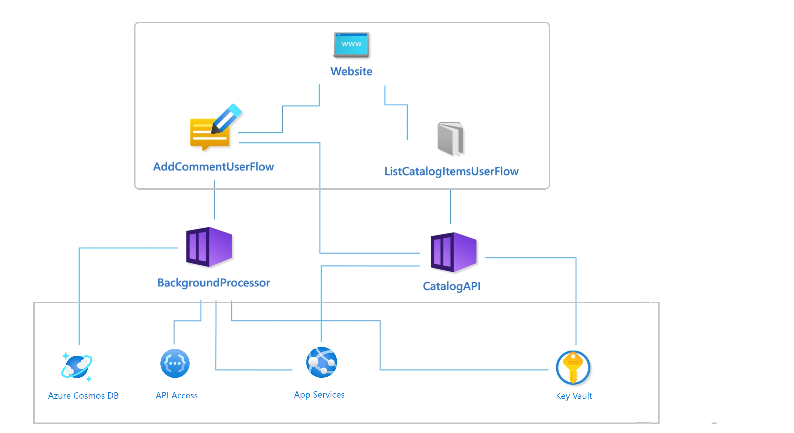

Contoso Shoes needs a way to detect, diagnose, and predict issues across this architecture. You would like to build an overall health model that's measurable through a health status. You'll apply the health status to all user and system flows. The goal is to identify failure points before they can cause an outage.

## Current state and problem

So far, you’ve added a health check API and built out multi-region capabilities in your API. However, there isn't a way of getting meaningful insight into the complex topology. The SRE team needs to  quickly identify and resolve issues.

In a recent incident, an operator wasn't able to see the cascading impact of an issue resulting from the API and platform dependencies. There was significant time spent on triage, which led to longer down times. 

## Specification

- Design a health model that hierarchically shows the relationship between the application components and the platform dependencies. Factor in all components in the architecture, including items that exist within the request flow including the gateway, compute, databases, storage, caches, and so on. Also include components that typically exist outside of the request flow. For example, OCI artifact stores, secret stores, configuration services, logging sinks. 
    
- Define an overall health status that is based on aggregated historical data. Represent the status in three health states: unhealthy, degraded, and healthy.

- Design a unified data sink for collecting all monitoring data.

## Start with the theoritical exercise of health modeling

Health modeling in a top-down design activity and you'll need a complete list of components used in the architecture. This includes the application components as well as the Azure services.

Place those components in a dependency graph that shows a hierarchical view of solution. The top layer has the _user flows_ that track request from the end user, to the website, and flows at the application API level. The bottom layer contains the _system flows_ from the Azure services that the application has dependencies on. Also map dependencies between the Azure resources.

Your graph should look something like this:

## Define the health scores

For each component, collect metrics and metric thresholds and decide the value at which the component should be considered health, degraded, and unhealthy. That decision is should be influenced by expected the performance and non-functional business requirements. 

For example, 

|Azure Event Hubs|Health status|
|---|---|
|Queue depth < 10  Processing time < 100ms Time in queue <200 ms|Healthy
|Queue depth < 50  Processing time < 200ms Time in queue <1000 ms|Degraded
|Queue depth < 50  Processing time > 200ms Time in queue > 1000 ms|Unhealthy

For each user and system flow, define an overall status. You'll need to aggregrate the health status of individual components that participate in that flow. 

For example, a system flow could be composed of Azure Event Hubs and a Storage account for checkpointing. 

|Azure Event Hubs|Azure Storage|Health status|
|---|---|---|
|Queue depth < 10  Processing time < 100ms Time in queue <200 ms|Response Time < 100ms Request_Failure_Count < 2|Healthy
|Queue depth < 50  Processing time < 200ms Time in queue <1000 ms|Response Time < 200ms Request_Failure_Count < 5|Degraded
|Queue depth < 50  Processing time > 200ms Time in queue > 1000 ms|Response Time > 200ms Request_Failure_Count > 5|Unhealthy

The health score for a user flow should be represented by the lowest score across all mapped components. For system flows, apply appropriate weights based on business criticality. Between the two flows, financially significant or customer-facing user flows should be prioritized.

## Proceed to the data sink

## Think about the monitoring queries

## Visualize the health status

The dependency graph with health scores can be visualized with a traffic light representation. Use tools such as Azure Dashboards, Monitor Workbooks, or Grafana.

## Check your work

- Do you have a unified data sink for correlated analysis?
- Did this include both application logs and infrastructure/service logs?
- Did you include any visualizations, such as dashboards?
- Did the solution include any threshold or AI-based alerting?
- Was your health check API helpful in this model? Did you need to alter that API to better suit the health model?
- Did you consider what a failure at each service (or part of that service) would have on your solution? Would that outage cause a client to consider the service to be down? Would that outage prevent you from scaling, deploying, monitoring?
- Predicting issues ahead of time that might arise across your architecture allows your SRE team engage failures quicker. Did you consider creating any Query Packs to capture key queries that would assist in fast triage of issues.

