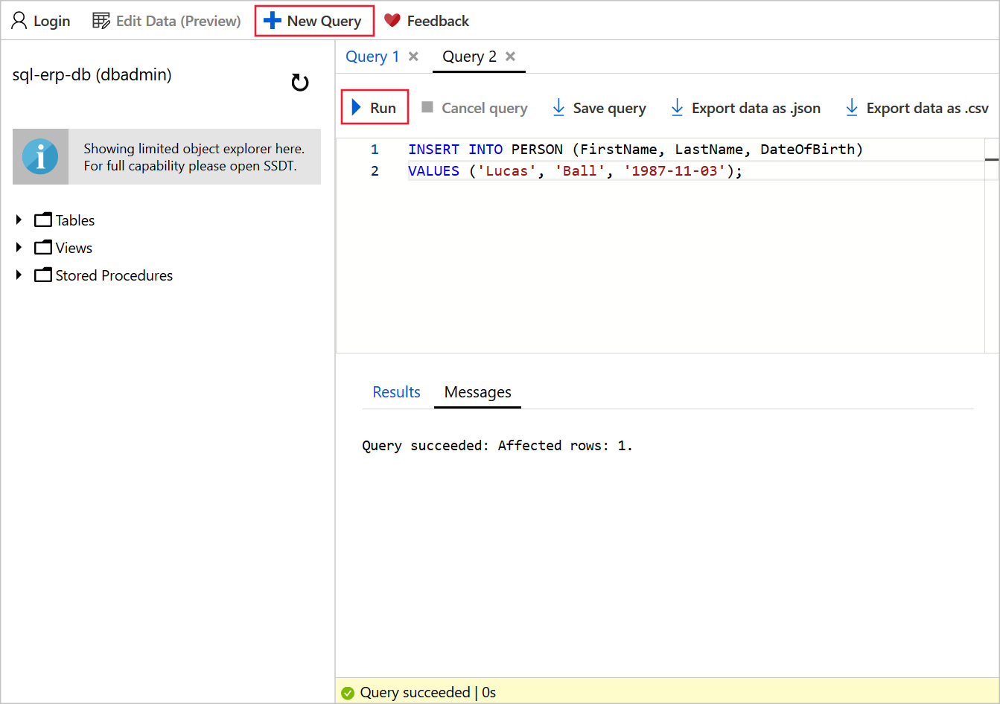
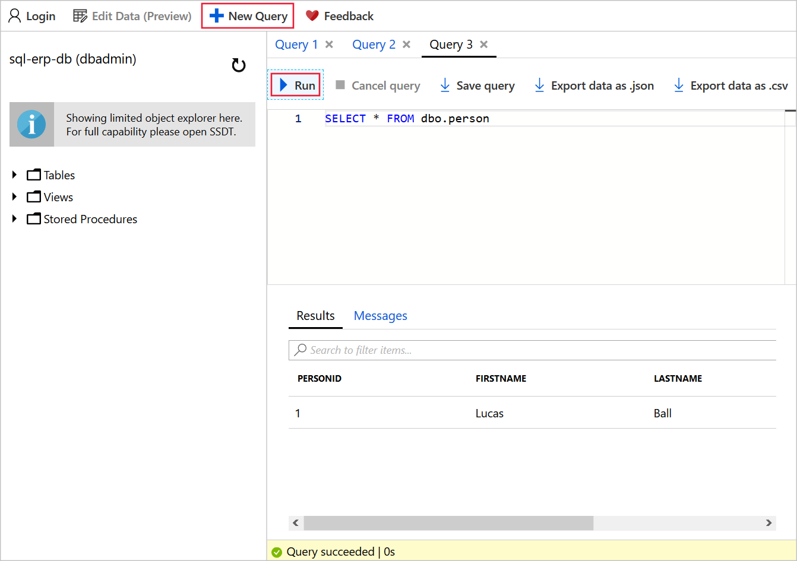

Although the default Azure SQL Database configuration includes automated backups, most organizations will modify the default setup to tailor it to their needs.

Now that you have planned a comprehensive backup strategy for Azure SQL Database and your company's ERP system, it's time to implement it.

Here, you will create a database in Azure, with content and then configure backups.

[!include[](../../../includes/azure-sandbox-activate.md)]

## Create a server and database

Let's use the Azure CLI to create an Azure SQL Server and database instance in that resource group:

1. In the Cloud Shell, to set up some variables for the SQL Server creation, run these commands:

    ```bash
    SERVER_NAME=ERPServer-$RANDOM
    ADMIN_PASSWORD=P4ssw0rd
    ```

1. To create an Azure SQL server, execute this command:

    ```bash
    az sql server create --resource-group <rgn>[sandbox resource group name]</rgn> --name $SERVER_NAME \
      --location westeurope --admin-user dbadmin --admin-password $ADMIN_PASSWORD
    ```

1. To create a database, run this command:

    ```bash
    az sql db create --resource-group <rgn>[sandbox resource group name]</rgn> --name sql-erp-db \
      --server $SERVER_NAME --edition Standard
    ```

## Configure the database retention policy

In the portal, you can examine the default retention policy and adapt it to your needs:

1. In the [Azure portal](https://portal.azure.com/learn.docs.microsoft.com?azure-portal=true), click **All resources** and then click the **ERPServer** database server.
1. Under **Settings**, click **Manage Backups**.
1. On the **Configure policies** tab, click the **sql-erp-db** database, and then click **Configure retention**.
1. In the **Point In Time Restore Configuration** drop-down list, select **28**.

    

1. Click **Apply**, and then click **Yes**.

## Permit access for your IP address

By default, Azure SQL Database prevents access to the server to execute queries. Enable access for your IP address with these steps:

1. In the [Azure portal](https://portal.azure.com/learn.docs.microsoft.com?azure-portal=true), click **All resources** and then click the **ERPServer** database server.
1. Under **Security**, click **Firewalls and virtual networks**.
1. At the top of the page, click **Add client IP**.
1. Under **Allow access to Azure services**, click **ON**:

    

1.  Click **Save**, and then when the rule has been saved, click **OK**.

## Add data to the database

Now let's add a table and a sample record to the database: 

1. In the [Azure portal](https://portal.azure.com/learn.docs.microsoft.com?azure-portal=true), click **All resources** and then click the **sql-erp-db** database.
1. Click **Query editor**, and then sign in with the credentials **dbadmin** and **P4ssw0rd**.
1. To create a table, in the **Query 1** window, type this SQL command, and then click **Run**:

    ```sql
    CREATE TABLE Person
    (
        PersonId INT IDENTITY PRIMARY KEY,
        FirstName NVARCHAR(50) NOT NULL,
        LastName NVARCHAR(50) NOT NULL,
        DateOfBirth DATE NOT NULL
    )
    ```

    

1. To add a record, click **+ New Query** and then, in the **Query 2** window, type this SQL command, and then click **Run**:

    ```sql
    INSERT INTO PERSON (FirstName, LastName, DateOfBirth)
    VALUES ('Lucas', 'Ball', '1987-11-03');
    ```

    

1. To query the database, click **+ New Query** and then, in the **Query 3** window, type this SQL command, and then click **Run**:

    ```sql
    SELECT * FROM dbo.Person
    ```

    The **Results** window displays the record for Lucas Ball.

    