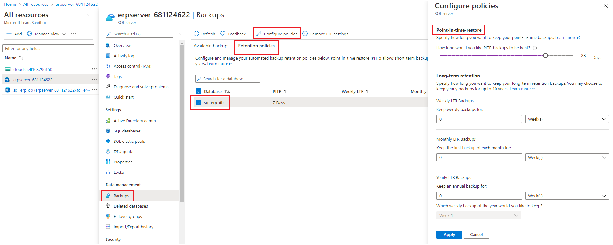
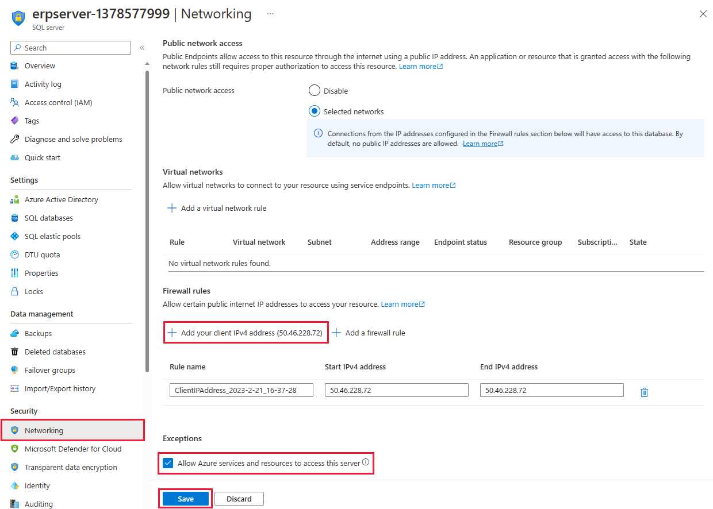
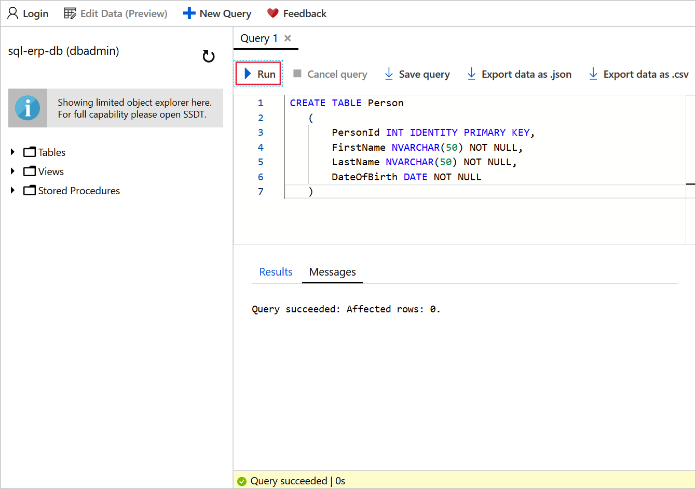

Although the default Azure SQL Database configuration includes automated backups, most organizations will modify the default setup to tailor it to their needs.

Now that you have planned a comprehensive backup strategy for Azure SQL Database and your company's ERP system, it's time to implement it.

Here, you will create a database in Azure and then configure backups. You will also add some content to the database.

## Create a server and database

Let's use the Azure CLI to create an Azure SQL Server and database instance in that resource group:

1. Run these commands in the Cloud Shell to set up some variables for the SQL Server creation. Replace `<password>` with a password of your choice.

    ```bash
    SERVER_NAME=ERPServer-$RANDOM
    ADMIN_PASSWORD=<password>
    ```

1. Run the `az sql server create` command to create an Azure SQL server to store the database.

    ```azurecli
    az sql server create \
        --resource-group <rgn>[sandbox resource group name]</rgn> \
        --name $SERVER_NAME \
        --admin-user dbadmin \
        --admin-password $ADMIN_PASSWORD
    ```

1. Run the `az sql db create` command to create a database.

    ```azurecli
    az sql db create \
        --resource-group <rgn>[sandbox resource group name]</rgn> \
        --name sql-erp-db \
        --server $SERVER_NAME \
        --edition Standard
    ```

## Configure the database retention policy

In the portal, you can examine the default retention policy and adapt it to your needs:

1. In the [Azure portal](https://portal.azure.com/learn.docs.microsoft.com?azure-portal=true), select **All resources** and then select the **ERPServer-NNNN** database server that you created.
1. Under **Settings**, select **Manage Backups**.
1. On the **Configure policies** tab, select the **sql-erp-db** database, and then select **Configure retention**.
1. In the **Point In Time Restore Configuration** drop-down list, select **28**.

    

1. Select **Apply**, and then select **Yes**.

## Allow network access to the database server

By default, Azure SQL Database blocks network access to the server. Let's enable both your IP address and Azure services to access the server so that we can run queries from Cloud Shell and the Azure portal. By adding your IP address, you could also connect directly from your local device.

1. In the [Azure portal](https://portal.azure.com/learn.docs.microsoft.com?azure-portal=true), select **All resources** and then select the **ERPServer** database server.
1. Under **Security**, select **Firewalls and virtual networks**.
1. At the top of the page, select **Add client IP**.
1. Under **Allow access to Azure services**, select **ON**:

    

1. Select **Save**, and then when the rule has been saved, select **OK**.

## Add data to the database

Now let's add a table and a sample record to the database. It is helpful to have some data in the database to to validate that our backups and restores work later in the module.

1. In the [Azure portal](https://portal.azure.com/learn.docs.microsoft.com?azure-portal=true), select **All resources** and then select the **sql-erp-db** database.
1. Select **Query editor**, and then sign in with the credentials **dbadmin** and the password you created previously.
1. To create a table, in the **Query 1** window, type this SQL command, and then select **Run**:

    ```sql
    CREATE TABLE Person
    (
        PersonId INT IDENTITY PRIMARY KEY,
        FirstName NVARCHAR(50) NOT NULL,
        LastName NVARCHAR(50) NOT NULL,
        DateOfBirth DATE NOT NULL
    )
    ```

    

1. To add a record, select **+ New Query** and then, in the **Query 2** window, type this SQL command, and then select **Run**:

    ```sql
    INSERT INTO PERSON (FirstName, LastName, DateOfBirth)
    VALUES ('Lucas', 'Ball', '1987-11-03');
    ```

    

1. To query the database, select **+ New Query** and then, in the **Query 3** window, type this SQL command, and then select **Run**:

    ```sql
    SELECT * FROM dbo.Person
    ```

    The **Results** window displays the record for Lucas Ball.

    