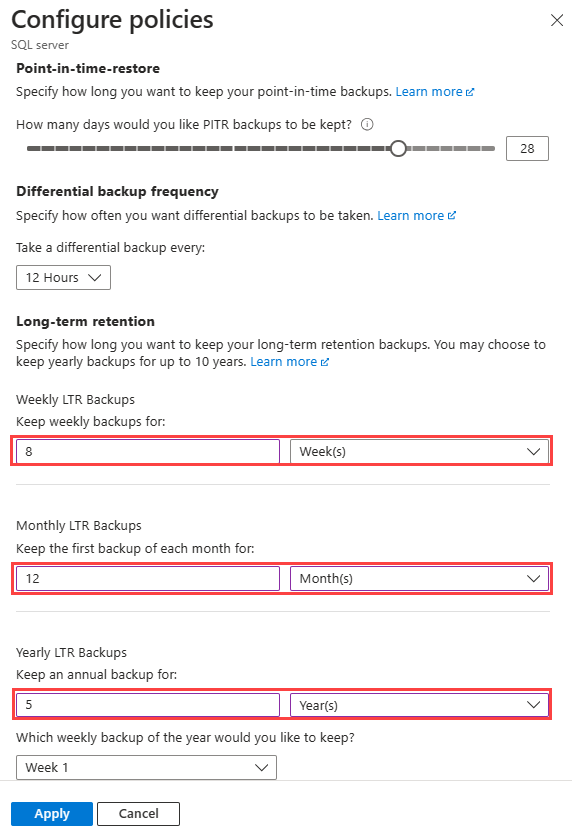

Your retail organization must comply with data protection regulations in your jurisdiction. You need to keep all data for two years and you want to keep one backup each month for six months. You have been asked to configure a long-term retention policy in Azure SQL Database to meet these requirements.

Here, you will use the Azure portal to set up a policy and then check it in PowerShell. You need to set up the following retention policy to meet your regulatory requirements:

|  |  |
|---------|---------|
| Weekly     | 8 weeks   |
| Monthly     |  12 months       |
| Yearly     |  5 years       |


## Use the Azure portal to configure long-term retention

Let's start by configuring the five year retention by using the portal.

1. In the [Azure portal](https://portal.azure.com/learn.docs.microsoft.com?azure-portal=true), select **All resources** and then select **ERPServer-NNNN**.

1. Under **Settings**, select **Manage Backups**.

1. In the list of databases, select **sql-erp-db**, and then select **Configure retention**.

1. Select **Yearly LTR Backups**.

1. In the **How long would you like this annual backup to be kept?** controls, select **2 Year(s)**.

    

1. Select **Apply**, and then select **Yes**.

## Use PowerShell to configure long-term retention

You can also configure long-term retention policies by using PowerShell. Let's configure the remainder of the policy this way.

1. In the Cloud Shell, run this command to set a variable to the value of your SQL server.

    ```powershell
    $sqlserver=Get-AzSqlServer
    ```

1. To view long-term retention policies for the database server, run this command.

    ``` powershell
    Get-AzSqlDatabase `
        -ResourceGroupName <rgn>[sandbox resource group name]</rgn> `
        -ServerName $sqlserver.ServerName `
        | Get-AzSqlDatabaseLongTermRetentionPolicy
    ```

    This will output the retention polices for all databases on the server. In this case you should see one policy for the **master** database, and one policy for the **sql-erp-db** database.

1. Run this command to view the long-term retention policies for the **sql-erp-db** database.

    ``` powershell
    Get-AzSqlDatabaseBackupLongTermRetentionPolicy `
        -ServerName $sqlserver.ServerName `
        -DatabaseName sql-erp-db `
        -ResourceGroupName <rgn>[sandbox resource group name]</rgn>
    ```

1. Now lets configure the remainder of our policy to meet the requirements specified earlier. To configure a long-term retention policy via PowerShell, run this command.

    ``` powershell
    Set-AzSqlDatabaseBackupLongTermRetentionPolicy `
        -ServerName $sqlserver.ServerName `
        -DatabaseName sql-erp-db `
        -ResourceGroupName <rgn>[sandbox resource group name]</rgn> `
        -WeeklyRetention P8W
        -MonthlyRetention P12M `
        -YearlyRetention P5Y `
        -WeekOfYear 1
    ```

1. To check that the new policy has been applied, run this command again.

    ```powerShell
    Get-AzSqlDatabaseBackupLongTermRetentionPolicy `
        -ServerName $sqlserver.ServerName `
        -DatabaseName sql-erp-db `
        -ResourceGroupName <rgn>[sandbox resource group name]</rgn>
    ```

1. You can also confirm this in the portal. In the [Azure portal](https://portal.azure.com/learn.docs.microsoft.com?azure-portal=true), select **All resources** and then select **ERPServer**

1. Under **Settings**, select **Manage Backups**, and then the list of databases, check the **sql-erp-db** long-term retention properties.

    

You've now configured a retention policy and validated that your retention policy meets your organizational and regulatory requirements.