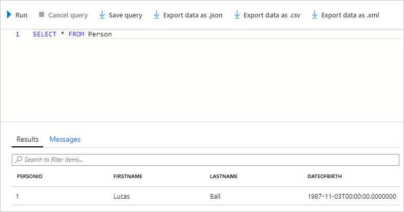

Trial restores are a key component of any disaster recovery strategy.

You want to familiarize yourself with the steps to restore a backed-up database to a specific point-in-time should it become necessary. You also want to investigate how long a restore operation will take so you can plan for this in your guidance for your organization.

Here, you will perform a restore of from automated Azure SQL Database backups.

## Confirm backups are active

It can take up to 15 minutes for the first successful backup to complete. We need to make sure that we have a backup before we continue with the exercise.

1. Run the following PowerShell command in the Cloud Shell to validate that continuous backups are running.

    ```powershell
    Get-AzSqlDatabaseRestorePoint `
        -ResourceGroupName <rgn>[sandbox resource group name]</rgn> `
        -DatabaseName sql-erp-db `
        -ServerName $sqlserver.ServerName
    ```

    You should see output similar to below if your backups are running. If the command returns no value, a backup hasn't kicked off quite yet. Rerun this command in a couple minutes.

    ```output
    ResourceGroupName        : <rgn>[sandbox resource group name]</rgn>
    ServerName               : ERPServer-53903
    DatabaseName             : sql-erp-db
    Location                 : East US
    RestorePointType         : CONTINUOUS
    RestorePointCreationDate :
    EarliestRestoreDate      : 9/24/19 4:21:21 PM
    RestorePointLabel        :
    ```

    Note that the `RestorePointType` is `CONTINUOUS`, indicating that backups are automatically happening. The `EarliestRestoreDate` indicates the timestamp of the first backup. With backups in place, let's continue with the exercise.

## Drop a table from the database

Let's start by simulating a mistaken database modification.

1. In the [Azure portal](https://portal.azure.com/learn.docs.microsoft.com?azure-portal=true), select **All resources** and then select the **sql-erp-db** database.

1. Select **Query editor**, and then sign in with the **dbadmin** user and the password you specified for this account.

1. Let's drop the **Person** table that we created earlier. In a new query window, run this command.

    ```sql
    DROP TABLE Person
    ```

1. To check the tables in the database, select **New Query**, and then in the **Query 2** window, run this command to list all tables in the database.

    ```sql
    SELECT schema_name(t.schema_id) as schema_name,
        t.name as table_name
    FROM sys.tables t
    ORDER BY schema_name, table_name;
    ```

    You should see **No results** returned, since we deleted the **Person** table.

    

## Run a point-in-time restore

The **Person** table has been mistakenly deleted. Now, let's restore the database to its previous state.

1. In the [Azure portal](https://portal.azure.com/learn.docs.microsoft.com?azure-portal=true), select **All resources** and then select the **sql-erp-db** database.

1. At the top of the **Overview** page, select **Restore**.

1. Complete the **Restore** page with these values, and then select **OK**.

    | Setting | Value |
    | --- | --- |
    | Select source | Point-in-time |
    | Database name | sql-erp-db-restored |
    | Restore point | Select a time 10 minutes ago, before you dropped the **Person** table |
    | Target server | ERPServer |
    | Elastic pool | None |
    | Pricing tier | Default value |
    | | |

    

    The database restore will take several minutes.

## View the restored database

The restored database should contain the **Person** table. You can check that in the portal.

1. In the [Azure portal](https://portal.azure.com/learn.docs.microsoft.com?azure-portal=true), select **All resources** and then select the **sql-erp-db-restored** database.

1. Select **Query editor**, and then sign in with the **dbadmin** user and the password you specified for this account.

1. To check the tables in the database, in the **Query 1** window, run this command.

    ```sql
    SELECT schema_name(t.schema_id) as schema_name,
        t.name as table_name
    FROM sys.tables t
    ORDER BY schema_name, table_name;
    ```

    The **Person** table should now be present.

    

1. Confirm that the data is in the table by running this command.

    ```sql
    SELECT * FROM Person
    ```

    You should see the data you entered previously.

    

You've now seen how you can restore a database in the event that something unintended happens to the data. You've familiarized yourself with the restore process, and can now assure your organization that your backup and restore procedures are properly defined.